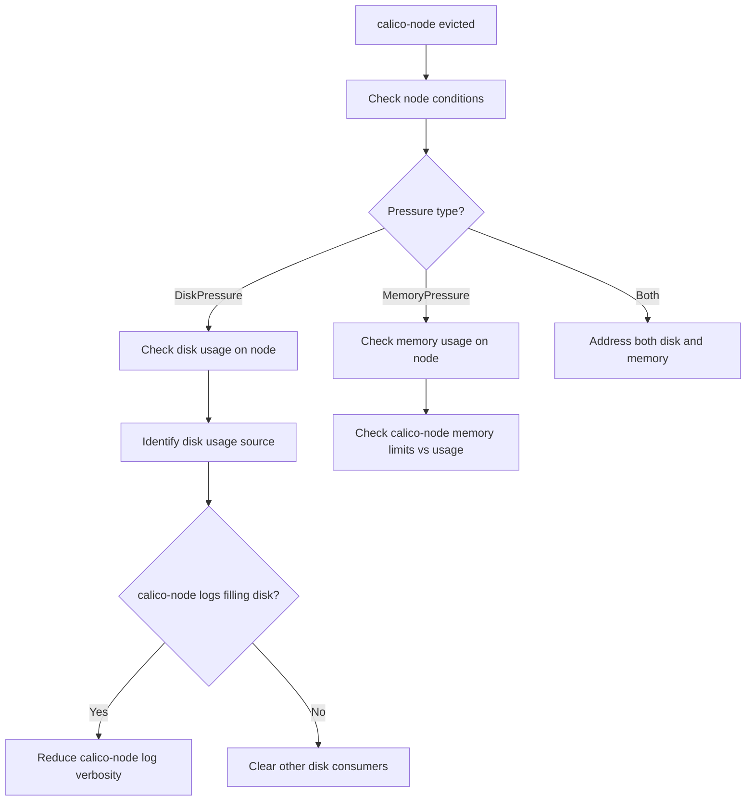

# How to Diagnose Calico Node Pod Evicted

Author: [nawazdhandala](https://github.com/nawazdhandala)

Tags: Calico, Kubernetes, Networking, Troubleshooting

Description: Diagnose calico-node pod eviction events by examining node pressure conditions, resource usage, and eviction thresholds affecting the calico-node DaemonSet.

---

## Introduction

calico-node pod eviction is a particularly damaging event because it deprives the node of its CNI and BGP daemon simultaneously. When the kubelet evicts calico-node due to resource pressure (disk, memory, or CPU), the node's networking degraded immediately: no new pods can receive IPs, existing pod routes may become stale, and BGP sessions are withdrawn.

The challenge is that eviction is a normal Kubernetes mechanism that indicates resource pressure on the node. Fixing calico-node eviction requires both restoring the pod and addressing the underlying resource pressure to prevent immediate re-eviction.

## Symptoms

- calico-node pod shows `Evicted` status in `kubectl get pods`
- Node shows DiskPressure, MemoryPressure, or similar conditions
- Eviction events visible in `kubectl describe node <node>`
- Node transitions to NotReady after calico-node is evicted

## Root Causes

- Insufficient disk space (most common) - calico-node logs filling disk
- Node memory pressure causing low-priority pod evictions
- calico-node does not have system-node-critical priority class
- Node ephemeral storage limits hit by calico-node

## Diagnosis Steps

**Step 1: Check calico-node pod status**

```bash
kubectl get pods -n kube-system -l k8s-app=calico-node -o wide | grep -E "Evicted|Error"
```

**Step 2: Check node pressure conditions**

```bash
kubectl describe node <node-name> | grep -A 20 "Conditions:"
# Look for: DiskPressure, MemoryPressure, PIDPressure
```

**Step 3: Check node resource usage**

```bash
kubectl top node <node-name>
ssh <node-name> "df -h && free -h"
```

**Step 4: Check calico-node resource configuration**

```bash
kubectl get daemonset calico-node -n kube-system \
  -o jsonpath='{.spec.template.spec.containers[0].resources}'
echo ""
kubectl get daemonset calico-node -n kube-system \
  -o jsonpath='{.spec.template.spec.priorityClassName}'
```

**Step 5: Check node eviction events**

```bash
kubectl get events -n kube-system | grep -i "evict\|oom\|pressure"
kubectl describe node <node-name> | grep -A 5 "Events:"
```

**Step 6: Check kubelet eviction thresholds**

```bash
ssh <node-name> "sudo cat /etc/kubernetes/kubelet-config.yaml | grep -A 5 'eviction'"
# Or check kubelet flags
ssh <node-name> "ps aux | grep kubelet | grep eviction"
```



## Solution

After identifying the pressure type and source, apply the targeted fix. See the companion Fix post for detailed steps including priority class assignment, resource limit adjustment, and disk cleanup.

## Prevention

- Set `system-node-critical` priority class on calico-node DaemonSet
- Set appropriate resource limits to prevent excessive resource use
- Monitor node disk and memory pressure metrics with alerts

## Conclusion

Diagnosing calico-node eviction requires checking node pressure conditions, resource utilization, and calico-node's priority class and resource configuration. Disk pressure is the most common cause, often from verbose logging filling node disk space.
