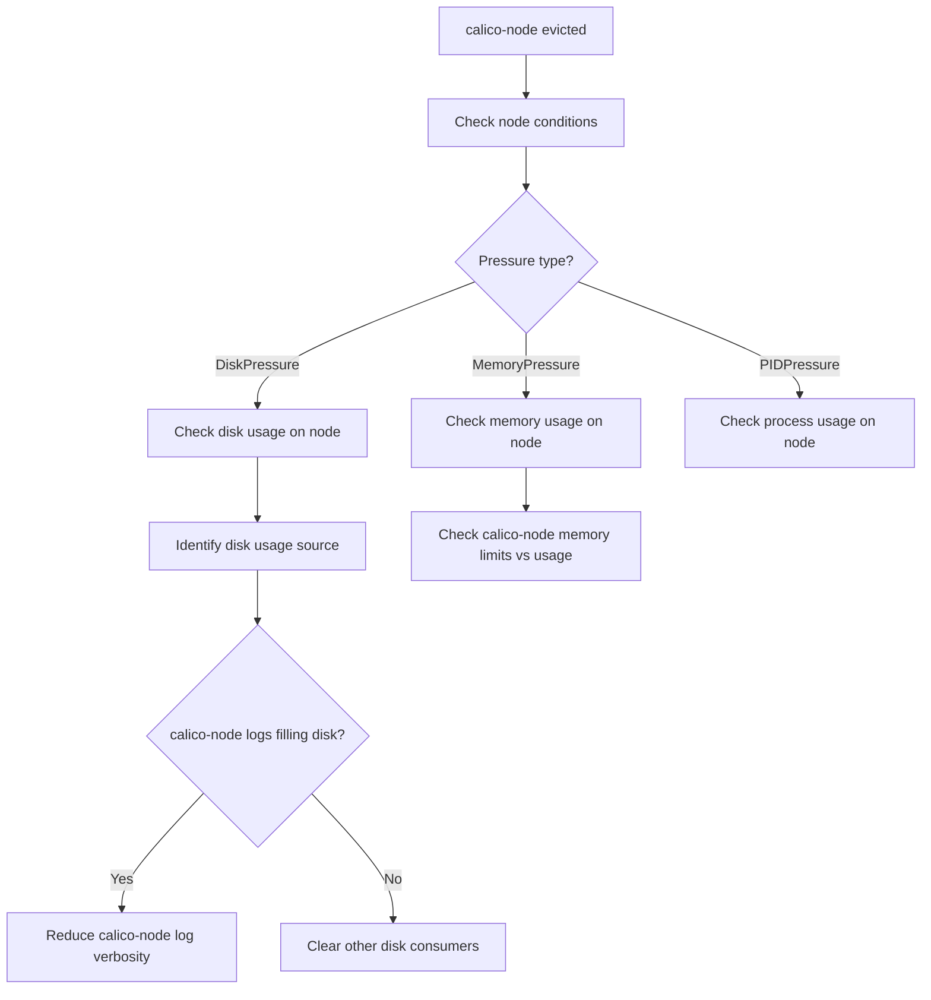

# How to Diagnose Calico Node Pod Evicted

Author: [nawazdhandala](https://github.com/nawazdhandala)

Tags: Calico, Kubernetes, Networking, Troubleshooting

Description: Diagnose calico-node pod eviction events by examining node pressure conditions, resource usage, and eviction thresholds affecting the calico-node DaemonSet.

---

## Introduction

calico-node pod eviction is a particularly damaging event because it can deprive the node of its CNI and, when BGP is enabled, its BGP daemon simultaneously. When the kubelet evicts calico-node due to node pressure such as disk, memory, or PID pressure, the node's networking degrades immediately: no new pods can receive IPs, existing pod routes may become stale, and BGP sessions can be withdrawn.

The challenge is that eviction is a normal Kubernetes mechanism that indicates resource pressure on the node. Fixing calico-node eviction requires both restoring the pod and addressing the underlying resource pressure to prevent immediate re-eviction.

## Symptoms

- calico-node pod shows `Evicted` status in `kubectl get pods`
- Node shows DiskPressure, MemoryPressure, or PIDPressure conditions
- Eviction events visible in `kubectl describe node <node>`
- Node may transition to NotReady or show network-related readiness issues after calico-node is evicted

## Root Causes

- Insufficient disk space or inodes, sometimes from excessive container logs
- Node memory pressure causing lower-priority or over-request pods to be evicted
- calico-node does not have system-node-critical priority class
- Node ephemeral storage limits hit by calico-node

## Diagnosis Steps

**Step 1: Check calico-node pod status**

```bash
kubectl get pods -A -l k8s-app=calico-node -o wide | grep -E "Evicted|Error"
```

**Step 2: Check node pressure conditions**

```bash
kubectl describe node <node-name> | grep -A 20 "Conditions:"
# Look for: DiskPressure, MemoryPressure, PIDPressure

```

**Step 3: Check node resource usage**

```bash
kubectl top node <node-name>
ssh <node-name> "df -h && free -h"
```

**Step 4: Check calico-node resource configuration**

```bash
kubectl get daemonset calico-node -n <calico-namespace> \
  -o jsonpath='{.spec.template.spec.containers[0].resources}'
echo ""
kubectl get daemonset calico-node -n <calico-namespace> \
  -o jsonpath='{.spec.template.spec.priorityClassName}'
```

**Step 5: Check node eviction events**

```bash
kubectl get events -A --field-selector involvedObject.name=<node-name> | grep -i "evict\|oom\|pressure"
kubectl describe node <node-name> | grep -A 5 "Events:"
```

**Step 6: Check kubelet eviction thresholds**

```bash
ssh <node-name> "sudo cat /etc/kubernetes/kubelet-config.yaml | grep -A 5 'eviction'"
# Or check kubelet flags
ssh <node-name> "ps aux | grep kubelet | grep eviction"
```


```mermaid
flowchart TD
    A[calico-node evicted] --> B[Check node conditions]
    B --> C{Pressure type?}
    C -- DiskPressure --> D[Check disk usage on node]
    C -- MemoryPressure --> E[Check memory usage on node]
    C -- PIDPressure --> F[Check process usage on node]
    D --> G[Identify disk usage source]
    G --> H{calico-node logs filling disk?}
    H -- Yes --> I[Reduce calico-node log verbosity]
    H -- No --> J[Clear other disk consumers]
    E --> K[Check calico-node memory limits vs usage]
```

## Solution

After identifying the pressure type and source, apply the targeted fix. See the companion Fix post for detailed steps including priority class assignment, resource limit adjustment, and disk cleanup.

## Prevention

- Set `system-node-critical` priority class on calico-node DaemonSet
- Set appropriate resource requests and limits to reduce eviction risk and prevent excessive resource use
- Monitor node disk and memory pressure metrics with alerts

## Conclusion

Diagnosing calico-node eviction requires checking node pressure conditions, resource utilization, and calico-node's priority class and resource configuration. Disk pressure is a common cause, including from verbose logging or other consumers filling node disk space.
