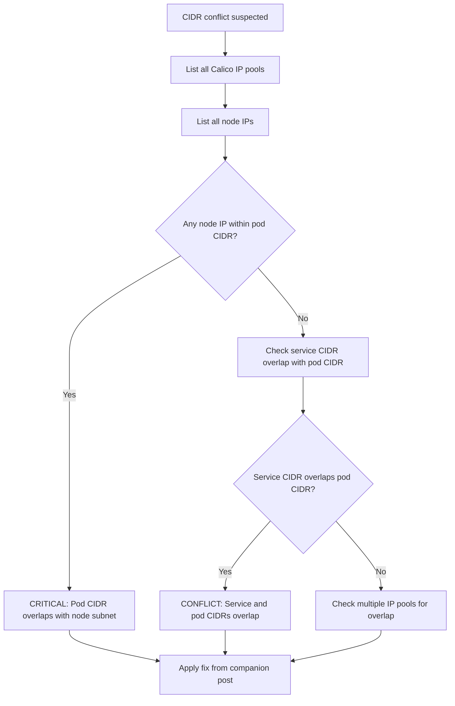

# How to Diagnose Calico Pod CIDR Conflicts

Author: [nawazdhandala](https://github.com/nawazdhandala)

Tags: Calico, Kubernetes, Networking, Troubleshooting

Description: Diagnose CIDR conflicts in Calico IP pools by comparing pod CIDRs against node subnets, existing IP pools, and service CIDRs to identify overlap.

---

## Introduction

CIDR conflicts in Calico occur when the pod IP pool overlaps with the node host network, the Kubernetes service CIDR, or another IP pool. When pods receive IP addresses from a CIDR that overlaps with the node network, routing becomes ambiguous: the node cannot determine whether a destination IP is a pod or a physical host, causing traffic to be misrouted or dropped.

These conflicts are particularly dangerous because they may work in a lab environment where address ranges happen not to overlap in practice, but fail in production where the actual node addresses fall within the conflicting range. The failure mode is often intermittent - only affecting traffic to specific IPs - making it difficult to diagnose without examining CIDR ranges explicitly.

This guide covers the diagnosis steps to identify CIDR conflicts in Calico IP pool configurations.

## Symptoms

- Pods on certain nodes cannot communicate with other nodes but communication works from most nodes
- Traffic to some pod IPs is routed to physical hosts instead of pods
- `calicoctl ipam check` reports conflicts or unreachable addresses
- Pod receives an IP that is also used by a node in `kubectl get nodes -o wide`

## Root Causes

- Pod CIDR overlaps with node host subnet (e.g., both use 10.0.0.0/16)
- Multiple IP pools with overlapping CIDRs
- Service CIDR overlaps with pod CIDR
- IPv6 CIDR conflicts when dual-stack is enabled

## Diagnosis Steps

**Step 1: List all Calico IP pools**

```bash
calicoctl get ippool -o yaml
```

**Step 2: Check Kubernetes cluster CIDR configuration**

```bash
kubectl get configmap kubeadm-config -n kube-system -o yaml | grep -E "podSubnet|serviceSubnet"
# Or check kube-controller-manager flags
kubectl describe pod -n kube-system $(kubectl get pods -n kube-system -l component=kube-controller-manager -o name | head -1) | grep "cluster-cidr"
```

**Step 3: List all node IPs**

```bash
kubectl get nodes -o wide
# Note the Internal IP column
```

**Step 4: Check for CIDR overlap**

```bash
# Get pool CIDRs
calicoctl get ippool -o jsonpath='{range .items[*]}{.spec.cidr}{"\n"}{end}'

# Get node IPs
kubectl get nodes -o jsonpath='{range .items[*]}{.status.addresses[?(@.type=="InternalIP")].address}{"\n"}{end}'

# Manually check if any node IP falls within the pod CIDR
# Example: if pod CIDR is 10.0.0.0/16 and node IP is 10.0.1.5 = CONFLICT
```

**Step 5: Run calicoctl IPAM check**

```bash
calicoctl ipam check
```

**Step 6: Check for routing ambiguity on the node**

```bash
# On a node with suspected conflict
ip route show | grep -E "10\.|192\." | head -20
# Look for routes where pod CIDR and node CIDR overlap
```



## Solution

After confirming the overlap, apply the fix described in the companion Fix post. CIDR changes require careful planning as they affect running pods.

## Prevention

- Plan CIDRs before cluster creation: use distinct ranges for pods, nodes, and services
- Use a network design document that reserves address space for all cluster components
- Run `calicoctl ipam check` after any IP pool configuration change

## Conclusion

Diagnosing Calico CIDR conflicts requires comparing IP pool CIDRs against node host IPs, service CIDRs, and other IP pools to identify overlap. `calicoctl ipam check` automates much of this comparison and should be the first diagnostic tool used when CIDR conflicts are suspected.
