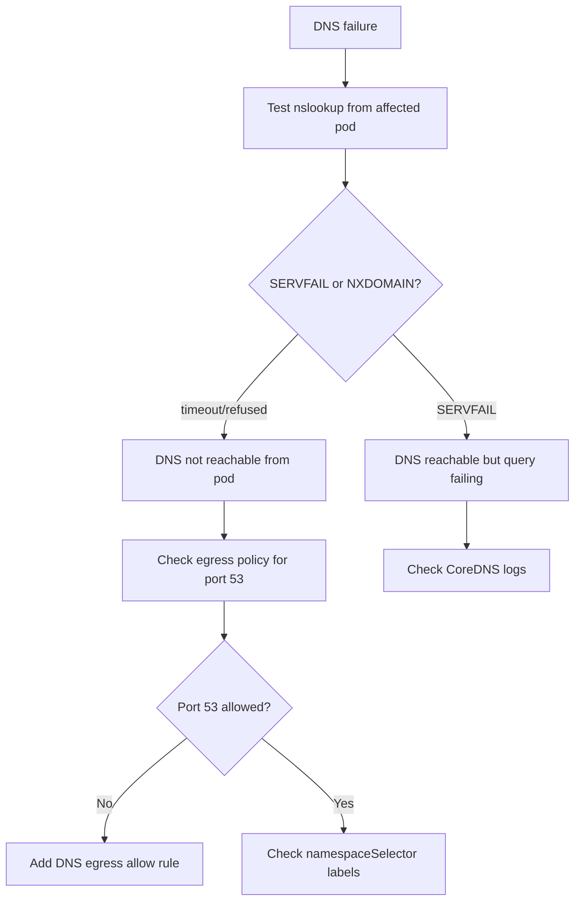

# How to Diagnose Calico Policy Blocking DNS

Author: [nawazdhandala](https://github.com/nawazdhandala)

Tags: Calico, Kubernetes, Networking, Troubleshooting

Description: Diagnose DNS failures caused by Calico NetworkPolicies by testing DNS resolution, inspecting egress rules, and tracing UDP port 53 traffic.

---

## Introduction

Calico NetworkPolicies blocking DNS is one of the most impactful misconfigurations in a Kubernetes cluster because DNS failure cascades into failures across every service that depends on name resolution. When a default-deny egress policy is applied without an explicit allow for UDP port 53 to CoreDNS, all pods in the affected namespace lose the ability to resolve service names.

The symptoms are often misleading - pods may report "connection refused" or "no such host" errors that look like application failures or service outages. The DNS layer needs to be specifically tested to distinguish DNS blocking from other connectivity issues.

## Symptoms

- Pods return `nslookup: server can't find <service>: SERVFAIL` or `NXDOMAIN`
- Application errors: `dial tcp: lookup <hostname>: no such host`
- `kubectl exec <pod> -- nslookup kubernetes.default` fails
- Errors disappear when a test pod without NetworkPolicy is deployed

## Root Causes

- Default-deny egress policy missing UDP/TCP port 53 allow rule
- Egress namespaceSelector not matching `kube-system` (where CoreDNS runs)
- Wrong CoreDNS service IP in ipBlock rule
- CoreDNS pods have ingress policy blocking from application namespaces

## Diagnosis Steps

**Step 1: Test DNS from affected pod**

```bash
kubectl exec <pod-name> -n <namespace> -- nslookup kubernetes.default 2>&1
kubectl exec <pod-name> -n <namespace> -- cat /etc/resolv.conf
```

**Step 2: Verify CoreDNS is accessible**

```bash
COREDNS_IP=$(kubectl get svc kube-dns -n kube-system -o jsonpath='{.spec.clusterIP}')
echo "CoreDNS Service IP: $COREDNS_IP"
kubectl exec <pod-name> -n <namespace> -- nc -zuv $COREDNS_IP 53 2>&1
```

**Step 3: Check egress policies in namespace**

```bash
kubectl get networkpolicy -n <namespace> -o yaml \
  | grep -A 15 "egress:" | grep -E "port|namespace|53"
```

**Step 4: Check CoreDNS ingress policies**

```bash
kubectl get networkpolicy -n kube-system -o yaml
calicoctl get networkpolicy -n kube-system -o yaml 2>/dev/null
```

**Step 5: Test with a pod that has no policy (confirm DNS works without policy)**

```bash
kubectl run dns-diag --image=busybox --restart=Never -n default -- sleep 120
kubectl exec dns-diag -- nslookup kubernetes.default
# If this works: policy is blocking DNS in affected namespace
# If this fails: DNS infrastructure problem
kubectl delete pod dns-diag
```



## Solution

Add egress allow for UDP/TCP port 53 to kube-system namespace. See the companion Fix post for exact YAML.

## Prevention

- Include DNS allow in all default-deny egress policy templates
- Test DNS from new namespaces during provisioning
- Alert on CoreDNS SERVFAIL rate increases

## Conclusion

Diagnosing Calico policies blocking DNS requires testing DNS resolution directly from the affected pod, verifying CoreDNS service IP accessibility, and inspecting egress rules for port 53 allow rules. The kube-system namespaceSelector and port 53 are the two key elements to verify.
