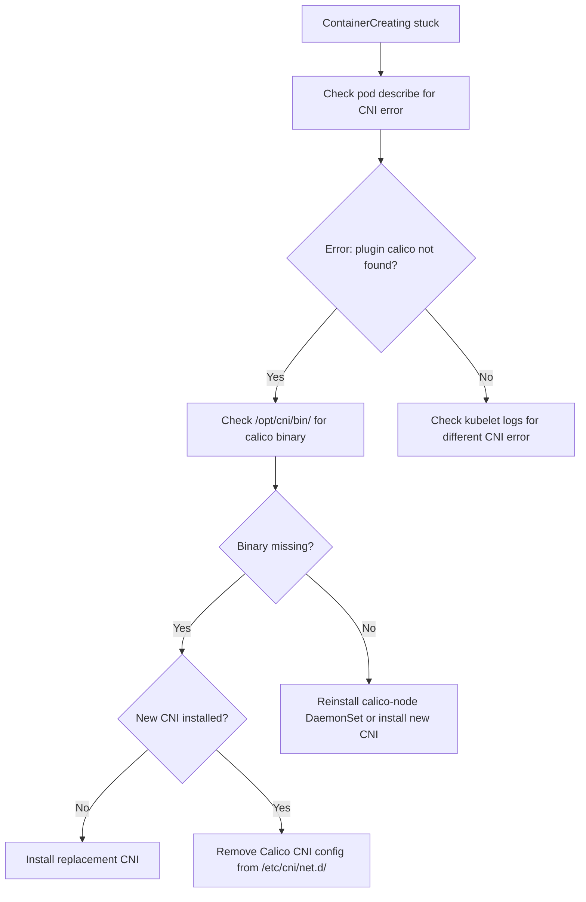

# How to Diagnose ContainerCreating After Uninstalling Calico

Author: [nawazdhandala](https://github.com/nawazdhandala)

Tags: Calico, Kubernetes, Networking, Troubleshooting

Description: Diagnose why pods are stuck in ContainerCreating after Calico CNI is uninstalled by examining CNI config state, kubelet logs, and node networking conditions.

---

## Introduction

Pods stuck in ContainerCreating after Calico is uninstalled indicate that the CNI layer is either absent or broken on the node. The kubelet attempts to call the CNI plugin to set up pod networking, but the CNI binary or configuration is missing, invalid, or pointing to a removed Calico plugin. Without a functioning CNI, no new pods can start.

This condition typically occurs in two scenarios: Calico was removed without a replacement CNI being installed, or Calico was removed but leftover CNI configuration files reference Calico binaries that no longer exist. The second scenario is particularly common when Calico is removed by deleting the DaemonSet but not cleaning up `/etc/cni/net.d/`.

## Symptoms

- All new pods stuck in `ContainerCreating` indefinitely after Calico uninstall
- `kubectl describe pod <pod>` shows `failed to find plugin "calico" in path [/opt/cni/bin]`
- Nodes show `NetworkPlugin not initialized` or similar condition
- Existing running pods may continue to work but no new pods can start

## Root Causes

- Calico CNI binaries removed from `/opt/cni/bin` but config still in `/etc/cni/net.d/`
- No replacement CNI installed after Calico removal
- New CNI installed but Calico config file takes precedence (lower number filename)
- kubelet not restarted after CNI change, still using cached configuration

## Diagnosis Steps

**Step 1: Check pod describe for CNI error**

```bash
kubectl describe pod <stuck-pod-name> | grep -A 10 "Warning\|Event"
# Look for: failed to find plugin "calico"
```

**Step 2: Check CNI config on the node**

```bash
NODE=$(kubectl get pod <stuck-pod-name> -o jsonpath='{.spec.nodeName}')
ssh $NODE "ls /etc/cni/net.d/"
ssh $NODE "cat /etc/cni/net.d/10-calico.conflist 2>/dev/null"
```

**Step 3: Check CNI binaries**

```bash
ssh $NODE "ls /opt/cni/bin/ | grep calico"
```

**Step 4: Check if a new CNI is installed**

```bash
ssh $NODE "ls /etc/cni/net.d/"
# Look for new CNI config files (e.g., 10-flannel.conflist, 00-cilium.conf)
```

**Step 5: Check kubelet logs on the node**

```bash
ssh $NODE "sudo journalctl -u kubelet | grep -i 'cni\|network\|plugin' | tail -30"
```

**Step 6: Verify kubelet is using the expected CNI config directory**

```bash
ssh $NODE "sudo cat /etc/kubernetes/kubelet.conf | grep cni"
ssh $NODE "ps aux | grep kubelet | grep cni"
```



## Solution

After identifying the specific CNI configuration issue, apply the targeted fix from the companion Fix post.

## Prevention

- Never remove Calico without having a replacement CNI ready to install immediately
- Clean up `/etc/cni/net.d/` as part of the Calico removal procedure
- Verify a working CNI is configured before removing Calico

## Conclusion

ContainerCreating after Calico uninstall is a CNI configuration problem. Check the pod describe output for the specific plugin error, then verify whether the Calico CNI config is still present in `/etc/cni/net.d/` and whether a replacement CNI has been installed. The solution is to either install a new CNI or clean up the stale Calico CNI config.
