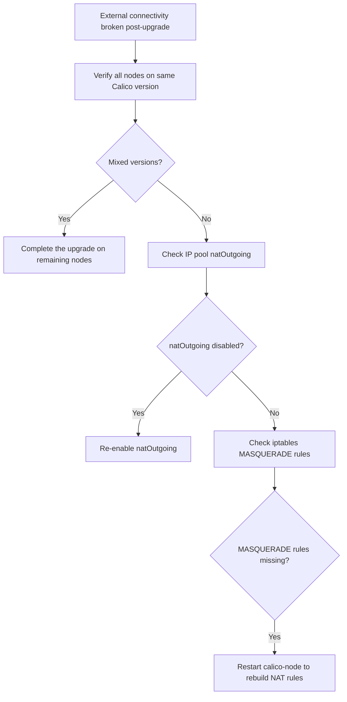

# How to Diagnose External Connectivity Broken After Calico Upgrade

Author: [nawazdhandala](https://github.com/nawazdhandala)

Tags: Calico, Kubernetes, Networking, Troubleshooting

Description: Diagnose external network connectivity failures after Calico upgrades by examining IP pool NAT settings, iptables MASQUERADE rules, and encapsulation mode changes.

---

## Introduction

External connectivity failures after a Calico upgrade typically stem from changes to default behaviors between Calico versions. Common breaking changes include modifications to the default IP-in-IP mode, natOutgoing behavior, or encapsulation protocol changes that affect how outbound pod traffic is routed to external destinations.

When pods lose external connectivity after an upgrade, they can no longer reach services outside the cluster (internet, external databases, corporate services). The failure is often asymmetric — inbound traffic from the load balancer to pods may still work, but outbound pod-initiated traffic fails.

## Symptoms

- Pods cannot reach external IPs or hostnames after Calico upgrade
- `kubectl exec <pod> -- curl https://api.example.com` fails after upgrade
- Previously working external connectivity broken immediately post-upgrade
- Node-to-external traffic works but pod-to-external traffic fails

## Root Causes

- natOutgoing disabled or changed to different behavior in new version
- IP pool ipipMode or vxlanMode changed during upgrade
- NAT masquerade rules not applied for pod egress
- Default GlobalNetworkPolicy changed between versions
- Calico-node upgrade partially applied (mixed versions on different nodes)

## Diagnosis Steps

**Step 1: Verify the upgrade completed fully**

```bash
kubectl get pods -n kube-system -l k8s-app=calico-node \
  -o jsonpath='{range .items[*]}{.metadata.name}{"\t"}{.spec.containers[0].image}{"\n"}{end}'
# All nodes should show the same Calico version
```

**Step 2: Check IP pool natOutgoing setting**

```bash
calicoctl get ippool -o yaml | grep -E "natOutgoing|ipipMode|vxlanMode"
```

**Step 3: Test external connectivity from pod**

```bash
kubectl run ext-test --image=busybox --restart=Never -- sleep 120
kubectl exec ext-test -- ping -c 3 8.8.8.8
kubectl exec ext-test -- wget -qO- --timeout=10 http://www.google.com 2>&1 | head -3
kubectl delete pod ext-test
```

**Step 4: Check iptables NAT masquerade rules**

```bash
# On a node - verify MASQUERADE rules exist for pod CIDR
ssh <node-name> "sudo iptables -t nat -L -n | grep -E 'MASQUERADE|SNAT|cali'"
```

**Step 5: Check for GlobalNetworkPolicy changes post-upgrade**

```bash
calicoctl get globalnetworkpolicy -o yaml | grep -A 10 "egress:"
```

**Step 6: Compare pre/post upgrade configuration**

```bash
# If you have version-controlled Calico config:
# Compare IP pool settings between old and new
git diff HEAD~1 -- calico-ippool.yaml
```



## Solution

After diagnosis, apply the targeted fix (see companion Fix post). Most commonly, re-enabling natOutgoing or completing the upgrade to bring all nodes to the same version resolves external connectivity.

## Prevention

- Read Calico release notes for breaking changes before upgrading
- Test external connectivity in staging after upgrade
- Monitor external connectivity probe during upgrades

## Conclusion

Diagnosing external connectivity failures after Calico upgrades requires checking the upgrade completion status, IP pool natOutgoing configuration, and iptables NAT rules. Mixed-version scenarios and natOutgoing changes are the most common causes.
