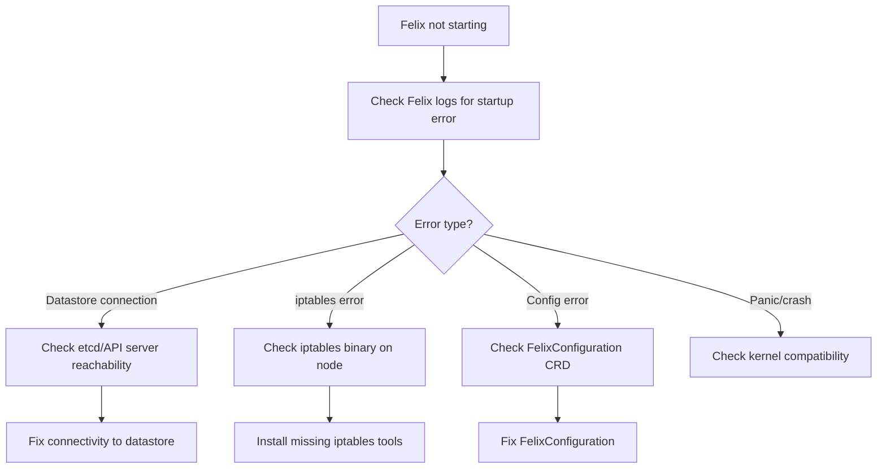

# How to Diagnose Felix Not Starting in Calico

Author: [nawazdhandala](https://github.com/nawazdhandala)

Tags: Calico, Kubernetes, Networking, Troubleshooting

Description: Diagnose why the Felix process is not starting within calico-node by examining Felix-specific logs, datastore connectivity, and kernel requirements.

---

## Introduction

Felix is the per-node policy enforcement engine in Calico. It runs as a sub-process within the calico-node pod and is responsible for programming iptables rules, managing routing, and enforcing NetworkPolicy. When Felix fails to start, the calico-node pod may remain running but will be unhealthy, and the node's NetworkPolicy enforcement and routing will not function.

Felix startup failures are distinct from calico-node CrashLoopBackOff. In a startup failure, the calico-node pod may be running but Felix itself is stuck in initialization. This is identified by examining the Felix-specific log lines within the calico-node pod logs.

## Symptoms

- calico-node pod is Running but shows 0/1 Ready or fails readiness probes
- `kubectl logs <calico-node-pod> -c calico-node` shows Felix startup errors
- Node is in Ready state but NetworkPolicy is not being applied
- Felix healthcheck endpoint returns unhealthy
- `calicoctl node status` shows Felix unhealthy

## Root Causes

- Felix cannot connect to the Calico datastore (etcd or Kubernetes API)
- Kernel does not support required iptables features
- iptables binary not found or wrong version
- Felix configuration in FelixConfiguration CRD is invalid
- Calico version mismatch between calico-node and the CRD API version

## Diagnosis Steps

**Step 1: Check calico-node pod readiness**

```bash
kubectl get pods -n kube-system -l k8s-app=calico-node -o wide
NODE_POD=$(kubectl get pods -n kube-system -l k8s-app=calico-node \
  --field-selector spec.nodeName=<node-name> -o name)
```

**Step 2: Get Felix-specific logs**

```bash
kubectl logs $NODE_POD -n kube-system -c calico-node \
  | grep -i "felix\|error\|fatal\|panic" | tail -40
```

**Step 3: Check Felix datastore connectivity**

```bash
kubectl logs $NODE_POD -n kube-system -c calico-node \
  | grep -i "datastore\|etcd\|apiserver\|connection" | tail -20
```

**Step 4: Check iptables availability on node**

```bash
ssh <node-name> "which iptables && iptables --version"
ssh <node-name> "which iptables-save && which iptables-restore"
```

**Step 5: Check FelixConfiguration**

```bash
calicoctl get felixconfiguration default -o yaml
```

**Step 6: Check Felix readiness probe**

```bash
kubectl describe $NODE_POD -n kube-system | grep -A 10 "Readiness:"
# Look for the probe path - typically /readiness
kubectl exec $NODE_POD -n kube-system -- wget -qO- http://localhost:9099/readiness 2>/dev/null
```



## Solution

Apply the fix matching the specific Felix startup error. See the companion Fix post for detailed remediation for each error type.

## Prevention

- Verify iptables availability on nodes before deploying Calico
- Test datastore connectivity before installing Calico
- Validate FelixConfiguration syntax before applying

## Conclusion

Diagnosing Felix startup failures requires examining Felix-specific log lines within the calico-node pod, categorizing the error type, and then applying the targeted fix. Datastore connectivity and iptables availability are the most common Felix startup blockers.
