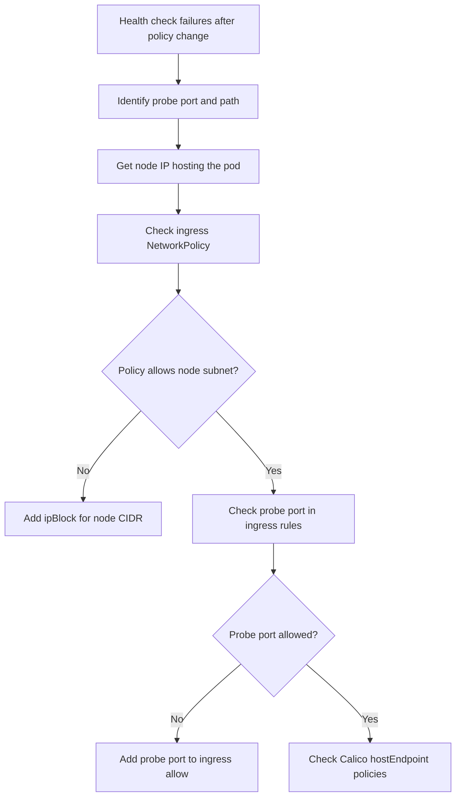

# How to Diagnose Health Checks Failing After Enabling Calico Policies

Author: [nawazdhandala](https://github.com/nawazdhandala)

Tags: Calico, Kubernetes, Networking, Troubleshooting

Description: Diagnose why liveness and readiness probes fail after enabling Calico NetworkPolicies by tracing probe traffic sources and inspecting policy ingress rules.

---

## Introduction

Kubernetes health check probes (liveness, readiness, and startup probes) originate from the node's kubelet process, not from another pod. This distinction is critical when diagnosing health check failures after enabling Calico NetworkPolicies: ingress policies that restrict traffic by pod or namespace selector will not match kubelet probe traffic, which comes from the node's host IP.

When a default-deny ingress policy is applied without an explicit allow for node-sourced probe traffic, health checks begin failing immediately. Pods transition to NotReady status and may be killed and restarted in a loop, causing workload disruption even though the application itself is functioning normally.

This guide provides a structured approach to diagnosing health check failures specifically caused by Calico NetworkPolicy ingress rules.

## Symptoms

- Pods transition to NotReady after a new NetworkPolicy is applied
- Liveness probe failures causing pods to restart in a loop
- `kubectl describe pod <pod>` shows `Liveness probe failed: dial tcp: connection refused`
- Services report no healthy endpoints despite pods running normally

## Root Causes

- Ingress NetworkPolicy with default-deny blocks kubelet probe traffic from node IP
- ipBlock in ingress rule does not include node subnet CIDR
- Calico GlobalNetworkPolicy hostEndpoint rules blocking node-originating traffic
- Probe port not included in any ingress allow rule

## Diagnosis Steps

**Step 1: Check probe configuration**

```bash
kubectl describe pod <pod-name> -n <namespace> \
  | grep -A 10 "Liveness:\|Readiness:\|Startup:"
```

**Step 2: Identify node IP for the pod**

```bash
POD_NODE=$(kubectl get pod <pod-name> -n <namespace> -o jsonpath='{.spec.nodeName}')
NODE_IP=$(kubectl get node $POD_NODE -o jsonpath='{.status.addresses[?(@.type=="InternalIP")].address}')
echo "Node IP: $NODE_IP"
```

**Step 3: Check ingress NetworkPolicies in the namespace**

```bash
kubectl get networkpolicy -n <namespace> -o yaml | grep -B5 -A 30 "policyTypes"
# Look for default-deny ingress without node CIDR allow
```

**Step 4: Test probe port accessibility from node IP**

```bash
# From the node hosting the pod:
ssh $POD_NODE
curl -v http://<pod-ip>:<probe-port><probe-path> 2>&1
```

**Step 5: Check if kubelet probe traffic matches NetworkPolicy**

```bash
# Kubelet probes come from the node's primary IP, not from a pod
# NetworkPolicy podSelector and namespaceSelector DO NOT match this traffic
# Must use ipBlock with node CIDR

kubectl get networkpolicy -n <namespace> -o yaml \
  | grep -A 5 "ipBlock:"
```

**Step 6: Check Calico hostEndpoint policies if applicable**

```bash
calicoctl get hostendpoint -o yaml
calicoctl get globalnetworkpolicy -o yaml | grep -A 20 "host"
```



## Solution

After diagnosis, add an ipBlock ingress allow for the node subnet CIDR covering the probe port. See the companion Fix post for the exact NetworkPolicy YAML.

## Prevention

- Always test health check probes after applying or modifying ingress NetworkPolicies
- Include node CIDR allow in ingress policy templates for pods with probes
- Use Calico's `!` notation to understand probe traffic origin before policy design

## Conclusion

Health check failures after enabling Calico policies are almost always caused by ingress rules that do not account for kubelet probe traffic originating from the node IP. Check whether the node's IP is covered by any ipBlock in the ingress policy and add it if missing.
