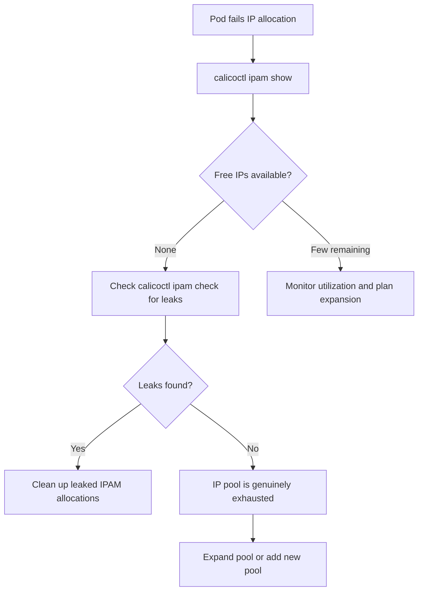

# How to Diagnose IP Pool Exhaustion in Calico

Author: [nawazdhandala](https://github.com/nawazdhandala)

Tags: Calico, Kubernetes, Networking, Troubleshooting

Description: Diagnose IP pool exhaustion in Calico IPAM by checking block utilization, free address counts, and identifying sources of IP address leaks.

---

## Introduction

IP pool exhaustion in Calico occurs when all IP addresses in the configured IP pools have been allocated and no free addresses remain for new pods. When this happens, new pod scheduling fails with IP allocation errors. The failure is not immediate - it builds gradually as pods are created and IPs are assigned, but is never returned when pods terminate improperly or when IPAM block garbage collection lags.

Understanding Calico's IPAM model is key to diagnosing exhaustion. Calico allocates IPs in blocks (typically /26 subnets) to nodes. A node holds a block even when pods on it terminate, releasing the individual IPs within the block but not the block itself. When all blocks are allocated to nodes, new nodes cannot get blocks and new pods on those nodes fail.

## Symptoms

- New pods fail with `failed to allocate IP address` or `no IP addresses available in block`
- `calicoctl ipam show` reports no free IPs
- Pod stays in Pending with event `FailedScheduling: failed to allocate IP address`
- Specific nodes cannot get new pod IPs while others are fine

## Root Causes

- IP pool CIDR is too small for the number of pods in the cluster
- IP address leaks from pods that terminated without proper IPAM cleanup
- Calico IPAM blocks allocated to nodes but not returning unused blocks
- Multiple IP pools all exhausted
- IP pool block size (/26 default) allocating too many IPs per node

## Diagnosis Steps

**Step 1: Check IPAM utilization**

```bash
calicoctl ipam show
# Shows: free blocks, allocated IPs, total capacity
```

**Step 2: Show detailed block allocation**

```bash
calicoctl ipam show --show-blocks
```

**Step 3: Check for leaked IP addresses**

```bash
calicoctl ipam check
# Reports any allocations without corresponding workloads
```

**Step 4: Count allocated vs available IPs**

```bash
calicoctl ipam show | grep -E "free|used|total"
```

**Step 5: Check current pod count vs IP pool size**

```bash
# Count running pods
kubectl get pods --all-namespaces | grep Running | wc -l

# Check IP pool capacity
calicoctl get ippool -o yaml | grep cidr:
# /16 = 65536, /24 = 256, etc.
```

**Step 6: Check for IP pools with nodeSelector constraints**

```bash
calicoctl get ippool -o yaml | grep -A 5 "nodeSelector:"
# Restricted pools may be exhausted even if others have capacity
```



## Solution

After identifying the cause (leaks vs. genuine exhaustion), apply the fix described in the companion Fix post: clean up leaked allocations, expand the IP pool, or add a new non-overlapping pool.

## Prevention

- Size IP pools for 2x expected pod count to allow for growth
- Set up IP utilization monitoring and alert at 70% and 90% usage
- Run `calicoctl ipam check` regularly to detect leaks early

## Conclusion

Diagnosing IP pool exhaustion in Calico requires checking IPAM utilization with `calicoctl ipam show`, identifying leaked allocations with `calicoctl ipam check`, and correlating IP pool capacity with current pod count. Leaks are common and addressable; genuine exhaustion requires pool expansion.
