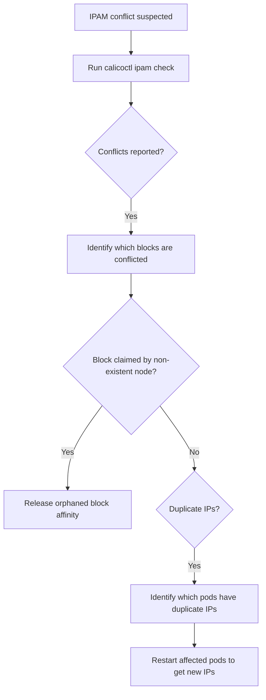

# How to Diagnose IPAM Block Conflicts in Calico

Author: [nawazdhandala](https://github.com/nawazdhandala)

Tags: Calico, Kubernetes, Networking, Troubleshooting

Description: Diagnose Calico IPAM block conflicts by examining block affinity assignments, detecting duplicate allocations, and using calicoctl ipam check to identify inconsistencies.

---

## Introduction

Calico IPAM organizes IP addresses into blocks (typically /26 subnets). Each block is affiliated with a specific node, and pods on that node receive IPs from its affiliated blocks. IPAM block conflicts occur when the same IP block is recorded as affiliated with more than one node, or when the block affinity records are inconsistent with actual IP allocations.

These conflicts can arise during cluster upgrades, node replacements, or split-brain scenarios where the IPAM datastore becomes temporarily inconsistent. The symptoms are pods receiving duplicate IP addresses, pods failing IP allocation on specific nodes, or routing anomalies for specific IP ranges.

## Symptoms

- `calicoctl ipam check` reports inconsistencies or duplicate allocations
- Multiple pods with the same IP address in `kubectl get pods -o wide`
- Pods failing to schedule on specific nodes with IPAM allocation errors
- Routing loops or drops for specific pod IP ranges
- BlockAffinity objects showing the same block claimed by multiple nodes

## Root Causes

- Node replacement without IPAM cleanup of the old node's blocks
- Concurrent IPAM operations during cluster upgrade causing race conditions
- etcd split-brain or write failure leaving IPAM in inconsistent state
- Node renamed without IPAM records being updated

## Diagnosis Steps

**Step 1: Run IPAM check**

```bash
calicoctl ipam check
calicoctl ipam check --show-all-ips 2>/dev/null | grep -i "conflict\|duplicate\|error"
```

**Step 2: List all IPAM blocks and their affiliations**

```bash
calicoctl ipam show --show-blocks
```

**Step 3: Check for blocks claimed by non-existent nodes**

```bash
# Get list of current nodes
CURRENT_NODES=$(kubectl get nodes -o jsonpath='{.items[*].metadata.name}')

# Get all block affinities
calicoctl get blockaffinity -o yaml 2>/dev/null | grep "node:" | \
  awk '{print $2}' | sort -u | while read NODE; do
  if ! echo "$CURRENT_NODES" | grep -qw "$NODE"; then
    echo "ORPHANED BLOCK AFFINITY for non-existent node: $NODE"
  fi
done
```

**Step 4: Check for duplicate pod IPs**

```bash
kubectl get pods --all-namespaces -o wide \
  | awk '{print $7}' | sort | uniq -d | grep -v "IP\|<none>"
```

**Step 5: Check block allocation database**

```bash
calicoctl get ipamblock -o yaml 2>/dev/null | \
  grep -A 5 "affinity:" | head -50
```



## Solution

Apply the targeted fix from the companion Fix post: release orphaned block affinities, resolve duplicate IP allocations, or repair inconsistent IPAM records.

## Prevention

- Clean up IPAM records when removing or replacing nodes
- Use `calicoctl ipam check` during maintenance windows
- Monitor for orphaned block affinities after node changes

## Conclusion

Diagnosing IPAM block conflicts requires running `calicoctl ipam check`, listing block affinities against current nodes, and checking for duplicate pod IPs. Orphaned block affinities from removed nodes are the most common cause.
