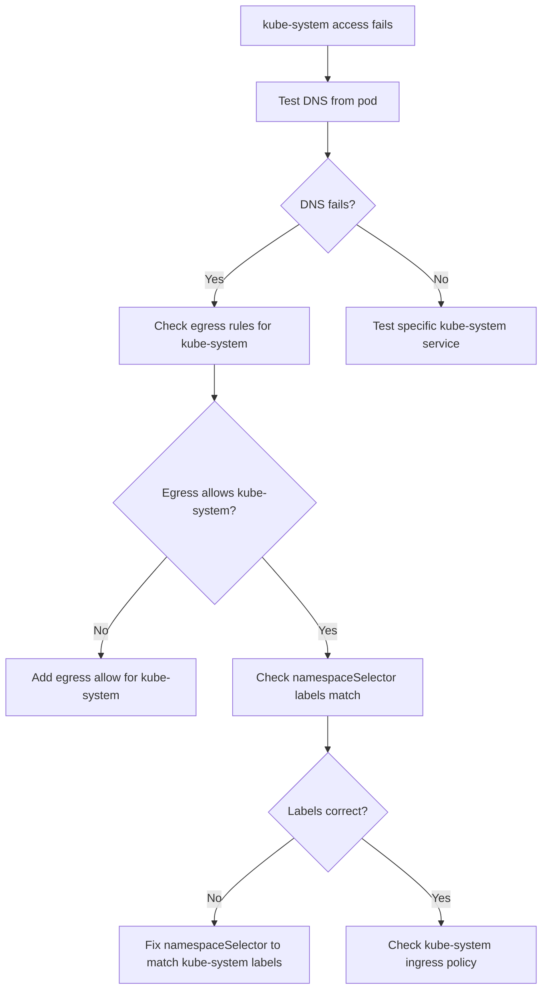

# How to Diagnose kube-system Access Problems with Calico NetworkPolicy

Author: [nawazdhandala](https://github.com/nawazdhandala)

Tags: Calico, Kubernetes, Networking, Troubleshooting

Description: Diagnose why pods cannot access kube-system services like DNS and metrics-server when Calico NetworkPolicies are applied, using namespace selector inspection and traffic tracing.

---

## Introduction

The `kube-system` namespace hosts critical cluster infrastructure including CoreDNS, the metrics server, and Kubernetes system components. When Calico NetworkPolicies apply strict namespace isolation, pods in application namespaces may lose the ability to communicate with these services, breaking DNS resolution, metrics collection, and health check endpoints.

These failures are particularly tricky to diagnose because the symptoms look like application issues: pods reporting unknown hosts, services failing health checks against the metrics server, or readiness probes timing out. The network policy connection is not obvious without examining egress rules in the affected namespace.

This guide provides a systematic approach to diagnosing kube-system access failures specifically caused by Calico NetworkPolicy namespace isolation.

## Symptoms

- Pods in application namespaces cannot resolve DNS names
- `kubectl exec <pod> -- nslookup kubernetes.default` fails or times out
- Metrics collection from kube-system components fails
- `kubectl exec <pod> -- curl http://metrics-server.kube-system.svc/apis/metrics.k8s.io/v1beta1/pods` fails

## Root Causes

- Egress NetworkPolicy in application namespace does not allow traffic to `kube-system`
- Ingress NetworkPolicy in `kube-system` namespace blocks traffic from application namespaces
- GlobalNetworkPolicy default-deny without cross-namespace allow for system services
- `namespaceSelector` in egress rule does not match `kube-system` labels

## Diagnosis Steps

**Step 1: Test DNS from affected pod**

```bash
kubectl exec <pod-name> -n <namespace> -- nslookup kubernetes.default 2>&1
kubectl exec <pod-name> -n <namespace> -- cat /etc/resolv.conf
```

**Step 2: Check kube-system namespace labels**

```bash
kubectl get namespace kube-system --show-labels
# The namespaceSelector in NetworkPolicy must match these labels
```

**Step 3: Check egress policies in affected namespace**

```bash
kubectl get networkpolicy -n <namespace> -o yaml | grep -A 30 "egress:"
```

**Step 4: Check ingress policies in kube-system**

```bash
kubectl get networkpolicy -n kube-system -o yaml
calicoctl get networkpolicy -n kube-system -o yaml
```

**Step 5: Verify CoreDNS pods are reachable**

```bash
COREDNS_IP=$(kubectl get pods -n kube-system -l k8s-app=kube-dns \
  -o jsonpath='{.items[0].status.podIP}')
kubectl exec <pod-name> -n <namespace> -- nc -zv $COREDNS_IP 53 2>&1
kubectl exec <pod-name> -n <namespace> -- \
  nslookup -type=A kubernetes.default $COREDNS_IP 2>&1
```

**Step 6: Check kube-system label for namespace selector**

```bash
# Common label names used in NetworkPolicy namespaceSelectors
kubectl get namespace kube-system -o jsonpath='{.metadata.labels}' | python3 -m json.tool
```



## Solution

After identification, add the correct egress allow rule referencing `kube-system` namespace. See the companion Fix post for detailed remediation steps.

## Prevention

- Label `kube-system` consistently and document labels used in NetworkPolicy selectors
- Include kube-system egress allow in all default namespace policy templates
- Test DNS and metrics-server access after every egress policy change

## Conclusion

Diagnosing kube-system access failures from Calico NetworkPolicies requires checking both egress rules in the application namespace and ingress rules in kube-system. DNS failure is the most common symptom and the quickest way to confirm namespace isolation is blocking kube-system traffic.
