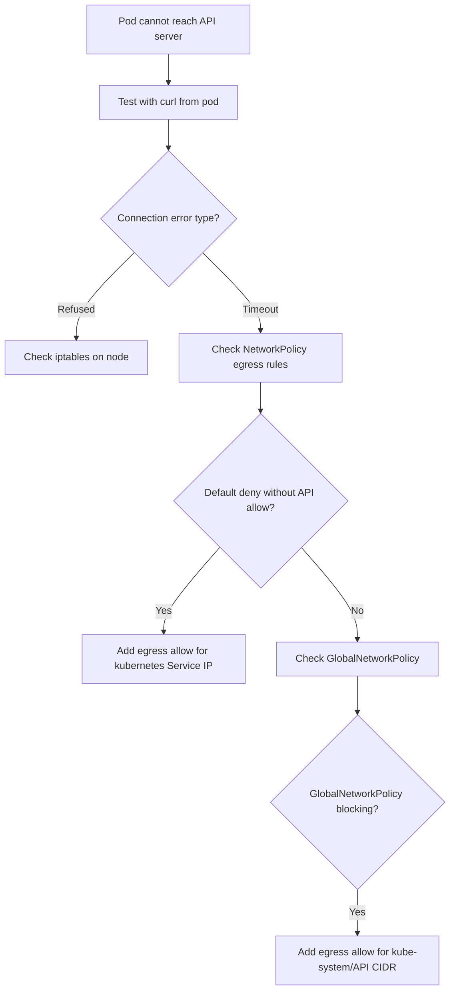

# How to Diagnose Kubernetes API Access Problems with Calico Egress Policy

Author: [nawazdhandala](https://github.com/nawazdhandala)

Tags: Calico, Kubernetes, Networking, Troubleshooting

Description: Diagnose Kubernetes API server access failures caused by Calico egress policies by tracing the traffic path, inspecting NetworkPolicy egress rules, and using Felix logs.

---

## Introduction

Calico egress policies blocking access to the Kubernetes API server are a particularly disruptive failure mode because they prevent pods from interacting with the control plane. Workloads that use the Kubernetes API - including operators, service accounts, init containers, and sidecar proxies - fail silently or with confusing error messages that do not immediately suggest a network policy problem.

The Kubernetes API server is typically accessible at the `kubernetes` Service IP in the `default` namespace (port 443) or directly on the control plane node IPs (port 6443). When a Calico egress policy blocks outbound traffic from pods to these destinations, API calls return connection refused or timeout errors.

Diagnosing this class of problem requires tracing the egress traffic path from the affected pod, inspecting Calico NetworkPolicy and GlobalNetworkPolicy egress rules, and examining Felix logs for policy drop events.

## Symptoms

- Pods return `connection refused` or timeout when calling `kubernetes.default.svc.cluster.local`
- Operators fail with `failed to watch` or `context deadline exceeded` errors
- Service accounts cannot list or watch resources
- `kubectl exec <pod> -- curl -k https://kubernetes.default.svc/api/v1` returns connection error

## Root Causes

- Egress NetworkPolicy in pod's namespace blocks outbound port 443 or 6443
- GlobalNetworkPolicy with default-deny blocks all egress without a Kubernetes API allow rule
- Calico egress gateway policy routing traffic away from the API server
- CIDR-based egress policy inadvertently blocking the service CIDR containing the `kubernetes` Service IP

## Diagnosis Steps

**Step 1: Test API access from the affected pod**

```bash
kubectl exec <pod-name> -- \
  curl -sk https://kubernetes.default.svc.cluster.local/api/v1 \
  --header "Authorization: Bearer $(cat /var/run/secrets/kubernetes.io/serviceaccount/token)" \
  | head -5
```

**Step 2: Check egress NetworkPolicies in the pod's namespace**

```bash
kubectl get networkpolicy -n <namespace> -o yaml \
  | grep -A 30 "egress:"
```

**Step 3: Check GlobalNetworkPolicies**

```bash
calicoctl get globalnetworkpolicy -o yaml | grep -B5 -A 20 "egress"
```

**Step 4: Resolve the kubernetes Service IP**

```bash
KUBE_SVC_IP=$(kubectl get svc kubernetes -o jsonpath='{.spec.clusterIP}')
echo "Kubernetes Service IP: $KUBE_SVC_IP"
# Test direct access
kubectl exec <pod-name> -- nc -zv $KUBE_SVC_IP 443
```

**Step 5: Check Felix logs for drops to API server**

```bash
NODE_POD=$(kubectl get pods -n kube-system -l k8s-app=calico-node \
  --field-selector spec.nodeName=<pod-node> -o name)
kubectl logs $NODE_POD -n kube-system -c calico-node \
  | grep -i "drop\|deny" | grep "$KUBE_SVC_IP" | tail -20
```

**Step 6: Enable policy log to trace the drop**

```bash
calicoctl patch globalnetworkpolicy <policy-name> \
  --patch='{"spec":{"ingress":[{"action":"Log"},{"action":"Pass"}],"egress":[{"action":"Log"},{"action":"Pass"}]}}'
```



## Solution

After diagnosis, apply the appropriate fix (see companion Fix post). The most common solution is adding an egress allow rule for the `kubernetes` Service IP on port 443.

## Prevention

- Always include an egress rule for the Kubernetes API when applying default-deny
- Test operator and service account functionality after any NetworkPolicy change
- Use Calico policy audit mode before enabling default-deny egress policies

## Conclusion

Diagnosing Kubernetes API access failures caused by Calico egress policies requires testing the specific API connection path from the affected pod, inspecting egress NetworkPolicy and GlobalNetworkPolicy rules, and using Felix logs to identify the drop point. The Kubernetes Service IP and port 443 are the key values to verify in egress rules.
