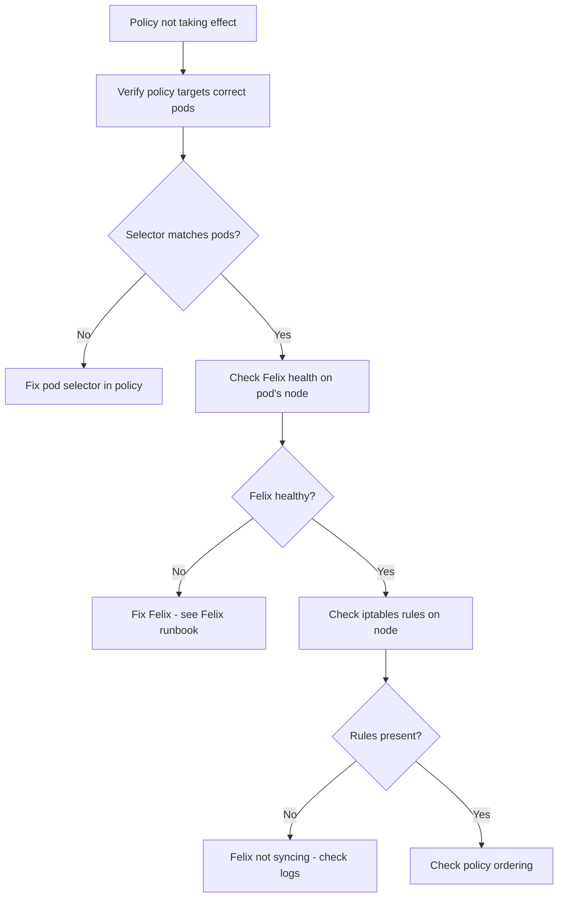

# How to Diagnose Network Policy Not Taking Effect in Calico

Author: [nawazdhandala](https://github.com/nawazdhandala)

Tags: Calico, Kubernetes, Networking, Troubleshooting

Description: Diagnose why Calico NetworkPolicies are not being enforced by examining Felix status, policy sync state, and iptables rule generation.

---

## Introduction

When a Calico NetworkPolicy is applied but traffic continues to flow or be blocked unexpectedly, the policy is not taking effect. This can happen when Felix is not running, the policy is not being synced to the datastore, the pod selector does not match the intended pods, or the policy ordering is not as expected.

Policy not taking effect is particularly insidious because it can mean either: traffic that should be blocked is still flowing (security risk), or traffic that should flow is still blocked (functionality impact). Both require diagnosing why Felix is not applying the expected rules.

## Symptoms

- Network traffic flows between pods that should be blocked by a policy
- Traffic that should be allowed is blocked despite an allow policy being applied
- `kubectl get networkpolicy` shows the policy but it has no effect
- Traffic behavior does not change after applying or deleting a policy

## Root Causes

- Pod label selector in policy does not match the target pods
- Felix is not running or not healthy on the affected node
- Policy is being applied to wrong namespace
- Policy ordering issue: a higher-priority policy overrides the applied one
- calico-node pod restarting and Felix in the process of re-syncing rules
- `policyTypes` field missing from NetworkPolicy

## Diagnosis Steps

**Step 1: Verify the policy exists and targets the right pods**

```bash
kubectl get networkpolicy <policy-name> -n <namespace> -o yaml
kubectl get pods -n <namespace> --show-labels | grep "<selector-label>"
```

**Step 2: Check if Felix is healthy on the pod's node**

```bash
POD_NODE=$(kubectl get pod <pod-name> -n <namespace> -o jsonpath='{.spec.nodeName}')
NODE_POD=$(kubectl get pods -n kube-system -l k8s-app=calico-node \
  --field-selector spec.nodeName=$POD_NODE -o name)
kubectl exec $NODE_POD -n kube-system -- wget -qO- http://localhost:9099/readiness 2>/dev/null
```

**Step 3: Check iptables rules for the policy on the node**

```bash
ssh $POD_NODE "sudo iptables -L | grep -A 5 cali-pi-"
# Look for rules matching your policy name
```

**Step 4: Check policy labels and selectors**

```bash
# Get the pod's labels
kubectl get pod <pod-name> -n <namespace> --show-labels

# Compare with policy selector
kubectl get networkpolicy <policy-name> -n <namespace> \
  -o jsonpath='{.spec.podSelector.matchLabels}'
```

**Step 5: Check Calico policy with calicoctl**

```bash
calicoctl get networkpolicy -n <namespace> <policy-name> -o yaml
# Calico NetworkPolicy may have different ordering than Kubernetes NetworkPolicy
```

**Step 6: Check GlobalNetworkPolicies that might override**

```bash
calicoctl get globalnetworkpolicy -o yaml | grep -E "order:|Allow|Pass|Deny"
```



## Solution

After identifying the specific issue (selector mismatch, Felix health, or ordering), apply the targeted fix from the companion Fix post.

## Prevention

- Test NetworkPolicy with a known allow/block scenario in staging before production
- Use `kubectl describe networkpolicy` to verify selector matches before applying
- Enable Calico policy audit logging to observe traffic decisions

## Conclusion

Diagnosing network policy not taking effect requires checking selector accuracy, Felix health, iptables rule presence, and policy ordering. The selector mismatch is the most common cause and is quickly diagnosed by comparing pod labels against the policy selector.
