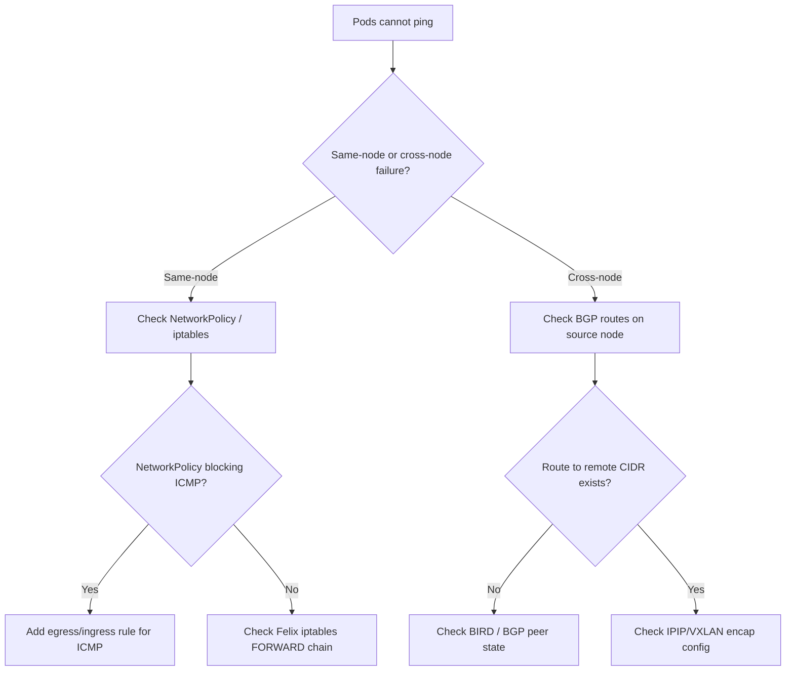

# How to Diagnose Pods That Cannot Ping Each Other with Calico

Author: [nawazdhandala](https://github.com/nawazdhandala)

Tags: Calico, Kubernetes, Networking, Troubleshooting

Description: Step-by-step diagnosis guide for pods that cannot ping each other in a Calico-managed cluster, covering NetworkPolicy inspection, routing table validation, and Felix rule analysis.

---

## Introduction

When pods in a Calico cluster cannot ping each other, the failure may be in one of several layers: network policy blocking ICMP traffic, a BGP routing issue preventing cross-node traffic, iptables rules applied by Felix rejecting packets, or an IP pool misconfiguration causing pods to receive non-routable addresses. The challenge is determining which layer is the actual cause.

The diagnosis is complicated by the fact that pod-to-pod ping may fail for different reasons depending on whether the pods are on the same node or different nodes. Same-node failures typically point to network policy or iptables issues. Cross-node failures are more likely to involve BGP routing, IP-in-IP tunnel misconfiguration, or VXLAN settings.

This guide provides a structured diagnosis that starts with basic connectivity tests and progressively narrows to the specific failure layer.

## Symptoms

- `kubectl exec <pod> -- ping <other-pod-ip>` returns no response or 100% packet loss
- Cross-node pod communication fails but same-node communication works (or vice versa)
- Application requests time out between pods that should be able to communicate
- `kubectl exec <pod> -- traceroute <other-pod-ip>` shows traffic being dropped at the node

## Root Causes

- Calico NetworkPolicy with default-deny blocking ICMP
- BGP routes missing for remote pod CIDR
- IP-in-IP or VXLAN encapsulation misconfigured
- Felix iptables rules incorrectly blocking traffic
- Node-to-node firewall rules blocking overlay traffic (UDP 4789 for VXLAN, protocol 4 for IPIP)

## Diagnosis Steps

**Step 1: Determine if same-node or cross-node**

```bash
# Get pod locations
kubectl get pods -o wide | grep -E "test-pod|your-pods"

# Test same-node (both on node-a)
kubectl exec pod-a -- ping -c 3 <pod-b-same-node-ip>

# Test cross-node
kubectl exec pod-a -- ping -c 3 <pod-c-different-node-ip>
```

**Step 2: Check for NetworkPolicies**

```bash
# List all NetworkPolicies in the namespace
kubectl get networkpolicy -n <namespace>
kubectl describe networkpolicy -n <namespace>

# Check for GlobalNetworkPolicy (Calico-specific)
calicoctl get globalnetworkpolicy -o yaml
```

**Step 3: Test without policy (temporarily)**

```bash
# Create a test pod without any NetworkPolicy applied
kubectl run diag-pod --image=busybox --restart=Never -- sleep 300
kubectl exec diag-pod -- ping -c 3 <target-pod-ip>
```

**Step 4: Check BGP routing for cross-node issues**

```bash
# On the source node - check routes to remote pod CIDR
NODE_A=<source-node>
ssh $NODE_A "ip route show | grep <destination-pod-cidr>"
```

**Step 5: Check Felix iptables rules**

```bash
# On the source node
ssh <node-name> "iptables -L cali-INPUT -n -v | head -30"
ssh <node-name> "iptables -L cali-OUTPUT -n -v | head -30"
```

**Step 6: Check IPIP/VXLAN encapsulation**

```bash
calicoctl get ippool -o yaml | grep -E "ipipMode|vxlanMode|cidr"
```

**Step 7: Check node firewall rules**

```bash
# On the node, verify IPIP traffic is allowed
ssh <node-name> "iptables -L -n | grep -E '4789|tunl|ipip'"
```



## Solution

After identifying the layer causing the failure, apply the targeted fix (see companion Fix post). The most common cause is a default-deny NetworkPolicy blocking ICMP — adding an explicit allow for ICMP typically restores connectivity within seconds.

## Prevention

- Test pod-to-pod connectivity after applying any new NetworkPolicy
- Document expected communication patterns before implementing default-deny
- Use Calico network policy audit mode to understand traffic before blocking it

## Conclusion

Diagnosing pod-to-pod ping failures in Calico requires distinguishing same-node versus cross-node failure patterns and then methodically checking each relevant layer. NetworkPolicy inspection, BGP routing table validation, and Felix iptables rule review cover the majority of failure scenarios.
