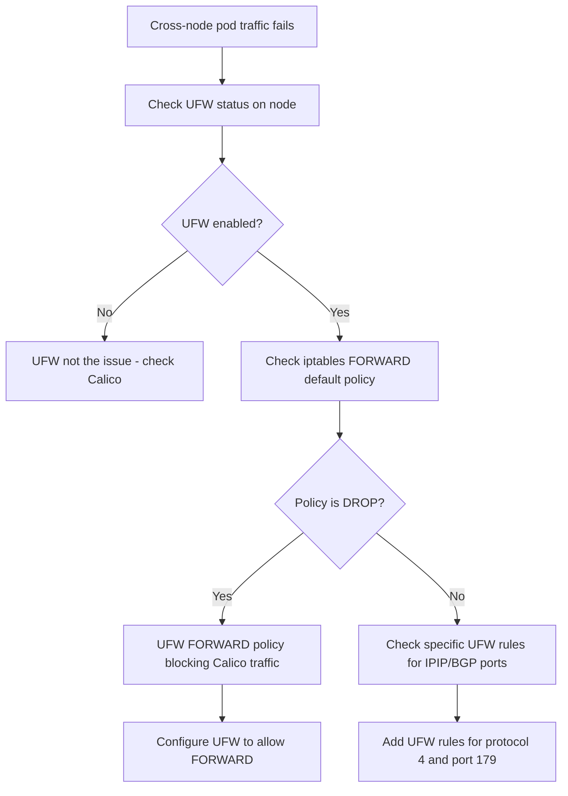

# How to Diagnose UFW Blocking Kubernetes When Using Calico

Author: [nawazdhandala](https://github.com/nawazdhandala)

Tags: Calico, Kubernetes, Networking, Troubleshooting

Description: Diagnose UFW firewall conflicts with Calico and Kubernetes networking by examining iptables rule ordering, UFW policies, and Calico traffic flows.

---

## Introduction

UFW (Uncomplicated Firewall) and Calico both manage iptables rules on Kubernetes nodes, and their interaction can cause subtle but severe networking problems. UFW's default FORWARD policy of DROP conflicts directly with Kubernetes's requirement to forward pod traffic between nodes. When UFW is enabled on a Kubernetes node running Calico, it can silently block inter-pod communication and even prevent CNI traffic from flowing.

The conflict is not always obvious because UFW and Calico each insert rules into different iptables chains. UFW inserts rules early in the INPUT and FORWARD chains, while Calico inserts its rules in custom chains (cali-*) that are jumped to from the standard chains. If UFW's FORWARD DROP rule is evaluated before Calico's FORWARD ACCEPT rule, Calico traffic is blocked.

This guide provides a systematic approach to diagnosing UFW-Calico conflicts.

## Symptoms

- Cross-node pod communication fails after UFW is enabled
- calico-node pods are running but BGP route advertisements are blocked
- `iptables -L FORWARD -n` shows `DROP all` as the default policy
- Calico's encapsulation traffic (IPIP, VXLAN) is blocked at the node level

## Root Causes

- UFW default FORWARD policy is DROP, blocking Calico pod traffic forwarding
- UFW is blocking Calico's IPIP traffic (protocol 4) or VXLAN (UDP 4789)
- UFW INPUT rules blocking BGP port 179 between nodes
- UFW rules added after Calico, overriding Calico's ACCEPT rules

## Diagnosis Steps

**Step 1: Check UFW status**

```bash
# On the affected node
sudo ufw status verbose
```

**Step 2: Check iptables FORWARD chain default policy**

```bash
sudo iptables -L FORWARD -n | head -5
# If policy is DROP: UFW is likely the cause
```

**Step 3: Check if IPIP/VXLAN is blocked**

```bash
# Check for IPIP (protocol 4) accepts
sudo iptables -L -n | grep -E "prot 4|ipip"
# Check for VXLAN (UDP 4789) accepts
sudo iptables -L -n | grep "4789"
```

**Step 4: Check BGP port**

```bash
sudo iptables -L INPUT -n | grep "179"
```

**Step 5: Test inter-node traffic manually**

```bash
# From node-a to node-b
ping -c 3 <node-b-ip>

# Test IPIP: if IPIP is used, try sending encapsulated traffic
# First, check the Calico tunnel interface
ip link show tunl0
ip addr show tunl0
```

**Step 6: Check kernel FORWARD policy**

```bash
sysctl net.ipv4.ip_forward
# Expected: net.ipv4.ip_forward = 1
```



## Solution

After diagnosing the specific UFW conflict, apply the targeted fix (see companion Fix post) to allow Calico traffic while maintaining UFW security posture.

## Prevention

- Evaluate whether UFW is needed when Calico NetworkPolicy handles cluster security
- Configure UFW before installing Calico or test Calico compatibility before enabling UFW
- Document UFW and Calico interaction in node setup runbooks

## Conclusion

Diagnosing UFW-Calico conflicts starts with checking UFW status and the iptables FORWARD chain default policy. A DROP FORWARD policy from UFW is the most common cause. Verify IPIP/VXLAN port allows and BGP port 179 accessibility to cover all potential blocking points.
