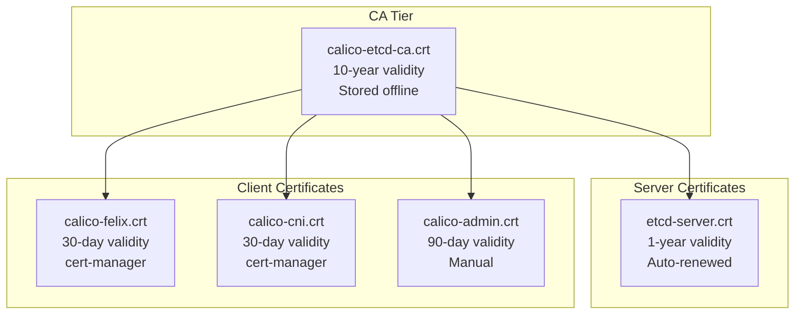

# Document Calico etcd Certificate Generation for Operators

Author: [nawazdhandala](https://github.com/nawazdhandala)

Tags: Calico, Kubernetes, Networking, etcd, TLS, Certificates, Documentation, Operations

Description: A guide to creating comprehensive operational documentation for Calico etcd TLS certificate generation and lifecycle management to support operator workflows.

---

## Introduction

Certificate management documentation is the single most impactful piece of operational knowledge for a Calico etcd deployment. When a certificate expires at 3 AM and pages the on-call engineer, clear documentation is the difference between a 15-minute resolution and a 3-hour outage. When a new team member needs to rotate certificates for the first time, documentation prevents trial-and-error errors in production.

Good certificate documentation covers the PKI architecture, the location and purpose of each certificate, rotation procedures, monitoring configuration, and the command-by-command steps for emergency procedures.

## Prerequisites

- Calico etcd TLS certificates deployed and working
- A documentation system accessible to all operators
- Version control for documentation and certificate configurations

## Documentation Structure

### 1. PKI Architecture Diagram



### 2. Certificate Inventory Table

```markdown
## Certificate Inventory - Last Updated: 2026-03-13

| Name | CN | Purpose | Validity | Renewal | K8s Secret | Expires |
|------|----|---------|----------|---------|-----------|---------|
| CA | calico-etcd-ca | Signs all Calico etcd certs | 10 years | Manual | N/A (offline) | 2036-01-01 |
| etcd server | etcd-server | etcd TLS server auth | 1 year | cert-manager | etcd-server-tls | 2027-01-01 |
| Felix client | calico-felix | Felix etcd auth | 30 days | cert-manager | calico-etcd-certs | Auto |
| CNI client | calico-cni | CNI etcd auth | 30 days | cert-manager | calico-cni-etcd | Auto |
| Admin | calico-admin | calicoctl etcd auth | 90 days | Manual | calico-admin-etcd | 2026-06-01 |
```

### 3. Certificate Generation Procedures

Document each step for generating a new certificate from scratch:

```markdown
## Procedure: Generate New Calico Client Certificate

### Prerequisites
- Access to the CA private key (stored in Vault at secret/calico/etcd-ca-key)
- OpenSSL installed on the ops workstation

### Steps
1. Retrieve CA credentials:
   vault kv get -field=key secret/calico/etcd-ca-key > /tmp/ca.key

2. Generate new client key:
   openssl ecparam -name prime256v1 -genkey -noout -out /tmp/calico-felix-new.key

3. Generate CSR:
   openssl req -new -key /tmp/calico-felix-new.key \
     -out /tmp/calico-felix-new.csr \
     -subj "/CN=calico-felix/O=calico"

4. Sign with CA:
   openssl x509 -req -in /tmp/calico-felix-new.csr \
     -CA calico-etcd-ca.crt -CAkey /tmp/ca.key \
     -out /tmp/calico-felix-new.crt -days 30

5. Verify:
   openssl verify -CAfile calico-etcd-ca.crt /tmp/calico-felix-new.crt

6. Update Kubernetes secret (see rotation runbook)

7. Shred sensitive files:
   shred -u /tmp/ca.key /tmp/calico-felix-new.key
```

### 4. Emergency Rotation Runbook

```markdown
## Emergency Runbook: Certificate Expiry

### Symptoms
- Calico nodes show NotReady
- Felix logs: "x509: certificate has expired"
- Pods stuck in ContainerCreating

### Time to Resolution: ~15 minutes

### Steps
1. Confirm expiry: kubectl get secret calico-etcd-certs -n kube-system \
     -o jsonpath='{.data.etcd-cert}' | base64 -d | openssl x509 -noout -enddate
2. Follow "Generate New Calico Client Certificate" procedure above
3. Apply new secret
4. Restart calico-node DaemonSet
5. Verify: kubectl get pods -n kube-system | grep calico-node
```

## Conclusion

Documenting Calico etcd certificate generation creates operational resilience — the ability to respond quickly and correctly to certificate-related incidents regardless of who is on call. Maintain the certificate inventory table, keep procedures up-to-date in version control, and test the emergency rotation runbook quarterly to ensure it works as documented.
