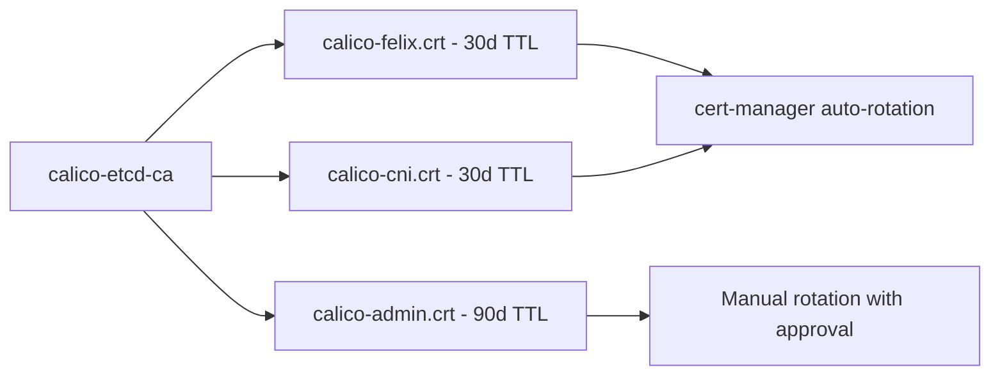

# Document Calico etcd RBAC for Operators

Author: [nawazdhandala](https://github.com/nawazdhandala)

Tags: Calico, Kubernetes, Networking, etcd, RBAC, Documentation, Operations

Description: How to create and maintain operational documentation for Calico etcd RBAC configurations, including role inventories, credential management procedures, and incident runbooks.

---

## Introduction

etcd RBAC configurations for Calico are complex enough that without documentation, even experienced operators can make mistakes during incidents or maintenance windows. Which component uses which certificate? What paths does each role grant access to? Who approved a specific role configuration and why? These questions need clear answers in your operational documentation.

Documentation for Calico etcd RBAC serves multiple audiences: security teams auditing access controls, platform engineers maintaining the infrastructure, and on-call engineers responding to incidents. Each audience needs different information presented in an accessible format.

## Prerequisites

- Calico etcd RBAC configured and operational
- Access to etcdctl for exporting current configuration
- A documentation system (Git repository, wiki, or similar)

## What to Document

### 1. Role and Permission Inventory

Export and store current role definitions:

```bash
#!/bin/bash
# export-etcd-rbac.sh

OUTPUT_DIR="docs/etcd-rbac/$(date +%Y-%m-%d)"
mkdir -p "$OUTPUT_DIR"

for role in calico-felix calico-cni calico-admin; do
  etcdctl --endpoints=https://etcd:2379 \
    --cacert=/etc/etcd/ca.crt \
    --cert=/etc/etcd/root.crt \
    --key=/etc/etcd/root.key \
    role get "$role" > "$OUTPUT_DIR/${role}.txt"
done

echo "Exported to $OUTPUT_DIR"
```

Maintain a human-readable table:

| Role | User | Paths (Read) | Paths (Write) | Last Reviewed |
|------|------|-------------|---------------|---------------|
| `calico-felix` | `calico-felix` | `/calico/v1/policy/`, `/calico/v1/config/` | `/calico/v1/host/`, `/calico/felix/v1/` | 2026-01-15 |
| `calico-cni` | `calico-cni` | `/calico/v1/config/`, `/calico/v1/policy/` | `/calico/v1/ipam/`, `/calico/v1/host/` | 2026-01-15 |

### 2. Certificate Inventory

```markdown
## Calico etcd Client Certificates

| Component | CN | Issuer | Expiry | Rotation Date | Owner |
|-----------|-----|--------|--------|---------------|-------|
| Felix | calico-felix | calico-etcd-ca | 2026-07-15 | Auto via cert-manager | Platform |
| CNI | calico-cni | calico-etcd-ca | 2026-07-15 | Auto via cert-manager | Platform |
```



### 3. Emergency Certificate Rotation Runbook

```markdown
## Runbook: Emergency etcd Certificate Rotation

### Trigger
Suspected certificate compromise or expiry-related Calico failure

### Steps
1. Identify the affected component:
   kubectl logs -n kube-system ds/calico-node | grep "authentication failed"

2. Generate a new certificate:
   ./scripts/rotate-calico-cert.sh calico-felix

3. Update the Kubernetes secret:
   kubectl create secret generic calico-etcd-secrets -n kube-system \
     --from-file=etcd-key=felix-etcd.key \
     --from-file=etcd-cert=felix-etcd.crt \
     --from-file=etcd-ca=ca.crt \
     --dry-run=client -o yaml | kubectl apply -f -

4. Restart the affected component:
   kubectl rollout restart ds/calico-node -n kube-system

5. Verify recovery:
   kubectl logs -n kube-system ds/calico-node --tail=50

6. Invalidate the old certificate if compromised:
   # Revoke old cert via your PKI
```

## Quarterly Review Checklist

```markdown
## Quarterly RBAC Review

- [ ] Export and diff role permissions against last review
- [ ] Check certificate expiry dates for all Calico components
- [ ] Verify no extra roles have been assigned to component users
- [ ] Review etcd audit logs for unexpected access patterns
- [ ] Test permission denied scenarios still work correctly
- [ ] Update this document with any changes and new review date
```

## Conclusion

Documenting Calico etcd RBAC is an investment that pays dividends during incidents, audits, and team transitions. A current role inventory, certificate tracking table, rotation runbooks, and regular review checklists together provide the operational scaffolding needed to maintain a secure and reliable etcd access control configuration over time.
