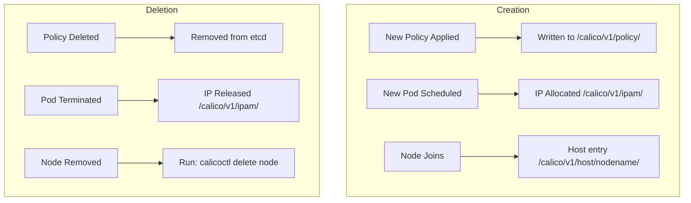

# Document Calico etcdv3 Paths for Operators

Author: [nawazdhandala](https://github.com/nawazdhandala)

Tags: Calico, Kubernetes, Networking, etcd, etcdv3, Documentation, Operations

Description: How to document Calico etcdv3 path structure, data ownership, and maintenance procedures to support operations teams managing Calico's etcd datastore.

---

## Introduction

The etcdv3 path structure that Calico uses is not widely documented outside of Calico's source code. Operators who need to configure RBAC, perform data recovery, set up monitoring, or troubleshoot datastore issues benefit significantly from having clear internal documentation of what data lives where and which components are responsible for it.

Good etcdv3 path documentation enables operators to write correct RBAC configurations, understand the impact of etcd data loss, build targeted backup strategies, and debug policy propagation issues by knowing exactly where to look in the datastore.

## Prerequisites

- Calico using etcd datastore
- Access to export current etcd path structure
- A documentation system for the team

## Documentation Component 1: Path Reference Table

Maintain a comprehensive reference table:

```markdown
## Calico etcdv3 Path Reference

| Path Prefix | Contents | Written By | Read By | RBAC Role |
|-------------|----------|-----------|---------|-----------|
| `/calico/v1/policy/tier/` | Network policies and tiers | calicoctl, API server | Felix | calico-admin |
| `/calico/v1/policy/profile/` | Calico profiles | calicoctl, API server | Felix | calico-admin |
| `/calico/v1/host/<node>/` | Node registration, workloads | Felix, CNI | Felix | calico-felix, calico-cni |
| `/calico/v1/ipam/v2/` | IP address allocations | CNI plugin | CNI plugin | calico-cni |
| `/calico/v1/config/` | Global Felix configuration | calicoctl, operator | Felix, CNI | calico-admin |
| `/calico/felix/v1/` | Per-node Felix status | Felix | Felix | calico-felix |
| `/calico/bgp/v1/` | BGP peer configuration | calicoctl | BGP daemon | calico-admin |
```

## Documentation Component 2: Data Lifecycle



## Documentation Component 3: Backup and Recovery Procedure

```markdown
## Calico etcd Backup Procedure

### Frequency: Daily automated + before any Calico upgrades

### Full Backup
# Export all Calico data via calicoctl (preferred)
calicoctl datastore migrate export > calico-backup-$(date +%Y%m%d).yaml

# Raw etcd backup
etcdctl snapshot save calico-etcd-$(date +%Y%m%d).db

### Restore Procedure
1. Restore etcd snapshot to a healthy etcd instance
2. Or restore via calicoctl:
   calicoctl datastore migrate import -f calico-backup-20260313.yaml
3. Verify: calicoctl get nodes && calicoctl get networkpolicies --all-namespaces
```

## Documentation Component 4: Monitoring Queries

```markdown
## Key Monitoring Queries for etcdv3 Paths

### Check data freshness
etcdctl get /calico/felix/v1/host/<nodename>/last_updated

### Count total Calico keys
etcdctl get /calico/ --prefix --keys-only | wc -l

### Check IPAM utilization
calicoctl ipam show

### Check for stale node entries
for h in $(etcdctl get /calico/v1/host/ --prefix --keys-only | awk -F/ '{print $5}' | sort -u); do
  kubectl get node $h &>/dev/null || echo "Stale: $h"
done
```

## Documentation Component 5: Change Management Notes

Document every structural change to etcd path usage:

```markdown
## etcdv3 Path Change Log

### 2026-01-15 - Calico v3.27 upgrade
- New path: /calico/v1/policy/globalnetworksets/ added for GlobalNetworkSet resources
- Deprecated path: /calico/v1/netset/ - migrated automatically by upgrade

### 2025-06-01 - Added IPAM secondary pool
- New IPAM block range added: 172.20.0.0/16
- New entries appear under /calico/v1/ipam/v2/host/*/ipv4/block/172.20.*/
```

## Conclusion

Documenting Calico etcdv3 paths provides the operational foundation for everything from RBAC configuration to incident response. A comprehensive path reference table, data lifecycle diagrams, backup and recovery procedures, and a change log together give operators the knowledge they need to manage Calico's etcd datastore confidently. Store this documentation in version control alongside your RBAC configurations and certificate management procedures.
