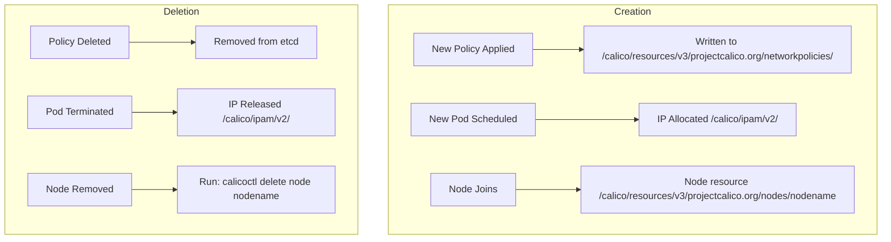

# Document Calico etcdv3 Paths for Operators

Author: [nawazdhandala](https://github.com/nawazdhandala)

Tags: Calico, Kubernetes, Networking, etcd, etcdv3, Documentation, Operation

Description: How to document Calico etcdv3 path structure, data ownership, and maintenance procedures to support operations teams managing Calico's etcd datastore.

---

## Introduction

The etcdv3 path structure that Calico uses is not widely documented outside of Calico's source code. Operators who need to configure RBAC, perform data recovery, set up monitoring, or troubleshoot datastore issues benefit significantly from having clear internal documentation of what data lives where and which components are responsible for it.

Good etcdv3 path documentation enables operators to write correct RBAC configurations, understand the impact of etcd data loss, build targeted backup strategies, and debug policy propagation issues by knowing exactly where to look in the datastore.

## Prerequisites

- Calico using etcd datastore
- Access to export current etcd path structure
- A documentation system for the team

## Documentation Component 1: Path Reference Table

Maintain a comprehensive reference table:

```markdown
## Calico etcdv3 Path Reference

| Path Prefix | Contents | Written By | Read By | RBAC Role |
|-------------|----------|-----------|---------|-----------|
| `/calico/resources/v3/projectcalico.org/tiers/` | Calico tiers | calicoctl, API server | Felix | calico-admin |
| `/calico/resources/v3/projectcalico.org/networkpolicies/<namespace>/` | Namespaced Calico network policies | calicoctl, API server | Felix | calico-admin |
| `/calico/resources/v3/projectcalico.org/globalnetworkpolicies/` | Global Calico network policies | calicoctl, API server | Felix | calico-admin |
| `/calico/resources/v3/projectcalico.org/profiles/` | Calico profiles | calicoctl, API server | Felix | calico-admin |
| `/calico/resources/v3/projectcalico.org/nodes/<node>` | Node resources | calico/node, calicoctl, API server | Felix, BGP daemon | calico-felix |
| `/calico/resources/v3/projectcalico.org/workloadendpoints/<namespace>/` | Workload endpoints | CNI plugin, calico/node | Felix | calico-cni, calico-felix |
| `/calico/ipam/v2/` | IPAM blocks, handles, affinities, and IPAM configuration | CNI plugin, calico/node | CNI plugin, calico/node | calico-cni |
| `/calico/resources/v3/projectcalico.org/felixconfigurations/` | Felix configuration resources | calicoctl, operator, API server | Felix | calico-admin |
| `/calico/felix/v1/host/<node>/endpoint/` | Host endpoint status | Felix | Felix | calico-felix |
| `/calico/felix/v2/<region>/host/<node>/` | Felix status reports and workload endpoint status | Felix | Felix | calico-felix |
| `/calico/resources/v3/projectcalico.org/bgppeers/` | BGP peer resources | calicoctl, API server | BGP daemon | calico-admin |
| `/calico/resources/v3/projectcalico.org/bgpconfigurations/` | BGP configuration resources | calicoctl, API server | BGP daemon | calico-admin |
```

## Documentation Component 2: Data Lifecycle


```mermaid
graph TD
    subgraph Creation
        A[New Policy Applied] --> B[Written to /calico/resources/v3/projectcalico.org/networkpolicies/]
        C[New Pod Scheduled] --> D[IP Allocated /calico/ipam/v2/]
        E[Node Joins] --> F[Node resource /calico/resources/v3/projectcalico.org/nodes/nodename]
    end
    subgraph Deletion
        G[Policy Deleted] --> H[Removed from etcd]
        I[Pod Terminated] --> J[IP Released /calico/ipam/v2/]
        K[Node Removed] --> L[Run: calicoctl delete node nodename]
    end
```

## Documentation Component 3: Backup and Recovery Procedure

```markdown
## Calico etcd Backup Procedure

### Frequency: Daily automated + before any Calico upgrades

### Full Backup
# Export all Calico data via calicoctl (preferred)

calicoctl datastore migrate export > calico-backup-$(date +%Y%m%d).yaml

# Raw etcd backup
etcdctl snapshot save calico-etcd-$(date +%Y%m%d).db

### Restore Procedure
1. Restore etcd snapshot to a healthy etcd instance
2. Or restore via calicoctl:
   calicoctl datastore migrate import -f calico-backup-20260313.yaml
3. Verify: calicoctl get nodes && calicoctl get networkpolicies --all-namespaces
```

## Documentation Component 4: Monitoring Queries

```markdown
## Key Monitoring Queries for etcdv3 Paths

### Check data freshness
etcdctl get /calico/felix/v2/<region>/host/<nodename>/last_reported_status

### Count total Calico keys
etcdctl get /calico/ --prefix --keys-only | wc -l

### Check IPAM utilization
calicoctl ipam show

### Check for stale node entries
for h in $(etcdctl get /calico/resources/v3/projectcalico.org/nodes/ --prefix --keys-only | awk -F/ '{print $7}' | sort -u); do
  kubectl get node $h &>/dev/null || echo "Stale: $h"
done
```

## Documentation Component 5: Change Management Notes

Document every structural change to etcd path usage:

```markdown
## etcdv3 Path Change Log

### 2026-01-15 - Calico v3.27 upgrade
- New path: /calico/resources/v3/projectcalico.org/globalnetworksets/ added for GlobalNetworkSet resources
- Deprecated path: /calico/v1/netset/ - replaced by /calico/resources/v3/projectcalico.org/networksets/ after v3 resource migration

### 2025-06-01 - Added IPAM secondary pool
- New IPAM block range added: 172.20.0.0/16
- New entries appear under /calico/ipam/v2/assignment/ipv4/block/172.20.* and /calico/ipam/v2/host/*/
```

## Conclusion

Documenting Calico etcdv3 paths provides the operational foundation for everything from RBAC configuration to incident response. A comprehensive path reference table, data lifecycle diagrams, backup and recovery procedures, and a change log together give operators the knowledge they need to manage Calico's etcd datastore confidently. Store this documentation in version control alongside your RBAC configurations and certificate management procedures.
