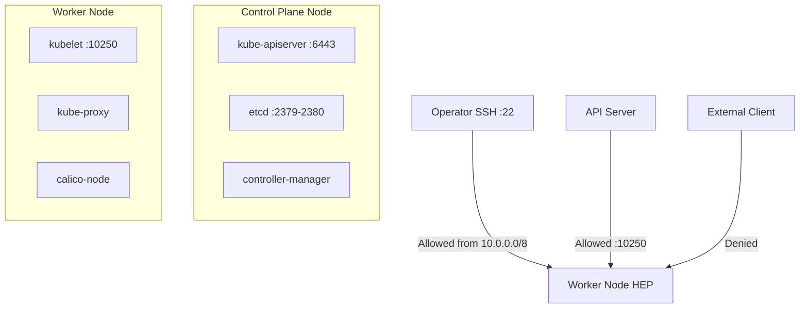

# Document Calico Host Endpoint Security for Operators

Author: [nawazdhandala](https://github.com/nawazdhandala)

Tags: Calico, Kubernetes, Networking, Security, Host Endpoint, Documentation, Operations

Description: A guide to creating effective operational documentation for Calico host endpoint security configurations, including runbooks, policy inventories, and change management procedures.

---

## Introduction

Well-designed host endpoint security policies are only as effective as the documentation that supports them. Operations teams need clear runbooks to respond to incidents, policy inventories to understand what is enforced, and change management procedures to safely evolve the security configuration over time.

Without good documentation, on-call engineers may make hasty changes during an outage that weaken security, and new team members will struggle to understand why policies are structured the way they are. Documentation also serves as the foundation for security audits and compliance reviews, proving that your cluster's network security posture is intentional and controlled.

This guide covers what to document, how to structure it, and tools that can help automate documentation for Calico host endpoint security.

## Prerequisites

- Calico host endpoints deployed in production
- An internal documentation system (wiki, Git repository, or similar)
- Access to `calicoctl` for policy export
- Team processes for change management

## What to Document

### 1. Policy Inventory

Maintain a living inventory of all GlobalNetworkPolicy and HostEndpoint resources:

```bash
# Export all policies to YAML for version control
calicoctl get globalnetworkpolicies -o yaml > policies/host-endpoint-policies.yaml
calicoctl get hostendpoints -o yaml > policies/host-endpoints.yaml

# Commit to Git
git add policies/
git commit -m "docs: export current host endpoint security policies"
```

### 2. Traffic Flow Diagram



### 3. Policy Decision Log

Document the rationale for each policy:

```markdown
## Policy: allow-ssh-restricted
- **Purpose**: Allow SSH access to worker nodes from management network only
- **Selector**: `has(node)`
- **Allowed sources**: 10.0.0.0/8 (internal management network)
- **Date added**: 2026-01-15
- **Owner**: Platform Security Team
- **Review date**: 2026-07-15
- **Justification**: Required for emergency node-level troubleshooting by SRE team
```

## Runbook Template

### Runbook: Host Endpoint Policy Rollback

```markdown
## Trigger
Node becomes unreachable after applying new host endpoint policy

## Steps
1. Connect via cloud console or out-of-band access
2. Identify recently applied policy:
   calicoctl get globalnetworkpolicies --sort-by=metadata.creationTimestamp
3. Delete the offending policy:
   calicoctl delete globalnetworkpolicy <name>
4. Verify connectivity restored
5. Review policy and add missing allow rules before reapplying
6. Post-mortem: document what traffic was blocked
```

## Change Management Procedure

Every policy change should follow a staged process:


## Automated Documentation

Use a CI pipeline to keep policy documentation current:

```yaml
# .github/workflows/export-calico-policies.yaml
name: Export Calico Policies
on:
  schedule:
    - cron: "0 2 * * *"
jobs:
  export:
    runs-on: ubuntu-latest
    steps:
      - uses: actions/checkout@v3
      - name: Export policies
        run: |
          calicoctl get globalnetworkpolicies -o yaml > docs/policies/host-endpoint.yaml
          calicoctl get hostendpoints -o yaml > docs/policies/hostendpoints.yaml
      - name: Commit changes
        run: |
          git add docs/policies/
          git commit -m "chore: auto-export Calico policies"
          git push
```

## Conclusion

Documenting Calico host endpoint security policies is as important as implementing them. A policy inventory in version control, clear traffic flow diagrams, decision logs with rationale, and tested runbooks for rollbacks give your operations team the context they need to manage security confidently. Automation ensures documentation stays in sync with actual cluster state, reducing the risk of documentation drift.
