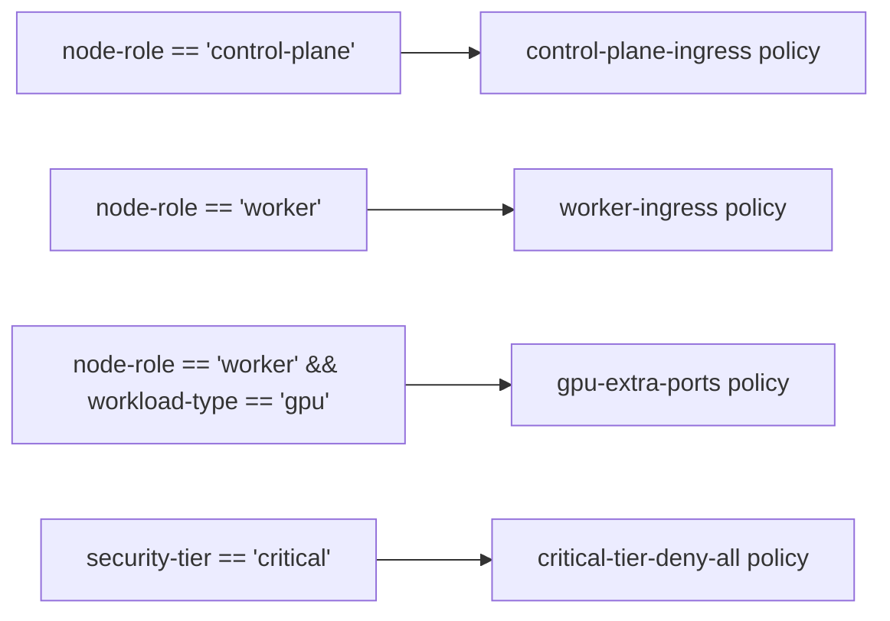

# Document Calico Host Endpoint Selectors for Operators

Author: [nawazdhandala](https://github.com/nawazdhandala)

Tags: Calico, Kubernetes, Networking, Host Endpoint, Selectors, Documentation, Operations

Description: A guide to documenting Calico host endpoint selector configurations so operators can understand, maintain, and safely modify the label-based policy targeting model.

---

## Introduction

Calico host endpoint selector documentation bridges the gap between the label schema applied to nodes and the policies that depend on those labels. Without clear documentation, operators modifying node labels for unrelated purposes — such as changing a deployment tier or adding a cloud-provider annotation — may inadvertently change which security policies apply to those nodes.

Good selector documentation explains the label taxonomy, maps labels to policies, and provides guidance for operators making changes. It should be stored alongside the policy definitions in version control and referenced in runbooks and change management procedures.

## Prerequisites

- Calico host endpoints with label-based policies in production
- A Git repository for infrastructure-as-code
- Documentation tooling (wiki, mkdocs, or similar)

## What to Document

### 1. Label Taxonomy

Define every label used by Calico selectors and its allowed values:

```markdown
## Calico Host Endpoint Label Schema

### node-role
- **Purpose**: Identifies the functional role of the node
- **Values**: `control-plane`, `worker`, `storage`, `monitoring`
- **Required**: Yes on all nodes
- **Owner**: Platform Team
- **Impact if changed**: Triggers GlobalNetworkPolicy selector re-evaluation

### security-tier
- **Purpose**: Security policy tier for the node
- **Values**: `critical`, `standard`, `isolated`
- **Required**: Yes
- **Impact if changed**: Changes which port restrictions apply
```

### 2. Policy-to-Label Mapping



Maintain this as a table in your documentation:

| Policy Name | Selector | Allowed Ports | Owner |
|-------------|----------|---------------|-------|
| `control-plane-ingress` | `node-role == 'control-plane'` | 6443, 2379, 2380 | Platform |
| `worker-ingress` | `node-role == 'worker'` | 10250, 30000-32767 | Platform |
| `ssh-management` | `has(node-role)` | 22 from 10.0.0.0/8 | Security |

### 3. Label Change Runbook

```markdown
## Runbook: Changing a Node Label Used by Calico Selectors

### Before Changing
1. Identify all policies that reference the label being changed:
   ```
   grep -r "node-role" policies/
   ```
2. Determine which nodes will be affected:
   ```
   calicoctl get hep --selector="node-role == 'old-value'" -o wide
   ```
3. Get approval from the Security and Platform teams

### Making the Change
1. Apply label change to one node first
2. Verify connectivity is maintained for 5 minutes
3. Check Felix policy count matches expected
4. Roll out to remaining nodes in batches

### After Changing
1. Update the Label Taxonomy documentation
2. Run validation tests
3. Commit updated documentation to Git
```

## Version-Controlled Policy Export

```bash
#!/bin/bash
# export-hep-docs.sh - Run weekly via CI

OUTDIR="docs/calico/host-endpoints/$(date +%Y-%m-%d)"
mkdir -p "$OUTDIR"

calicoctl get hostendpoints -o yaml > "$OUTDIR/hostendpoints.yaml"
calicoctl get globalnetworkpolicies -o yaml > "$OUTDIR/policies.yaml"

# Generate selector summary
calicoctl get globalnetworkpolicies -o json | \
  python3 -c "
import json, sys
data = json.load(sys.stdin)
for p in data['items']:
    print(p['metadata']['name'], '->', p['spec'].get('selector', 'none'))
" > "$OUTDIR/selector-summary.txt"

echo "Documentation exported to $OUTDIR"
```

## Conclusion

Documenting Calico host endpoint selectors means maintaining a clear label taxonomy, a policy-to-label mapping table, and runbooks that guide operators through safe label changes. Store everything in version control alongside your policy YAML files. The investment in documentation pays dividends every time an operator needs to modify a node label or understand why a specific policy is — or isn't — being enforced on a particular node.
