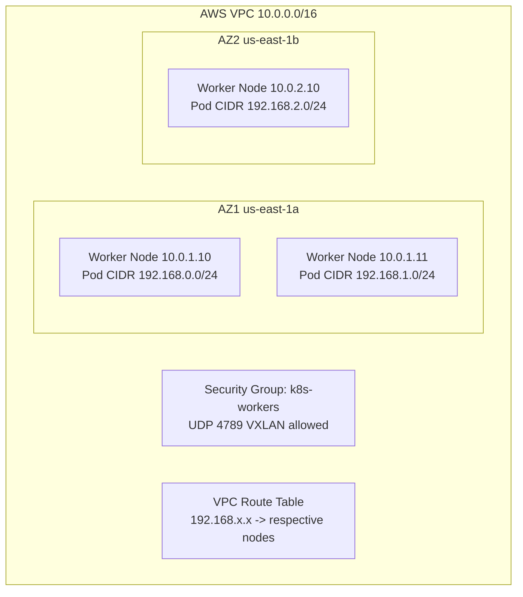

# Document Calico Networking on AWS for Operators

Author: [nawazdhandala](https://github.com/nawazdhandala)

Tags: Calico, Kubernetes, Networking, AWS, Cloud, Documentation, Operations

Description: How to create operational documentation for Calico networking on AWS, covering architecture diagrams, IP addressing plans, runbooks, and change management procedures.

---

## Introduction

Calico networking on AWS involves multiple interdependent systems — Calico IP pools, VPC CIDR ranges, security groups, route tables, and IAM roles. Without clear documentation, operators may make changes to one system without understanding the impact on others. A new team member deploying a node in a new AZ may not know they need to disable source/destination check, or may not understand which security group rules are required for VXLAN.

Good documentation captures the decisions made when designing the network, the current state of all relevant AWS and Calico resources, and the procedures needed to safely make changes or respond to incidents.

## Prerequisites

- Calico networking on AWS in a stable, working state
- Access to AWS and Calico configuration for documentation
- A documentation system (Git repository, wiki, or similar)

## Documentation Component 1: Architecture Overview



## Documentation Component 2: IP Addressing Plan

```markdown
## IP Addressing Plan - AWS Kubernetes Cluster

### VPC CIDR
- **VPC**: 10.0.0.0/16
- **Worker Subnet AZ1**: 10.0.1.0/24
- **Worker Subnet AZ2**: 10.0.2.0/24
- **Control Plane Subnet**: 10.0.0.0/24

### Calico Pod Network
- **IP Pool**: 192.168.0.0/16
- **Block Size**: /24 (256 IPs per node)
- **Encapsulation**: CrossSubnet (VXLAN within AZ, encap across AZ)
- **Max Nodes Supported**: 256 (with /16 pool and /24 blocks)

### Reserved Ranges
- **Kubernetes Service CIDR**: 10.96.0.0/12
- **DNS Service IP**: 10.96.0.10
```

## Documentation Component 3: AWS Resource Inventory

```markdown
## AWS Resource Inventory - Calico Dependencies

| Resource Type | ID | Purpose |
|--------------|-----|---------|
| VPC | vpc-0123456789 | Cluster VPC |
| Security Group | sg-workers | Worker node security group |
| Route Table | rtb-0123456789 | Worker subnet routes |
| IAM Role | k8s-node-role | EC2 instance role |

### Security Group Rules (sg-workers)
| Protocol | Port | Source | Purpose |
|---------|------|--------|---------|
| UDP | 4789 | sg-workers | VXLAN encapsulation |
| Protocol 4 | - | sg-workers | IP-in-IP (backup) |
| TCP | 10250 | sg-control-plane | Kubelet |
```

## Documentation Component 4: Runbooks

```markdown
## Runbook: Add New Node in New AZ

1. Provision EC2 instance in the new AZ subnet
2. Disable source/destination check:
   aws ec2 modify-instance-attribute --instance-id i-NEW --no-source-dest-check
3. Verify security group attachment includes sg-workers
4. Join node to Kubernetes cluster
5. Verify Calico assigns IPAM block:
   calicoctl ipam show --show-blocks | grep new-node-name
6. Test cross-AZ connectivity from new node to existing nodes

## Runbook: Security Group Change

1. Review impact with Security team
2. Test in non-production cluster first
3. Apply to one worker instance and verify Calico traffic still works
4. Roll out to all instances
5. Update this documentation
```

## Documentation Component 5: Troubleshooting Reference

```markdown
## Quick Reference: Common AWS Calico Issues

| Symptom | Likely Cause | Quick Fix |
|---------|-------------|-----------|
| Cross-AZ ping fails | Source/dest check enabled | Disable on affected instance |
| Pods can't communicate | Security group missing VXLAN rule | Add UDP 4789 rule |
| Pods can't reach internet | NAT gateway missing or route table | Check VPC routes |
| IP allocation fails | IP pool exhausted | Expand Calico IP pool |
```

## Conclusion

Documenting Calico networking on AWS creates a shared understanding of the architecture across the team and provides the reference material needed for safe changes and rapid incident resolution. Keep the architecture diagram, IP addressing plan, and AWS resource inventory up-to-date whenever changes are made, and test the runbooks quarterly to ensure they remain accurate.
