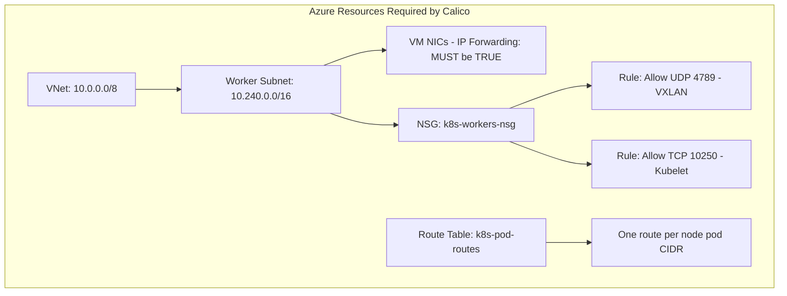

# Document Calico Networking on Azure for Operators

Author: [nawazdhandala](https://github.com/nawazdhandala)

Tags: Calico, Kubernetes, Networking, Azure, Cloud, Documentation, Operations

Description: How to create operational documentation for Calico networking on Azure, covering architecture, Azure resource dependencies, runbooks, and change management for VNet-integrated Kubernetes clusters.

---

## Introduction

Calico networking on Azure has a tighter coupling with Azure platform resources than most other Calico deployments. IP Forwarding settings on VM NICs, NSG rules, Azure route tables, and VNet CIDR assignments all directly affect whether Calico can function. When operators are on call and pods stop communicating, they need documentation that clearly shows all the Azure dependencies and how to quickly verify and restore them.

Good Azure Calico documentation serves as a quick reference during incidents and a guide for provisioning new nodes. It should be accessible to operators who are proficient in Kubernetes but may be less familiar with Azure networking specifics.

## Prerequisites

- Calico networking on Azure in a working state
- Documentation system accessible to the team
- Azure CLI and kubectl for generating current-state exports

## Documentation Component 1: Azure Dependency Map



## Documentation Component 2: IP Addressing Reference

```markdown
## Kubernetes Cluster on Azure - IP Addressing

| Component | CIDR / Value | Notes |
|-----------|-------------|-------|
| Azure VNet | 10.0.0.0/8 | Total cluster VNet |
| Worker Subnet | 10.240.0.0/16 | Worker node IPs |
| Control Plane Subnet | 10.241.0.0/24 | Control plane nodes |
| Calico Pod Pool | 192.168.0.0/16 | Pod IP space |
| Pod Block Size | /24 | 256 IPs per node |
| Service CIDR | 10.96.0.0/12 | Kubernetes services |
| Max Nodes | 256 | (65536 IPs / 256 per block) |

### Encapsulation Mode
- **Mode**: VXLAN Always
- **Reason**: Azure VNet doesn't natively route pod CIDRs without route table entries
- **Alternative**: Native routing via Route Table (see optimization guide)
```

## Documentation Component 3: Node Provisioning Checklist

```markdown
## New Node Provisioning Checklist (Azure)

### Before adding to Kubernetes
- [ ] VM created in correct subnet (10.240.0.0/16)
- [ ] VM size supports Accelerated Networking (D/E/F series)
- [ ] IP Forwarding enabled on primary NIC:
      az network nic update --ids <NIC_ID> --ip-forwarding true
- [ ] NSG k8s-workers-nsg attached to NIC
- [ ] Verify accelerated networking enabled (optional but recommended):
      az vm show -g k8s-rg -n <vm-name> --query "networkProfile"

### After joining Kubernetes
- [ ] Node appears in: kubectl get nodes
- [ ] Calico assigns IPAM block: calicoctl ipam show --show-blocks
- [ ] Test pod-to-pod connectivity from new node
- [ ] If using native routing: add route for new node's pod CIDR to route table
```

## Documentation Component 4: Incident Response Runbook

```markdown
## Incident: Pods Cannot Communicate Across Nodes on Azure

### Assessment (< 5 minutes)
1. kubectl exec test-pod -- ping <other-node-pod-ip>
2. If fails: proceed to root cause steps

### Root Cause Investigation
1. Check IP Forwarding:
   az network nic show --ids <NIC_ID> --query enableIPForwarding
   Fix: az network nic update --ids <NIC_ID> --ip-forwarding true

2. Check NSG allows VXLAN:
   az network nsg rule list -g k8s-rg --nsg-name k8s-workers-nsg -o table | grep 4789

3. Check Calico pods running:
   kubectl get pods -n calico-system

4. Check Felix logs for errors:
   kubectl logs -n calico-system ds/calico-node --tail=100 | grep ERROR

### Escalation
If not resolved in 30 minutes, escalate to Azure networking team and Calico platform team.
```

## Conclusion

Azure Calico documentation must prominently feature Azure-specific configuration requirements that don't exist in other environments - IP Forwarding, NSG VXLAN rules, and route table management. A clear dependency map, provisioning checklist, and incident response runbook collectively reduce the mean time to resolution for Azure-specific Calico failures and ensure new team members can confidently provision and maintain cluster nodes.
