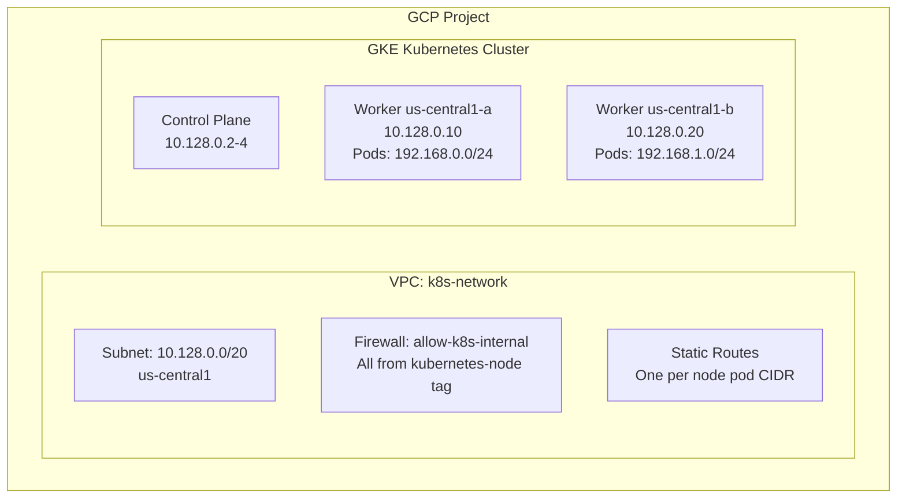

# Document Calico Networking on GCE for Operators

Author: [nawazdhandala](https://github.com/nawazdhandala)

Tags: Calico, Kubernetes, Networking, GCE, Google Cloud, Documentation, Operations

Description: How to create operational documentation for Calico networking on GCE, covering VPC route management, firewall dependency maps, and runbooks for GCE-specific Kubernetes cluster operations.

---

## Introduction

Calico on GCE has unique operational documentation requirements compared to other cloud providers. The VPC static routes that enable native routing must be maintained in sync with Calico's IPAM block assignments - a relationship that isn't obvious to operators unfamiliar with how Calico allocates IP blocks. Clear documentation of this relationship, combined with runbooks for adding nodes and responding to connectivity incidents, prevents common operational mistakes.

Documentation for GCE Calico should be accessible to operators who may be experienced Kubernetes administrators but less familiar with GCP networking specifics.

## Prerequisites

- Calico networking on GCE in a working state
- A documentation system for the team
- `gcloud` and `calicoctl` access

## Documentation Component 1: GCE Networking Architecture



## Documentation Component 2: GCP Resource Dependencies

```markdown
## GCP Resources Required for Calico Networking

### VPC Firewall Rules
| Rule Name | Protocol/Port | Source | Target | Purpose |
|-----------|--------------|--------|--------|---------|
| allow-kubelet | TCP/10250 | kubernetes-node tag | kubernetes-node tag | API server to kubelet |
| allow-vxlan | UDP/4789 | kubernetes-node tag | kubernetes-node tag | VXLAN overlay (if used) |
| allow-bgp | TCP/179 | kubernetes-node tag | kubernetes-node tag | BGP peering (if used) |
| allow-internal-all | All | 10.128.0.0/20 | kubernetes-node tag | Internal cluster traffic |

### VPC Static Routes
One route per Calico IPAM block (per node):
- Format: `<node-name>-pod-cidr`
- Destination: Pod CIDR block assigned by Calico (/24)
- Next hop: Node VM instance

### Required GCE Instance Settings
- `canIpForward: true` - Required for pod traffic forwarding
- Network tag: `kubernetes-node` - Required for firewall rule matching
```

## Documentation Component 3: Node Addition Procedure

```markdown
## Procedure: Add New GCE Worker Node

### Pre-provisioning (Day 0)
1. Provision GCE instance with required settings:
   gcloud compute instances create worker-new \
     --machine-type n2-standard-8 \
     --can-ip-forward \
     --tags kubernetes-node \
     --subnet k8s-subnet \
     --zone us-central1-c

### After Kubernetes Join
2. Verify Calico assigns an IPAM block to the new node:
   calicoctl ipam show --show-blocks | grep worker-new

3. Add VPC route for the node's pod CIDR:
   POD_CIDR=$(calicoctl ipam show --show-blocks | grep worker-new | awk '{print $2}')
   gcloud compute routes create worker-new-pod-cidr \
     --network k8s-network \
     --destination-range $POD_CIDR \
     --next-hop-instance worker-new \
     --next-hop-instance-zone us-central1-c

4. Test connectivity from new node pods to existing node pods

### Node Removal
5. Drain node: kubectl drain worker-old --ignore-daemonsets --delete-emptydir-data
6. Delete from K8s: kubectl delete node worker-old
7. Delete VPC route: gcloud compute routes delete worker-old-pod-cidr
8. Delete GCE instance: gcloud compute instances delete worker-old
```

## Documentation Component 4: Troubleshooting Quick Reference

```markdown
## GCE Calico Troubleshooting Quick Reference

| Symptom | Check First | Quick Command |
|---------|------------|---------------|
| Cross-zone pods fail | VPC routes for dest pod CIDR | gcloud compute routes list |
| New node pods fail | can-ip-forward setting | gcloud compute instances describe <node> |
| Random packet loss | Firewall rules and tags | gcloud compute firewall-rules list |
| Felix not starting | GCE kernel compatibility | kubectl logs ds/calico-node |
```

## Conclusion

GCE Calico documentation must clearly explain the VPC static route lifecycle - especially that routes must be added when nodes join and removed when they leave. Without this documentation, operators frequently add nodes without the corresponding VPC route, resulting in one-way connectivity failures that are confusing to diagnose. A clear provisioning checklist and quick troubleshooting reference table help operators get to the right fix quickly.
