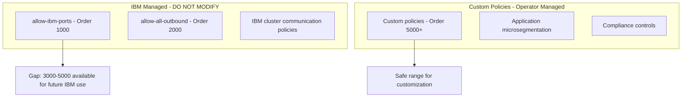

# Document Calico Networking on IBM Cloud for Operators

Author: [nawazdhandala](https://github.com/nawazdhandala)

Tags: Calico, Kubernetes, Networking, IBM Cloud, Documentation, Operations

Description: How to create operational documentation for Calico networking on IBM Cloud, covering IKS managed policy boundaries, VPC network dependencies, and runbooks for IBM Cloud-specific operations.

---

## Introduction

IBM Cloud Kubernetes Service has a managed Calico layer that most other Kubernetes distributions lack. IBM installs, upgrades, and maintains a set of GlobalNetworkPolicies alongside the Calico components. Operators must understand which policies are IBM-managed and which are custom to avoid inadvertently breaking cluster networking. This shared management model requires documentation that clearly delineates IBM's responsibility boundary from the operator's.

Good IBM Cloud Calico documentation describes the IKS managed policy set, the custom policy namespace operators work in, the VPC network dependencies, and procedures for safe policy management within IKS's constraints.

## Prerequisites

- IKS or self-managed Kubernetes on IBM Cloud in a working state
- Documentation system accessible to the team
- IBM Cloud CLI and calicoctl access

## Documentation Component 1: Policy Ownership Model



## Documentation Component 2: IBM Cloud IKS Calico Reference

```markdown
## IKS Calico Configuration Reference

### Managed by IBM (Do not modify)
| Resource | Type | Description |
|----------|------|-------------|
| `allow-ibm-ports` | GlobalNetworkPolicy (order 1000) | Allows IBM control plane traffic |
| `allow-all-outbound` | GlobalNetworkPolicy (order 2000) | Egress for worker node updates |
| `default-ipv4-ippool` | IPPool | Default pod CIDR (172.30.0.0/16) |

### Custom Configuration (Operator Managed)
| Resource | Type | Order Range | Description |
|----------|------|------------|-------------|
| Application policies | GlobalNetworkPolicy | 5000+ | Your security policies |
| Additional IP pools | IPPool | N/A | Expanded pod CIDR if needed |
```

## Documentation Component 3: VPC Network Dependencies

```markdown
## VPC Network Dependencies for Calico

### Required Security Group Rules
| Rule | Protocol | Port | Source | Purpose |
|------|---------|------|--------|---------|
| Kubelet | TCP | 10250 | Worker SG | API server health checks |
| VXLAN | UDP | 4789 | Worker SG | Pod overlay networking |
| NodePorts | TCP | 30000-32767 | 0.0.0.0/0 | External service access |
| SSH | TCP | 22 | 10.0.0.0/8 | Emergency node access |

### Network Configuration
- **VPC**: my-k8s-vpc (10.10.0.0/16)
- **Workers Subnet Zone 1**: 10.10.1.0/24 (us-south-1)
- **Workers Subnet Zone 2**: 10.10.2.0/24 (us-south-2)
- **Pod CIDR**: 172.30.0.0/16 (Calico default-ipv4-ippool)
- **Service CIDR**: 172.21.0.0/16 (IKS default)
```

## Documentation Component 4: IKS Upgrade Runbook

```markdown
## Runbook: Before IKS Kubernetes Version Upgrade

### Pre-Upgrade
1. Export current Calico configuration:
   calicoctl get globalnetworkpolicies -o yaml > calico-backup-pre-upgrade.yaml
   calicoctl get ippools -o yaml >> calico-backup-pre-upgrade.yaml

2. Document any custom changes to IBM policies (should be none)

3. Note current Calico version:
   kubectl get pods -n calico-system -o yaml | grep image:

### Post-Upgrade Validation
1. Verify IBM managed policies are restored:
   calicoctl get globalnetworkpolicies | grep ibm
2. Verify custom policies are intact:
   calicoctl get globalnetworkpolicies | grep -v ibm
3. Run pod connectivity tests
4. Update documentation with new Calico version
```

## Documentation Component 5: Escalation Guide

```markdown
## When to Escalate to IBM Support

Escalate to IBM if:
- IBM managed Calico policies are missing after an action
- Calico pods in ibm-system namespace are failing
- IKS upgrade modifies or removes your custom policies
- You need to grant special permissions on IBM's managed paths

IBM Support: https://cloud.ibm.com/unifiedsupport
Create support case: ibmcloud case create
```

## Conclusion

Documenting Calico on IBM Cloud requires clearly communicating the IBM-managed vs. operator-managed boundary. Operators who understand this boundary can safely customize Calico's behavior within IKS's constraints. The pre-upgrade backup procedure is particularly important because IKS upgrades may modify Calico configuration, and having a backup ensures custom work can be quickly restored. A clear escalation guide prevents teams from spending time troubleshooting issues that require IBM support intervention.
