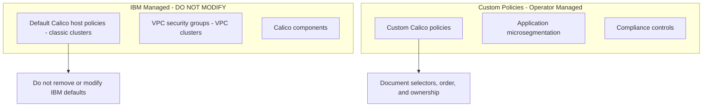

# Document Calico Networking on IBM Cloud for Operators

Author: [nawazdhandala](https://github.com/nawazdhandala)

Tags: Calico, Kubernetes, Networking, IBM Cloud, Documentation, Operation

Description: How to create operational documentation for Calico networking on IBM Cloud, covering IKS managed policy boundaries, VPC network dependencies, and runbooks for IBM Cloud-specific operations.

---

## Introduction

IBM Cloud Kubernetes Service has a managed Calico layer that most other Kubernetes distributions lack. IBM installs, upgrades, and maintains Calico components, and classic clusters include default Calico host policies that protect worker interfaces. VPC clusters also rely on IBM-managed VPC security groups for cluster networking. Operators must understand which resources are IBM-managed and which are custom to avoid inadvertently breaking cluster networking. This shared management model requires documentation that clearly delineates IBM's responsibility boundary from the operator's.

Good IBM Cloud Calico documentation describes the IKS managed policy and security group set, the custom policy space operators work in, the VPC network dependencies, and procedures for safe policy management within IKS's constraints.

## Prerequisites

- IKS cluster on IBM Cloud in a working state
- Documentation system accessible to the team
- IBM Cloud CLI and calicoctl access

## Documentation Component 1: Policy Ownership Model


```mermaid
graph TD
    subgraph IBM Managed - DO NOT MODIFY
        A[Default Calico host policies - classic clusters]
        B[VPC security groups - VPC clusters]
        C[Calico components]
    end
    subgraph Custom Policies - Operator Managed
        D[Custom Calico policies]
        E[Application microsegmentation]
        F[Compliance controls]
    end
    A --> G[Do not remove or modify IBM defaults]
    D --> H[Document selectors, order, and ownership]
```

## Documentation Component 2: IBM Cloud IKS Calico Reference

```markdown
## IKS Calico Configuration Reference

### Managed by IBM (Do not modify)
| Resource | Type | Description |
|----------|------|-------------|
| `allow-all-outbound` | GlobalNetworkPolicy | Allows outbound traffic on the public network in classic clusters |
| `allow-all-private-default` | GlobalNetworkPolicy | Allows inbound and outbound traffic on the private network in classic clusters |
| `allow-node-port-dnat` | GlobalNetworkPolicy | Allows NLB, ALB Ingress, and NodePort service traffic in classic clusters |
| `kube-<clusterID>` | VPC security group | Allows traffic necessary for VPC cluster infrastructure |
| `default-ipv4-ippool` | IPPool | Default pod CIDR, such as 172.30.0.0/16 for classic clusters or 172.17.0.0/18 for the first VPC cluster unless customized |

### Custom Configuration (Operator Managed)
| Resource | Type | Order Guidance | Description |
|----------|------|----------------|-------------|
| Application policies | NetworkPolicy or GlobalNetworkPolicy | Document explicit order values when using Calico policy ordering | Your security policies |
| Custom pod or service subnets | Cluster creation setting | N/A | Alternative CIDRs configured at cluster creation if needed |
```

## Documentation Component 3: VPC Network Dependencies

```markdown
## VPC Network Dependencies for Calico

### Required Security Group Rules
| Rule | Protocol | Port | Source | Purpose |
|------|---------|------|--------|---------|
| Worker-to-worker | ICMP/TCP/UDP | All | `kube-<clusterID>` | Pod and node communication inside the cluster |
| Pod subnet | ICMP/TCP/UDP | All | Pod CIDR | Traffic to and from the cluster pod subnet |
| NodePorts | TCP | Load balancer node ports, or 30000-32767 on older VPC clusters | LB security group or intended sources | External service access |
| IBM service ranges | ICMP/TCP/UDP | All | 161.26.0.0/16 and 166.8.0.0/14 | Worker provisioning and IBM Cloud private service access |

### Network Configuration
- **VPC**: my-k8s-vpc (10.10.0.0/16)
- **Workers Subnet Zone 1**: 10.10.1.0/24 (us-south-1)
- **Workers Subnet Zone 2**: 10.10.2.0/24 (us-south-2)
- **Pod CIDR**: 172.17.0.0/18 for the first VPC cluster, or the custom pod subnet configured at cluster creation
- **Service CIDR**: 172.21.0.0/16 (IKS default)
```

## Documentation Component 4: IKS Upgrade Runbook

```markdown
## Runbook: Before IKS Kubernetes Version Upgrade

### Pre-Upgrade
1. Export current Calico configuration:
   calicoctl get globalnetworkpolicies -o yaml > calico-backup-pre-upgrade.yaml
   calicoctl get networkpolicies --all-namespaces -o yaml >> calico-backup-pre-upgrade.yaml
   calicoctl get ippools -o yaml >> calico-backup-pre-upgrade.yaml

2. Document any custom changes to IBM policies (should be none)

3. Note current Calico version:
   kubectl get pods -n calico-system -o yaml | grep image:

### Post-Upgrade Validation
1. Verify IBM managed policies are present:
   calicoctl get globalnetworkpolicies
2. Verify custom policies are intact:
   calicoctl get globalnetworkpolicies
   calicoctl get networkpolicies --all-namespaces
3. Run pod connectivity tests
4. Update documentation with new Calico version
```

## Documentation Component 5: Escalation Guide

```markdown
## When to Escalate to IBM Support

Escalate to IBM if:
- IBM managed Calico policies or VPC security group rules are missing after an action
- Calico pods in calico-system namespace are failing
- IKS upgrade modifies or removes your custom policies
- You need to grant special permissions on IBM's managed paths

IBM Support: https://cloud.ibm.com/unifiedsupport
Create support case: Use the IBM Cloud Support Center to create a case
```

## Conclusion

Documenting Calico on IBM Cloud requires clearly communicating the IBM-managed vs. operator-managed boundary. Operators who understand this boundary can safely customize Calico's behavior within IKS's constraints. The pre-upgrade backup procedure is particularly important because IKS upgrades may modify Calico configuration, and having a backup ensures custom work can be quickly restored. A clear escalation guide prevents teams from spending time troubleshooting issues that require IBM support intervention.
