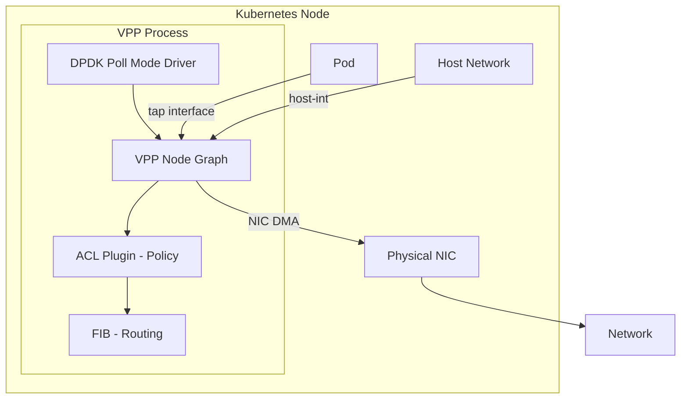

# Document Calico VPP Host Networking for Operators

Author: [nawazdhandala](https://github.com/nawazdhandala)

Tags: Calico, Kubernetes, Networking, VPP, Documentation, Operations

Description: How to create operational documentation for Calico VPP host networking, covering hardware requirements, deployment procedures, performance baselines, and incident response runbooks.

---

## Introduction

Calico VPP is significantly more complex to operate than standard Calico. VPP takes ownership of physical NICs, requires specialized hardware configuration (hugepages, isolated CPUs), and has failure modes that can leave nodes without network connectivity. Comprehensive documentation is critical for teams operating VPP in production — especially for on-call engineers who may need to respond to VPP failures without deep VPP expertise.

Good VPP documentation covers the hardware requirements that must be met before deployment, the configuration decisions made and why, performance baselines for anomaly detection, and step-by-step runbooks for common operational tasks and incident response.

## Prerequisites

- Calico VPP deployed in production or staging
- A documentation system accessible to operators
- Ability to generate configuration exports

## Documentation Component 1: Hardware Requirements

```markdown
## Calico VPP Hardware Requirements

### CPU Requirements
- x86_64 architecture with SSE4.2 and AVX2 support
- Recommended: Allocate 1-2 cores exclusively to VPP per node
- Isolated from Linux scheduler via isolcpus kernel parameter

### Memory Requirements
- Hugepages: 2GB minimum for 1G NIC, 4-8GB for 10G+ NICs
- Hugepage size: 2MB (standard) or 1GB (large page support)

### Network Interface Requirements
| Requirement | Why |
|-------------|-----|
| DPDK support | Required for full VPP performance |
| SR-IOV support | Optional: enables hardware VF offload |
| RSS support | Required for multi-queue VPP workers |

### Verified Hardware
| NIC Model | Driver | Performance |
|-----------|--------|-------------|
| Intel X550 | ixgbe/i40e | 10G line rate |
| Mellanox ConnectX-5 | mlx5 | 25G line rate |
| Intel E810 | ice | 100G line rate |
```

## Documentation Component 2: VPP Architecture Reference



## Documentation Component 3: Deployment Configuration Export

```bash
#!/bin/bash
# export-vpp-config.sh - Run to document current VPP configuration

echo "=== VPP Interfaces ==="
kubectl exec -n calico-vpp-dataplane ds/calico-vpp-node -c vpp -- \
  vppctl show interface

echo "=== VPP Startup Config ==="
kubectl get configmap calico-vpp-config -n calico-vpp-dataplane -o yaml

echo "=== Hugepage Configuration ==="
grep HugePages /proc/meminfo

echo "=== CPU Isolation ==="
cat /proc/cmdline | tr ' ' '\n' | grep -E "isolcpus|nohz_full"
```

## Documentation Component 4: Performance Baseline

```markdown
## VPP Performance Baseline - Updated: 2026-03-13

### Node: worker-vpp-1 (Intel X550 10G NIC)
| Metric | Baseline Value | Alert Threshold |
|--------|---------------|----------------|
| Pod-to-pod throughput (iperf3 4-stream) | 8.5 Gbps | < 6 Gbps |
| Round-trip latency (ping) | 28 us | > 100 us |
| VPP vector rate | 64 avg | < 4 or > 250 |
| Drop rate | 0 pps | > 100 pps |
```

## Documentation Component 5: Incident Response Runbooks

```markdown
## Runbook: Node Lost Network Connectivity After VPP Restart

### Symptoms
- Node unreachable via SSH or kubectl
- VPP pod restarting

### Response Steps
1. Use out-of-band console access (IPMI/iDRAC) to reach the node
2. Check VPP process: systemctl status vpp
3. Review VPP logs: journalctl -u vpp -n 100
4. If VPP startup failed, check hugepages: grep HugePages_Free /proc/meminfo
5. Emergency recovery - stop VPP and restore Linux networking:
   systemctl stop vpp
   # Calico VPP manager will detect VPP is down and attempt recovery
   kubectl delete pod -n calico-vpp-dataplane -l app=calico-vpp-node \
     --field-selector spec.nodeName=affected-node
```

## Conclusion

Documenting Calico VPP requires capturing the complexity that distinguishes it from standard Calico deployments: specific hardware requirements, DPDK configuration, performance baselines, and incident response procedures that assume the node may be unreachable. Out-of-band console access is a prerequisite that must be documented as a dependency, not just a nice-to-have. With comprehensive documentation, even operators unfamiliar with VPP can confidently respond to common operational scenarios.
