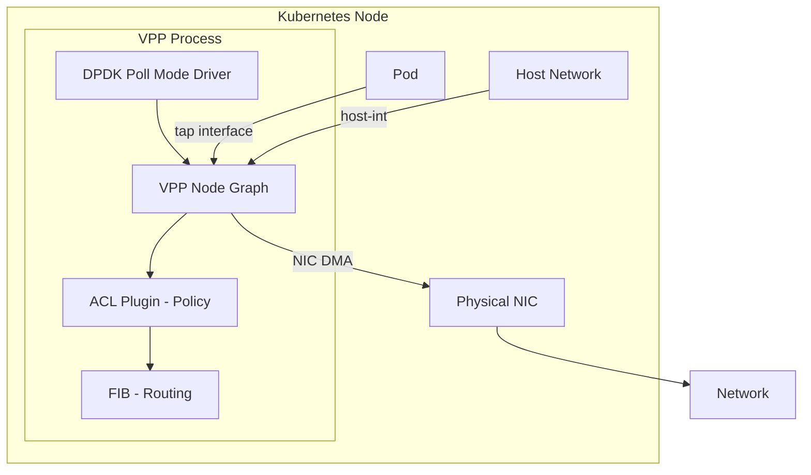

# Document Calico VPP Host Networking for Operators

Author: [nawazdhandala](https://github.com/nawazdhandala)

Tags: Calico, Kubernetes, Networking, VPP, Documentation, Operation

Description: How to create operational documentation for Calico VPP host networking, covering hardware requirements, deployment procedures, performance baselines, and incident response runbooks.

---

## Introduction

Calico VPP is significantly more complex to operate than standard Calico. VPP takes ownership of physical NICs, requires specialized hardware configuration (hugepages, isolated CPUs), and has failure modes that can leave nodes without network connectivity. Comprehensive documentation is critical for teams operating VPP in production - especially for on-call engineers who may need to respond to VPP failures without deep VPP expertise.

Good VPP documentation covers the hardware requirements that must be met before deployment, the configuration decisions made and why, performance baselines for anomaly detection, and step-by-step runbooks for common operational tasks and incident response.

## Prerequisites

- Calico VPP deployed in production or staging
- A documentation system accessible to operators
- Ability to generate configuration exports

## Documentation Component 1: Hardware Requirements

```markdown
## Calico VPP Hardware Requirements

### CPU Requirements
- CPU architecture supported by the Calico and VPP images in use
- Document any CPU feature requirements for your VPP build and NIC driver combination
- Recommended: Allocate 1-2 cores exclusively to VPP per node
- Isolated from Linux scheduler via isolcpus kernel parameter

### Memory Requirements
- Hugepages: at least 512 x 2MB pages when using DPDK or native VPP drivers that require hugepages
- Hugepage size: 2MB standard; 1GB hugepages may be used where supported and configured

### Network Interface Requirements
| Requirement | Why |
|-------------|-----|
| DPDK or supported native VPP driver | Needed for the highest-performance uplink modes |
| SR-IOV support | Optional: enables VF-based configurations |
| Multi-queue/RSS support | Needed to distribute traffic across multiple VPP workers |

### Verified Hardware
| NIC Model | Driver | Performance |
|-----------|--------|-------------|
| Intel X550 | ixgbe | 10G line rate |
| Mellanox ConnectX-5 | mlx5 | 25G line rate |
| Intel E810 | ice | 100G line rate |
```

## Documentation Component 2: VPP Architecture Reference


```mermaid
graph TD
    subgraph Kubernetes Node
        subgraph VPP Process
            A[DPDK Poll Mode Driver]
            B[VPP Node Graph]
            C[ACL Plugin - Policy]
            D[FIB - Routing]
        end
        A --> B --> C --> D
        E[Pod] -->|tap interface| B
        F[Host Network] -->|host-int| B
        B -->|NIC DMA| G[Physical NIC]
    end
    G --> H[Network]
```

## Documentation Component 3: Deployment Configuration Export

```bash
#!/bin/bash
# export-vpp-config.sh - Run to document current VPP configuration

echo "=== VPP Interfaces ==="
kubectl exec -n calico-vpp-dataplane ds/calico-vpp-node -c vpp -- \
  vppctl show interface

echo "=== VPP Startup Config ==="
kubectl get configmap calico-vpp-config -n calico-vpp-dataplane -o yaml

echo "=== Hugepage Configuration ==="
grep HugePages /proc/meminfo

echo "=== CPU Isolation ==="
cat /proc/cmdline | tr ' ' '\n' | grep -E "isolcpus|nohz_full"
```

## Documentation Component 4: Performance Baseline

```markdown
## VPP Performance Baseline - Updated: 2026-03-13

### Node: worker-vpp-1 (Intel X550 10G NIC)
| Metric | Baseline Value | Alert Threshold |
|--------|---------------|----------------|
| Pod-to-pod throughput (iperf3 4-stream) | 8.5 Gbps | < 6 Gbps |
| Round-trip latency (ping) | 28 us | > 100 us |
| VPP vector rate | 64 avg | < 4 or > 250 |
| Drop rate | 0 pps | > 100 pps |
```

## Documentation Component 5: Incident Response Runbooks

```markdown
## Runbook: Node Lost Network Connectivity After VPP Restart

### Symptoms
- Node unreachable via SSH or kubectl
- VPP pod restarting

### Response Steps
1. Use out-of-band console access (IPMI/iDRAC) to reach the node
2. Check the Calico VPP containers: crictl ps -a --name calico-vpp-node
3. Review the VPP container logs: crictl logs <vpp-container-id> | tail -n 100
4. If VPP startup failed, check hugepages: grep HugePages_Free /proc/meminfo
5. Emergency recovery - stop VPP and restore Linux networking:
   crictl stop <vpp-container-id>
   # vpp-manager restores Linux interface configuration when VPP stops
   kubectl delete pod -n calico-vpp-dataplane -l app=calico-vpp-node \
     --field-selector spec.nodeName=affected-node
```

## Conclusion

Documenting Calico VPP requires capturing the complexity that distinguishes it from standard Calico deployments: specific hardware requirements, DPDK configuration, performance baselines, and incident response procedures that assume the node may be unreachable. Out-of-band console access is a prerequisite that must be documented as a dependency, not just a nice-to-have. With comprehensive documentation, even operators unfamiliar with VPP can confidently respond to common operational scenarios.
