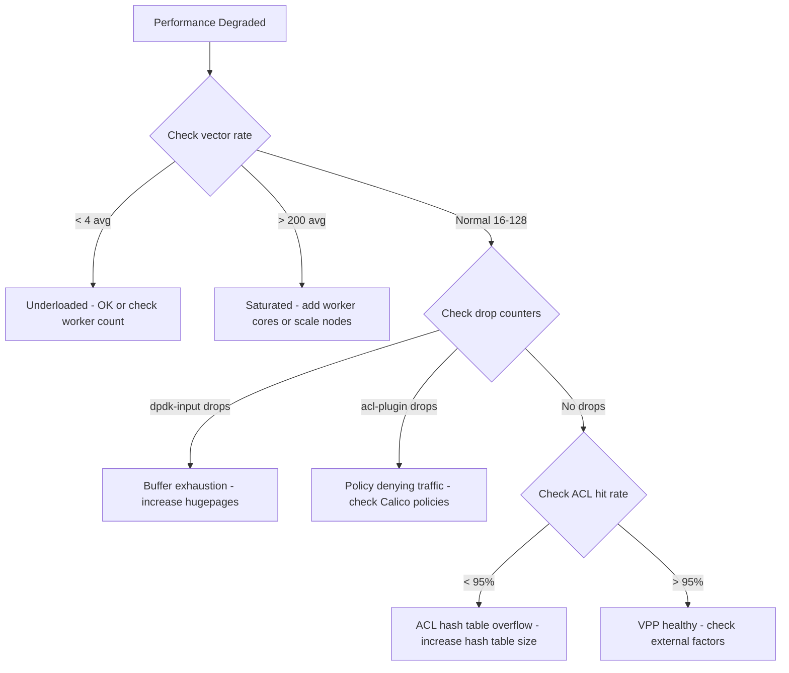

# Document Calico VPP Technical Details for Operators

Author: [nawazdhandala](https://github.com/nawazdhandala)

Tags: Calico, Kubernetes, Networking, VPP, DPDK, Documentation, Technical

Description: How to document Calico VPP's technical architecture, internal configuration parameters, and operational details to support engineers maintaining VPP-based Kubernetes networking.

---

## Introduction

VPP technical documentation bridges the knowledge gap between VPP experts who designed the deployment and engineers who must maintain and troubleshoot it. VPP's internal architecture - node graphs, buffer pools, ACL hash tables, DPDK queue management - requires documentation that goes beyond "run this command" to explain why specific parameters were chosen and what the consequences of changing them are.

This documentation is especially valuable for on-call engineers responding to performance anomalies and for capacity planning teams deciding whether to expand the deployment.

## Prerequisites

- Calico VPP running in production
- Ability to export VPP configuration and performance baselines
- Documentation system for the team

## Documentation Component 1: VPP Architecture Reference

```markdown
## Calico VPP Architecture Reference

### Processing Model
VPP processes packets in "vectors" - groups of packets processed together through
the node graph. Higher vector sizes = better throughput. Lower = better latency.

### Current Configuration (as of 2026-03-13)
- VPP Version: 23.06
- Calico VPP Version: v3.27.0
- NIC: Intel X550 (PCI: 0000:00:0a.0)
- VPP Driver: DPDK vfio-pci
- Workers: 4 threads (cores 2-5, isolated)
- Hugepages: 4GB (2048 × 2MB pages)
- Buffer pool: 2,097,152 buffers (4GB total)
- Rx queues: 4 (one per worker)
- Rx descriptor ring: 4096 entries
```

## Documentation Component 2: Startup Configuration Export

```bash
#!/bin/bash
# export-vpp-startup.sh
cat > docs/vpp/startup-config-$(date +%Y%m%d).conf <<'EOF'
# Auto-exported from cluster worker-vpp-1 on $(date)
# Generated by: export-vpp-startup.sh

$(kubectl get configmap calico-vpp-config -n calico-vpp-dataplane \
  -o jsonpath='{.data.VPP_STARTUP_CONF}')
EOF
```

## Documentation Component 3: Performance Baseline Reference

```markdown
## VPP Performance Baseline - Cluster: prod-k8s-01

### Measurement Date: 2026-03-13
### Test Tool: iperf3 with 8 parallel streams

| Test Case | Throughput | Latency (avg) | Latency (p99) |
|-----------|-----------|---------------|---------------|
| Same-node pod-to-pod | 9.8 Gbps | 12 us | 28 us |
| Cross-node pod-to-pod | 8.5 Gbps | 45 us | 95 us |
| Service VIP (ClusterIP) | 7.2 Gbps | 55 us | 120 us |

### VPP Internal Metrics at Peak Load
| Metric | Value | Healthy Range |
|--------|-------|---------------|
| Vector rate | 47 avg | 16-128 |
| Buffer free % | 68% | > 20% |
| ACL hash hit rate | 99.2% | > 95% |
| DPDK rx_missed | 0 | 0 |
```

## Documentation Component 4: Troubleshooting Decision Tree



## Documentation Component 5: Capacity Planning Guidelines

```markdown
## VPP Capacity Planning

### When to Add Worker Cores
- Sustained vector rate > 150 for > 30 minutes
- Worker thread CPU usage > 85% sustained

### When to Add Hugepages
- Buffer free percentage drops below 30% at peak

### When to Add Nodes
- Cross-node throughput saturates NIC bandwidth (8.5+ Gbps sustained)
- p99 latency exceeds 500us consistently

### Maximum Supported Nodes per VPP Instance
- Limited by FIB table size and ACL table memory
- Current config supports up to 1000 nodes (testing recommended above 500)
```

## Conclusion

Technical documentation for Calico VPP needs to capture both the static configuration (startup parameters, hardware details) and the dynamic baselines (performance at normal and peak load) that define what "healthy" looks like. The decision tree for performance troubleshooting translates VPP-specific metrics into actionable guidance for operators who may not have deep VPP expertise. Update this documentation quarterly and after any configuration changes.
