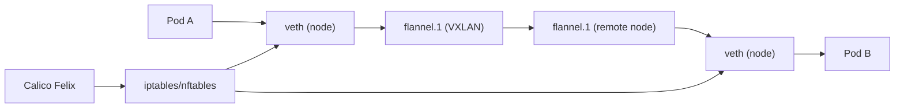

# How to Document Flannel with Calico Network Policy for Your Team

Author: [nawazdhandala](https://github.com/nawazdhandala)

Tags: Calico, Flannel, Canal, Kubernetes, Networking, Documentation, Team

Description: A guide to creating effective internal documentation for a Canal (Flannel + Calico network policy) deployment that helps operations and development teams understand, operate, and troubleshoot the...

---

## Introduction

Canal documentation serves two audiences: operations teams who manage the cluster infrastructure and development teams who write NetworkPolicy objects for their workloads. Operations teams need runbooks for installation, upgrade, and troubleshooting. Development teams need policy authoring guides that explain how Calico's policy model interacts with standard Kubernetes NetworkPolicy and how to test their policies before deploying to production.

Good Canal documentation is organized by role, uses tested commands, and includes architecture diagrams that show how Flannel and Calico interact on each node.

## Architecture Overview Section

Every Canal documentation set should include a node-level architecture description.

```plaintext
Node Architecture (Canal):
  Pod A ──► veth ──► flannel.1 ──► VXLAN ──► flannel.1 ──► veth ──► Pod B
                        │
                     Felix
                        │
                   iptables/nftables (NetworkPolicy enforcement)
```

Include the Mermaid diagram in your internal wiki:



## Operations Runbook Template

### Installation

```bash
kubectl apply -f https://raw.githubusercontent.com/projectcalico/calico/v3.27.0/manifests/canal.yaml
kubectl wait --for=condition=Ready pods -n kube-system -l k8s-app=canal --timeout=120s
```

### Health Check

```bash
# Canal DaemonSet health
kubectl get daemonset canal -n kube-system

# Node readiness
kubectl get nodes

# Felix status
kubectl exec -n kube-system -l k8s-app=canal -- calicoctl node status
```

### Upgrade

```bash
# Download new manifest
curl -O https://raw.githubusercontent.com/projectcalico/calico/v3.XX.0/manifests/canal.yaml
kubectl apply -f canal.yaml
kubectl rollout status daemonset/canal -n kube-system
```

## Developer Policy Guide Template

### NetworkPolicy Basics for Canal

```yaml
# Allow ingress from pods with label app=frontend to pods with label app=backend
apiVersion: networking.k8s.io/v1
kind: NetworkPolicy
metadata:
  name: allow-frontend-to-backend
  namespace: <your-namespace>
spec:
  podSelector:
    matchLabels:
      app: backend
  ingress:
  - from:
    - podSelector:
        matchLabels:
          app: frontend
  policyTypes: [Ingress]
```

Include a policy testing procedure for developers:

```bash
# Test that policy is enforced
kubectl run tester --image=busybox --labels="app=frontend" --restart=Never -- sleep 3600
BACKEND_IP=$(kubectl get pod <backend-pod> -o jsonpath='{.status.podIP}')
kubectl exec tester -- wget --timeout=5 -qO- http://$BACKEND_IP:<port>
```

## Troubleshooting Quick Reference

| Symptom | Check | Resolution |
|---------|-------|------------|
| Pod stuck in ContainerCreating | `kubectl logs -n kube-system <canal-pod> -c canal` | Restart Canal DaemonSet pod |
| Cross-node ping fails | `ip link show flannel.1` | Check VXLAN UDP 8472 firewall |
| Policy not enforced | `calicoctl get workloadendpoint` | Restart Canal pod on node |
| NetworkPolicy blocks unexpected traffic | `kubectl get pod --show-labels` | Verify pod selector labels |

## Version and Configuration Reference

Document the current deployment state in your wiki.

```bash
# Get current Canal version
kubectl get daemonset canal -n kube-system -o jsonpath='{.spec.template.spec.containers[?(@.name=="calico-node")].image}'

# Get FelixConfiguration
kubectl exec -n kube-system deploy/calicoctl -- calicoctl get felixconfiguration default -o yaml

# Get IPPool configuration
kubectl exec -n kube-system deploy/calicoctl -- calicoctl get ippool -o yaml
```

## Conclusion

Canal documentation organized by audience - operations runbooks and developer policy guides - reduces incident response time and gives development teams the information they need to write and test NetworkPolicy objects without needing platform team involvement. Including the node architecture, tested commands, and a troubleshooting quick reference makes the documentation actionable rather than descriptive. Versioning the documentation alongside the Canal version prevents drift between documentation and the actual cluster state.
