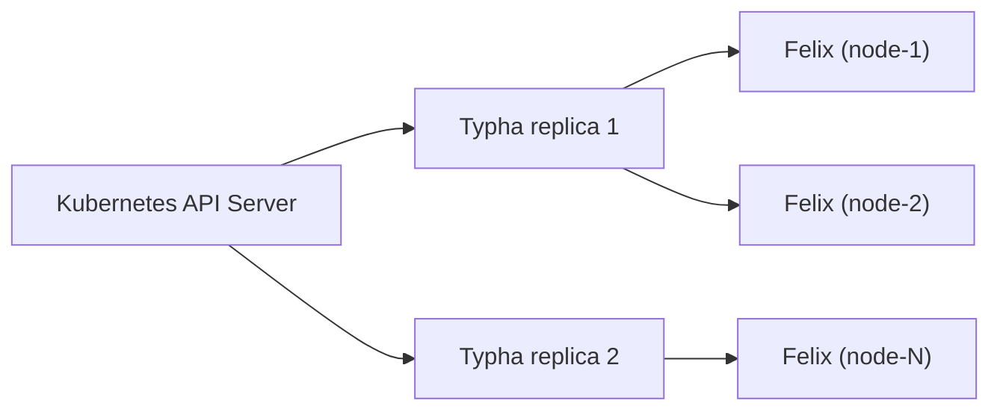

# How to Document Typha in a Calico Hard Way Installation

Author: [nawazdhandala](https://github.com/nawazdhandala)

Tags: Calico, Typha, Kubernetes, Networking, Documentation, Hard Way, Operations

Description: A guide to creating effective internal documentation for Typha in a manually installed Calico cluster, covering architecture, operations runbooks, and troubleshooting guides.

---

## Introduction

Documentation for Typha in a hard way installation must serve multiple audiences and time horizons: engineers who need to understand the architecture when joining the team, operators who need runbooks for day-to-day and incident operations, and the on-call rotation who need a quick reference when policy propagation fails at 2am. Structuring this documentation by scenario rather than by component ensures that each section is actionable.

## Architecture Documentation

The architecture section should explain Typha's role, when it was added to the cluster, and why.

### Typha Architecture Overview

Typha is deployed as a Deployment with N replicas in the `calico-system` namespace. It acts as a fan-out proxy between the Kubernetes API server and Calico's Felix agents on each node.



**Current configuration:**
- Typha replicas: `kubectl get deployment calico-typha -n calico-system -o jsonpath='{.spec.replicas}'`
- Felix connection target per replica: 200
- TLS: mTLS with certificates in `calico-typha-tls` and `calico-felix-typha-tls` secrets

## Operations Runbooks

### Daily Health Check

```bash
#!/bin/bash
# typha-health-check.sh
NODES=$(kubectl get nodes --no-headers | wc -l)
CONNECTIONS=$(kubectl exec -n calico-system deployment/calico-typha -- \
  wget -qO- http://localhost:9093/metrics 2>/dev/null | grep typha_connections_active | awk '{print $2}')

echo "Nodes: $NODES | Active Typha connections: $CONNECTIONS"
if [ "$CONNECTIONS" -lt "$NODES" ]; then
  echo "WARNING: $((NODES - CONNECTIONS)) nodes not connected to Typha"
fi
```

### Scale Typha

Run when node count crosses a multiple of 200.

```bash
NODES=$(kubectl get nodes --no-headers | wc -l)
REPLICAS=$(( (NODES + 199) / 200 ))
kubectl scale deployment calico-typha -n calico-system --replicas=$REPLICAS
echo "Scaled Typha to $REPLICAS replicas for $NODES nodes"
```

### Rotate Certificates

Run annually or 30 days before certificate expiry.

```bash
# Check expiry
kubectl get secret calico-typha-tls -n calico-system -o jsonpath='{.data.tls\.crt}' | \
  base64 -d | openssl x509 -enddate -noout

# If rotation needed:
# 1. Generate new certs (see setup runbook)
# 2. Update secrets
# 3. kubectl rollout restart deployment/calico-typha -n calico-system
# 4. kubectl rollout restart daemonset/calico-node -n calico-system
```

## Troubleshooting Quick Reference

| Symptom | First Check | Resolution |
|---------|-------------|------------|
| Felix can't connect to Typha | `kubectl get endpoints calico-typha -n calico-system` | Verify Typha pod is running |
| TLS handshake failure | Compare CA certs in both secrets | Regenerate with shared CA |
| Policy not propagating | Check `typha_updates_sent` metric | Check Typha RBAC permissions |
| Typha OOMKilled | `kubectl describe pod -n calico-system <typha-pod>` | Increase memory limit |
| High propagation latency | Check `typha_ping_latency` metric | Scale Typha replicas |

## Configuration Reference

Document the current state of all Typha configuration.

```bash
# Generate configuration snapshot
echo "=== Typha Deployment ==="
kubectl get deployment calico-typha -n calico-system -o yaml

echo "=== Typha Service ==="
kubectl get service calico-typha -n calico-system -o yaml

echo "=== Felix Typha Configuration ==="
calicoctl get felixconfiguration default -o yaml | grep -i typha

echo "=== Certificate Expiry ==="
kubectl get secret calico-typha-tls -n calico-system -o jsonpath='{.data.tls\.crt}' | \
  base64 -d | openssl x509 -enddate -noout
```

Save this output to the team wiki at each major change.

## Incident Response Template

For Typha-related incidents:

```
Incident: Calico policy propagation failure
Severity: P1 (if new policies are not taking effect)

Investigation steps:
1. kubectl get pods -n calico-system -l app=calico-typha
2. kubectl logs -n calico-system deployment/calico-typha | tail -50
3. Check typha_connections_active metric
4. Verify TLS certificate validity

Escalation: If Typha is healthy but propagation fails, escalate to Calico core team
```

## Conclusion

Typha documentation in a hard way installation should combine architecture context with immediately runnable commands. Organizing the documentation into architecture overview, operations runbooks (health checks, scaling, certificate rotation), troubleshooting quick reference, and an incident response template ensures that every person who interacts with Typha — from day-one onboarding to 2am incidents — can find what they need without requiring deep Calico expertise.
