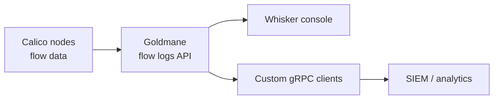

# How to Enable the Calico Flow Logs API

Author: [nawazdhandala](https://github.com/nawazdhandala)

Tags: Calico, Kubernetes, Networking, Observability

Description: Enable the Calico Flow Logs API endpoint to query historical network flow data programmatically for security auditing, compliance reporting, and custom observability integrations.

---

## Introduction

The Calico Flow Logs API, also known as Goldmane, provides programmatic access to aggregated network traffic data, enabling custom integrations with SIEM systems, compliance reporting tools, and network analytics pipelines. In current Calico Open Source releases this is a tech preview gRPC API that powers Calico Whisker and can be queried for flows by time range, namespace, protocol, policy, or policy decision.

## Key Commands

```bash
# Enable the flow logs API

kubectl apply -f - <<'EOF'
apiVersion: operator.tigera.io/v1
kind: Goldmane
metadata:
  name: default
EOF

# Optional: enable the Calico Whisker web console

kubectl apply -f - <<'EOF'
apiVersion: operator.tigera.io/v1
kind: Whisker
metadata:
  name: default
EOF

# Check operator status

kubectl get tigerastatus goldmane
```

## Goldmane and Whisker Resources

```yaml
apiVersion: operator.tigera.io/v1
kind: Goldmane
metadata:
  name: default
---
apiVersion: operator.tigera.io/v1
kind: Whisker
metadata:
  name: default
```

## Architecture



## Conclusion

Goldmane provides the Calico flow logs API for aggregated network traffic visibility. Enable the `Goldmane` resource to expose the gRPC API, enable `Whisker` when you also want the built-in web console, and build custom clients against the published protobuf definitions for programmatic reporting and analytics.
