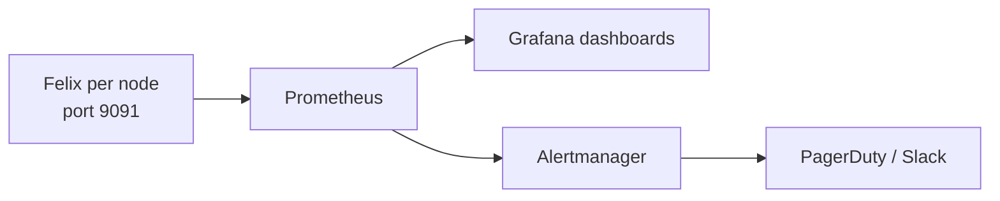

# How to Enable Felix Metrics in Calico

Author: [nawazdhandala](https://github.com/nawazdhandala)

Tags: Calico, Kubernetes, Networking, Observability

Description: Enable Felix Prometheus metrics on port 9091 to collect per-node network policy enforcement statistics, iptables rule counts, and dataplane error rates for cluster health monitoring.

---

## Introduction

Felix metrics provide the deepest per-node view of Calico's network policy enforcement. Enabling them requires a FelixConfiguration change to expose the metrics port, and a ServiceMonitor or Prometheus scrape configuration to collect them. Felix metrics include iptables rule counts, policy calculation times, dataplane errors, and BGP session state - covering the full operational health of the Calico data plane.

## Key Commands

```bash
# Enable Felix metrics (if not already enabled)
kubectl patch felixconfiguration default   --type=merge   -p '{"spec":{"prometheusMetricsEnabled":true,"prometheusMetricsPort":9091}}'

# Test Felix metrics endpoint
CALICO_POD=$(kubectl get pods -n calico-system -l k8s-app=calico-node   -o jsonpath='{.items[0].metadata.name}')

kubectl exec -n calico-system "${CALICO_POD}" -c calico-node --   wget -qO- http://localhost:9091/metrics | head -30

# Key Felix metrics to check:
kubectl exec -n calico-system "${CALICO_POD}" -c calico-node --   wget -qO- http://localhost:9091/metrics | grep -E   "^felix_int_dataplane_failures|^felix_calc_graph"
```

## ServiceMonitor for Felix

```yaml
apiVersion: monitoring.coreos.com/v1
kind: ServiceMonitor
metadata:
  name: calico-felix-metrics
  namespace: calico-system
spec:
  selector:
    matchLabels:
      k8s-app: calico-node
  endpoints:
    - port: http-metrics
      path: /metrics
      interval: 30s
```

## Architecture



## Conclusion

Felix metrics provide the deepest operational visibility into the Calico data plane. Enable the Prometheus endpoint via FelixConfiguration, configure a ServiceMonitor to scrape all calico-node pods, and build dashboards focused on dataplane failures and policy calculation latency. These two metric categories detect the most impactful Calico failure modes before they cause visible pod connectivity issues.
