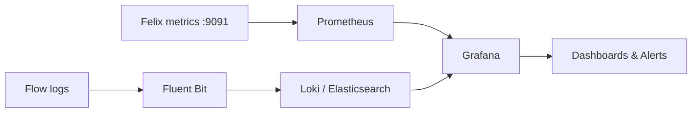

# Calico Observability: enable-policy-troubleshooting-calico-logs

Author: [nawazdhandala](https://github.com/nawazdhandala)

Tags: Calico, Kubernetes, Networking, Observability

Description: Configure Calico observability capabilities for network visibility, security monitoring, and operational awareness.

---

## Introduction

Calico provides multiple observability mechanisms: Felix Prometheus metrics (port 9091), Calico Cloud flow logs for connection-level visibility, and integration with Grafana for dashboards. This guide covers how to configure and use these capabilities effectively.

## Key Commands

```bash
# Enable Felix metrics

kubectl patch felixconfiguration default \
  --type=merge \
  -p '{"spec":{"prometheusMetricsEnabled":true,"prometheusMetricsPort":9091}}'

# Enable flow logs (Calico Cloud)
kubectl patch felixconfiguration default \
  --type=merge \
  -p '{"spec":{"flowLogsFlushInterval":"15s","flowLogsFileEnabled":true}}'

# Check BGP peer state
calicoctl node status

# View metrics
CALICO_POD=$(kubectl get pods -n calico-system -l k8s-app=calico-node \
  -o jsonpath='{.items[0].metadata.name}')
kubectl exec -n calico-system "${CALICO_POD}" -c calico-node -- \
  wget -qO- http://localhost:9091/metrics | grep felix | head -20
```

## Observability Architecture



## Alert Configuration

```yaml
apiVersion: monitoring.coreos.com/v1
kind: PrometheusRule
metadata:
  name: calico-observability-alerts
  namespace: calico-system
spec:
  groups:
    - name: calico.network
      rules:
        - alert: CalicoDataplaneFailures
          expr: rate(felix_int_dataplane_failures[5m]) > 0
          for: 5m
          annotations:
            summary: "Calico Felix dataplane update failures on {{ $labels.instance }}"
        - alert: CalicoFelixMetricsDown
          expr: up{job="calico-node-metrics"} == 0
          for: 5m
          annotations:
            summary: "Calico Felix metrics unreachable on {{ $labels.instance }}"
```

## Conclusion

Calico observability requires enabling Felix Prometheus metrics, configuring Calico Cloud flow logs for connection-level data where available, and building dashboards that surface actionable signals. Important operational signals include Felix dataplane failures (indicates dataplane programming errors), policy deny rate where policy metrics are enabled (indicates policy misconfiguration or security events), and IPAM utilization (indicates capacity issues). Configure alerts for the signals relevant to your Calico edition from day one in production clusters.
