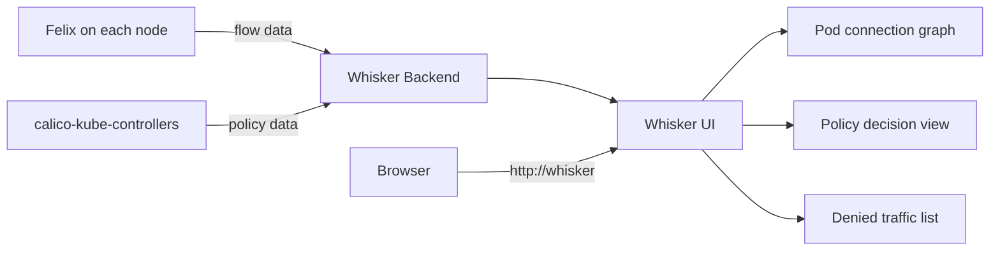

# How to Enable Whisker in Calico

Author: [nawazdhandala](https://github.com/nawazdhandala)

Tags: Calico, Kubernetes, Networking, Observability

Description: Enable Whisker, Calico's built-in network observability UI, to get a real-time visual view of pod connections, policy decisions, and denied traffic in your Kubernetes cluster.

---

## Introduction

Whisker is Calico's built-in network observability dashboard that provides real-time visualization of pod-to-pod connections, network policy allow and deny decisions, and traffic flow patterns. Unlike external observability tools, Whisker is built directly into Calico Enterprise and Calico Cloud, requiring no additional infrastructure. Enabling it gives operators immediate visual insight into what's actually happening on the network.

## Prerequisites

- Calico Enterprise or Calico Cloud installed (Whisker is not available in open-source Calico)
- Tigera Operator managing the Calico installation
- kubectl with cluster-admin access

## Step 1: Enable Whisker via Installation CRD

```yaml
# Enable Whisker in the Installation resource
apiVersion: operator.tigera.io/v1
kind: Installation
metadata:
  name: default
spec:
  # ... other settings ...
  whisker:
    enabled: true
```

```bash
# Apply the configuration
kubectl apply -f installation-with-whisker.yaml

# Or patch the existing Installation
kubectl patch installation default \
  --type=merge \
  -p '{"spec":{"whisker":{"enabled":true}}}'
```

## Step 2: Verify Whisker Deployment

```bash
# Check Whisker pods are running
kubectl get pods -n calico-system | grep whisker

# Check Whisker service
kubectl get svc -n calico-system | grep whisker

# View Whisker logs
kubectl logs -n calico-system -l app=whisker | tail -20
```

## Step 3: Access the Whisker Dashboard

```bash
# Port-forward to access Whisker locally
kubectl port-forward -n calico-system svc/whisker 8081:8081

# Open in browser: http://localhost:8081
```

## Whisker Architecture



## Step 4: Configure Flow Log Aggregation Level

```yaml
# FelixConfiguration: control flow log detail
apiVersion: projectcalico.org/v3
kind: FelixConfiguration
metadata:
  name: default
spec:
  flowLogsFlushInterval: 10s  # How often to flush flow data
  flowLogsFileAggregationKindForAllowed: 1  # Aggregate allowed flows
  flowLogsFileAggregationKindForDenied: 0   # Per-flow detail for denies
```

## Conclusion

Enabling Whisker provides immediate network observability without requiring Prometheus, Grafana, or external logging infrastructure. The most valuable feature is the denied traffic view — it shows exactly which network policies are blocking which connections, making policy debugging significantly faster. Enable Whisker in staging first to understand the UI before relying on it in production incidents.
