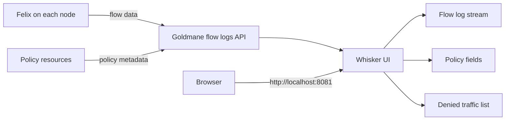

# How to Enable Whisker in Calico

Author: [nawazdhandala](https://github.com/nawazdhandala)

Tags: Calico, Kubernetes, Networking, Observability

Description: Enable Whisker, Calico's built-in network observability UI, to get a real-time visual view of pod connections, policy decisions, and denied traffic in your Kubernetes cluster.

---

## Introduction

Whisker is Calico's built-in network observability dashboard that provides a real-time browser-based view of aggregated flow logs, network policy allow and deny decisions, and traffic flow patterns. Unlike external observability tools, Whisker is built directly into Calico, and is powered by the Goldmane flow logs API. Enabling it gives operators immediate visual insight into what's actually happening on the network.

## Prerequisites

- Calico Open Source 3.30 or later installed with the Tigera Operator or Helm (Whisker and Goldmane are enabled by default for new installs, but not for clusters upgraded from 3.29 or earlier)
- kubectl with cluster-admin access

## Step 1: Enable Goldmane and Whisker

```yaml
# Enable the flow logs API
apiVersion: operator.tigera.io/v1
kind: Goldmane
metadata:
  name: default
---
# Enable the Whisker web console
apiVersion: operator.tigera.io/v1
kind: Whisker
metadata:
  name: default
```

```bash
# Apply the configuration
kubectl apply -f whisker.yaml

# Or apply both resources inline
kubectl apply -f - <<'EOF'
apiVersion: operator.tigera.io/v1
kind: Goldmane
metadata:
  name: default
---
apiVersion: operator.tigera.io/v1
kind: Whisker
metadata:
  name: default
EOF
```

## Step 2: Verify Whisker Deployment

```bash
# Check Whisker pods are running
kubectl get pods -n calico-system | grep -E 'goldmane|whisker'

# Check Whisker service
kubectl get svc -n calico-system | grep whisker

# Check operator status for the components
kubectl get tigerastatus goldmane whisker
```

## Step 3: Access the Whisker Dashboard

```bash
# Port-forward to access Whisker locally
kubectl port-forward -n calico-system svc/whisker 8081:8081

# Open in browser: http://localhost:8081
```

## Whisker Architecture


```mermaid
flowchart LR
    A[Felix on each node] -->|flow data| B[Goldmane flow logs API]
    C[Policy resources] -->|policy metadata| B
    B --> D[Whisker UI]
    E[Browser] -->|http://localhost:8081| D
    D --> F[Flow log stream]
    D --> G[Policy fields]
    D --> H[Denied traffic list]
```

## Step 4: Configure Flow Log Aggregation Level

```yaml
# Calico Cloud / Calico Enterprise file-based flow logs: control aggregation detail
apiVersion: projectcalico.org/v3
kind: FelixConfiguration
metadata:
  name: default
spec:
  flowLogsFlushInterval: 10s  # How often to flush flow data
  flowLogsFileAggregationKindForAllowed: 1  # Aggregate allowed flows
  flowLogsFileAggregationKindForDenied: 0   # Per-flow detail for denies
```

## Conclusion

Enabling Whisker provides immediate network observability without requiring Prometheus, Grafana, or external logging infrastructure. The most valuable feature is the denied traffic view - it shows which network policies are blocking traffic flows, making policy debugging significantly faster. Enable Whisker in staging first to understand the UI before relying on it in production incidents.
