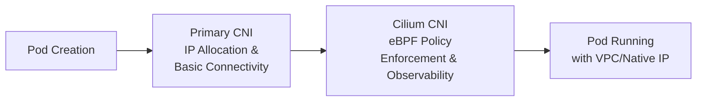

# Execute CNI Chaining with Cilium

Author: [nawazdhandala](https://github.com/nawazdhandala)

Tags: Cilium, CNI Chaining, Kubernetes, Networking, eBPF, Security, Migration

Description: Understand CNI chaining with Cilium — what it is, when to use it, and how to configure Cilium as a secondary CNI plugin on top of any primary CNI for enhanced network policy enforcement and observability.

---

## Introduction

CNI (Container Network Interface) chaining allows multiple CNI plugins to run in sequence when a pod is created. The primary CNI handles IP allocation and basic network connectivity; secondary plugins add capabilities on top of that foundation. Cilium's chaining mode makes it a secondary plugin, adding eBPF-based policy enforcement and observability without replacing the existing CNI.

This pattern is particularly useful for teams that want to adopt Cilium's advanced features incrementally—without the risk and operational overhead of a full CNI migration during which all nodes must be restarted. It's also the recommended approach for managed Kubernetes services (EKS, AKS, GKE) where the primary CNI is managed by the cloud provider.

## Prerequisites

- Kubernetes cluster with an existing CNI (AWS VPC CNI, Azure CNI, Calico, Flannel, etc.)
- Linux kernel 5.4+ on all nodes (required for eBPF)
- `kubectl`, `cilium`, and `helm` CLIs installed

## Understanding the CNI Chain Architecture



When a pod starts, the kubelet calls the CNI chain sequentially:
1. The primary CNI allocates an IP and sets up the veth pair.
2. Cilium's CNI plugin attaches eBPF programs to the pod's network interface for policy enforcement.

## Step 1: Check Kernel Version on Nodes

```bash
# Verify all nodes have kernel 5.4+ for eBPF support
kubectl get nodes -o custom-columns='NAME:.metadata.name,KERNEL:.status.nodeInfo.kernelVersion'
```

## Step 2: Identify Your Primary CNI

Identify the existing CNI conflist file to understand the chaining setup.

```bash
# Check the CNI configuration directory on a node
kubectl debug node/<node-name> -it --image=ubuntu -- ls /etc/cni/net.d/

# Read the primary CNI configuration
kubectl debug node/<node-name> -it --image=ubuntu -- cat /etc/cni/net.d/10-*.conf*
```

## Step 3: Install Cilium in Generic Chaining Mode

The generic chaining mode works with any primary CNI that creates a standard veth pair.

```bash
# Add the Cilium Helm repository
helm repo add cilium https://helm.cilium.io/
helm repo update

# Install Cilium in generic-veth chaining mode
helm install cilium cilium/cilium \
  --version 1.15.0 \
  --namespace kube-system \
  --set cni.chainingMode=generic-veth \
  --set cni.exclusive=false \
  --set kubeProxyReplacement=false \
  --set hostServices.enabled=false \
  --set externalIPs.enabled=false \
  --set hostPort.enabled=false \
  --set policyEnforcementMode=default
```

## Step 4: Verify the Chain

```bash
# Confirm Cilium pods are running on all nodes
kubectl get pods -n kube-system -l k8s-app=cilium

# Check Cilium status
cilium status --wait

# Verify the CNI conflist shows both plugins
# The primary CNI conflist should now include a Cilium entry
kubectl debug node/<node-name> -it --image=ubuntu -- \
  cat /etc/cni/net.d/05-cilium.conf
```

## Step 5: Validate with a CiliumNetworkPolicy

Test that Cilium's policy enforcement works on top of the primary CNI.

```yaml
# Test policy: only allow HTTP GET from labeled pods
apiVersion: cilium.io/v2
kind: CiliumNetworkPolicy
metadata:
  name: test-chaining-policy
  namespace: default
spec:
  endpointSelector:
    matchLabels:
      app: test-server
  ingress:
    - fromEndpoints:
        - matchLabels:
            role: allowed-client
      toPorts:
        - ports:
            - port: "80"
              protocol: TCP
```

```bash
# Apply and check policy status
kubectl apply -f test-chaining-policy.yaml
cilium endpoint list
cilium policy get
```

## CNI-Specific Chaining Modes

Different primary CNIs have dedicated Cilium chaining modes:

| Primary CNI | Cilium chaining mode |
|---|---|
| AWS VPC CNI | `aws-cni` |
| Azure CNI | `azure-cni` |
| Flannel | `flannel` |
| Generic (veth-based) | `generic-veth` |
| Portmap | `portmap` |

## Best Practices

- Use CNI chaining as a transitional step, not a permanent state; a single CNI with full eBPF datapath performs better.
- Always set `cni.exclusive=false` to prevent Cilium from overwriting the primary CNI configuration.
- Test with `cilium connectivity test` after installation before applying production network policies.
- Use the CNI-specific chaining mode (`aws-cni`, `azure-cni`) when available; it is more efficient than `generic-veth`.
- Monitor the `cilium_drop_count_total` metric to detect policy denials introduced by the new chain.

## Conclusion

CNI chaining with Cilium provides a pragmatic, low-risk path to adopting eBPF-based network security on clusters running any primary CNI. By chaining rather than replacing, you can validate Cilium policies and Hubble observability in production before committing to a full CNI migration.
