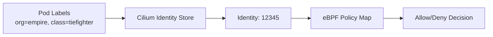

# Explaining the Cilium Star Wars Demo: How It Works

Author: [nawazdhandala](https://github.com/nawazdhandala)

Tags: Cilium, Kubernetes, eBPF, Networking, Network Policy, Star Wars Demo

Description: A deep-dive explanation of how the Cilium Star Wars demo works under the hood, covering eBPF identity enforcement and CiliumNetworkPolicy mechanics.

---

## Introduction

The Cilium Star Wars demo is more than a clever marketing exercise - it is a carefully constructed pedagogical tool that reveals how eBPF-based network policy differs fundamentally from traditional approaches. To explain the demo properly, you need to understand the mechanics behind Cilium's identity model, how eBPF programs intercept and evaluate traffic, and how `CiliumNetworkPolicy` translates label selectors into kernel-level enforcement.

When Cilium assigns a security identity to a workload, it does so based on the pod's Kubernetes labels. This identity is embedded in network packets using a Kubernetes concept called the "security context" and tracked in Cilium's distributed identity store backed by etcd or Kubernetes CRD storage. Every time a packet arrives at a node, Cilium's eBPF programs look up the source identity and evaluate it against the active policies for the destination endpoint - all without leaving the kernel.

This document explains the flow of the Star Wars demo from the perspective of the Cilium data plane, helping engineers understand not just what happens, but why Cilium can enforce policy this way without performance penalties.

## Prerequisites

- Cilium installed on Kubernetes
- The Star Wars demo deployed
- Basic understanding of Linux networking and eBPF concepts

## How Cilium Assigns Identities

Each pod in the Star Wars demo gets a Cilium security identity based on its labels:



```bash
# Inspect Cilium endpoints and their identities
kubectl exec -n kube-system ds/cilium -- cilium endpoint list

# Check identity for a specific pod
kubectl exec -n kube-system ds/cilium -- cilium identity list
```

## The eBPF Data Plane Explained

Cilium attaches eBPF programs at TC (Traffic Control) hooks on each network interface. When the `tiefighter` pod sends a request to the `deathstar` service, the following happens:

1. The packet is intercepted at the veth interface by a Cilium TC hook
2. The source identity is looked up from a BPF map (keyed by IP address)
3. The destination endpoint's policy map is consulted
4. The packet is allowed or dropped inline, without userspace involvement

```bash
# Inspect the eBPF programs loaded by Cilium
kubectl exec -n kube-system ds/cilium -- cilium bpf policy get --all

# View the policy map for a specific endpoint
kubectl exec -n kube-system ds/cilium -- cilium policy get
```

## CiliumNetworkPolicy Structure

The demo uses `CiliumNetworkPolicy` resources that extend standard `NetworkPolicy`:

```yaml
apiVersion: "cilium.io/v2"
kind: CiliumNetworkPolicy
metadata:
  name: "rule1"
spec:
  description: "L3-L4 policy to restrict deathstar access to empire ships"
  endpointSelector:
    matchLabels:
      org: empire
      class: deathstar
  ingress:
  - fromEndpoints:
    - matchLabels:
        org: empire
    toPorts:
    - ports:
      - port: "80"
        protocol: TCP
```

The `endpointSelector` identifies which pods the policy applies to. The `fromEndpoints` selector identifies which sources are permitted. Cilium translates both into identity lookups in the kernel.

## Why Label-Based Identity Is Superior to IP-Based Rules

In traditional firewall environments, rules are tied to IP addresses. In Kubernetes, pod IPs change on every restart and are meaningless across namespaces. Cilium's identity model solves this:

| Approach | IP-Based Rules | Cilium Identity |
|----------|---------------|-----------------|
| Pod restart | Rules break | Identity preserved via labels |
| Horizontal scaling | Manual rule updates | Automatic via label selector |
| Cross-namespace | Complex CIDR logic | Simple label match |
| L7 awareness | Not possible | Native HTTP/gRPC support |

## Conclusion

The Cilium Star Wars demo exposes a fundamental shift in how Kubernetes network security should be thought about. By anchoring policy to workload identity rather than network addresses, and by enforcing that policy in the kernel via eBPF, Cilium provides both the correctness and performance that modern microservice architectures demand. Understanding the mechanics explained here is the foundation for building production Cilium policy at scale.
