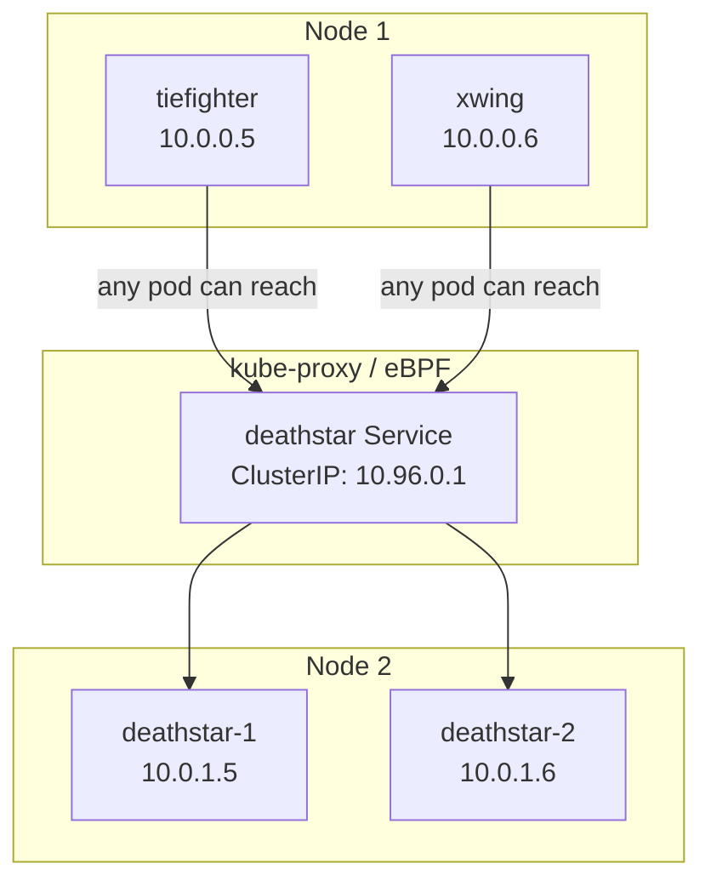

# Explaining Current Access in the Cilium Star Wars Demo

Author: [nawazdhandala](https://github.com/nawazdhandala)

Tags: Cilium, Kubernetes, eBPF, Networking, Network Policy, Security

Description: A technical explanation of how Kubernetes's default permissive network model creates the open access state demonstrated in the Star Wars demo's initial phase.

---

## Introduction

The current access state in the Cilium Star Wars demo is not a bug — it is an accurate representation of how Kubernetes networking works without explicit policy. To explain this properly requires diving into the Kubernetes network model: the flat IP space, the absence of implicit deny rules, and the way that without a `NetworkPolicy` (or `CiliumNetworkPolicy`), the kube-proxy forwarding rules make every service reachable from every pod.

Explaining current access also means explaining what Cilium's eBPF data plane is not doing yet. Without any policy loaded, Cilium functions as a high-performance CNI that routes traffic and provides observability, but it does not drop any packets based on identity. The BPF policy maps are empty or set to allow-all. Understanding this default state helps engineers diagnose unexpected connectivity — either traffic that should work but does not, or traffic that should be blocked but is not.

This post explains the mechanics of open access in detail, including how kube-proxy or eBPF-based service load balancing routes requests and how Cilium's identity model remains dormant until policies are applied.

## Prerequisites

- Understanding of Kubernetes networking basics (pod IPs, Services, kube-proxy)
- Cilium installed on the cluster
- Star Wars demo deployed

## The Kubernetes Flat Network Model



Every pod IP is routable from every other pod. kube-proxy (or Cilium's eBPF-based kube-proxy replacement) implements service VIP translation via NAT rules, making the `deathstar` ClusterIP reachable from any pod in the cluster.

## Checking the Default Policy State

```bash
# Verify Cilium has no policies loaded
kubectl exec -n kube-system ds/cilium -- cilium policy get
# Expected: empty policy list

# Check BPF policy maps (should show allow-all without policies)
kubectl exec -n kube-system ds/cilium -- cilium bpf policy get --all

# Check endpoint list - all should show policy enforcement mode
kubectl exec -n kube-system ds/cilium -- cilium endpoint list
```

## What Cilium Is Doing Without Policies

Without any `CiliumNetworkPolicy`, Cilium operates in `disabled` or `default-allow` policy enforcement mode for each endpoint. The eBPF programs still handle packet forwarding, load balancing, and observability — but the policy verdict is always allow.

```bash
# Observe Cilium forwarding traffic (no drops)
kubectl exec -n kube-system ds/cilium -- cilium monitor --type trace

# Check policy enforcement mode
kubectl exec -n kube-system ds/cilium -- cilium endpoint list | grep "policy-enforcement"
```

## The Role of DNS in Service Discovery

The demo uses DNS-based service discovery (`deathstar.default.svc.cluster.local`). CoreDNS resolves this to the ClusterIP, which is then load-balanced to a `deathstar` pod. Cilium can inspect DNS responses and create identity-aware DNS policies, but in the default state, all DNS queries are resolved and forwarded normally.

```bash
# Verify DNS resolution from xwing
kubectl exec xwing -- nslookup deathstar.default.svc.cluster.local

# Direct IP test (bypasses service discovery)
DS_IP=$(kubectl get svc deathstar -o jsonpath='{.spec.clusterIP}')
kubectl exec xwing -- curl -s -XPOST http://$DS_IP/v1/request-landing
```

## Conclusion

The current access state in the Cilium Star Wars demo is fully explained by Kubernetes's flat, permissive network model. Without `NetworkPolicy` or `CiliumNetworkPolicy` resources, every connection is allowed by default. Cilium's eBPF programs are active and forwarding traffic but making no policy decisions. This is the starting point from which the demo builds toward a fully locked-down, identity-aware network — illustrating the transformation that Cilium enables.
