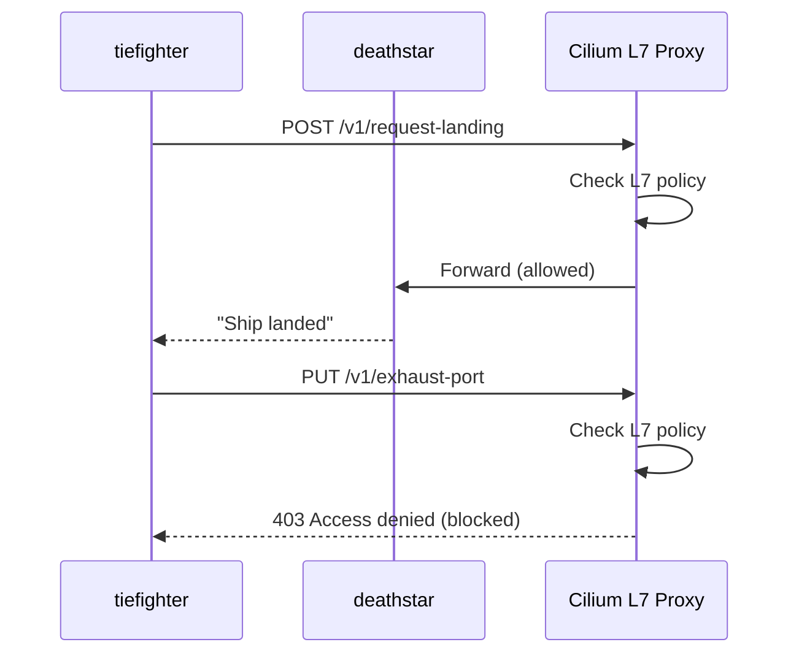

# Explaining the Demo Application in the Cilium Star Wars Demo

Author: [nawazdhandala](https://github.com/nawazdhandala)

Tags: Cilium, Kubernetes, eBPF, Network Policy, Star Wars Demo

Description: An in-depth explanation of how the Star Wars demo application exposes HTTP endpoints and how Cilium uses them to demonstrate L7-aware policy enforcement.

---

## Introduction

The demo application powering the Cilium Star Wars scenario is deliberately designed to expose both safe and dangerous HTTP endpoints. This design choice makes it possible to demonstrate the limitations of L3/L4 policies - which can only control whether a connection is established - versus L7 policies, which can control what happens once a connection is open. The `/v1/exhaust-port` endpoint is the smoking gun: an L3/L4 policy cannot block it when the `tiefighter` already has permission to connect on port 80.

Explaining this nuance is the whole point of the demo application. In real systems, this maps precisely to scenarios like an authenticated service calling a privileged administrative API that it should not have access to. Port 443 is open, TLS is valid, but the `/admin/drop-database` path should be forbidden. Standard `NetworkPolicy` cannot help here. Cilium can.

This document explains the demo application's HTTP interface, how Cilium intercepts and parses HTTP traffic using its L7 proxy, and how policy decisions at the HTTP layer are made without a sidecar.

## Prerequisites

- Star Wars demo deployed on a Cilium-enabled cluster
- Cilium CLI installed
- Basic understanding of HTTP methods and paths

## The Application's HTTP Interface



## Testing the Application Endpoints

```bash
# Verify health endpoint
kubectl exec tiefighter -- curl -sv http://deathstar.default.svc.cluster.local/v1/health

# Test landing request - primary use case
kubectl exec tiefighter -- curl -s -XPOST deathstar.default.svc.cluster.local/v1/request-landing
# Expected: Ship landed

# Test exhaust port - should be blocked after L7 policy
kubectl exec tiefighter -- curl -s -XPUT deathstar.default.svc.cluster.local/v1/exhaust-port
```

## How Cilium Parses HTTP at the Kernel Level

Cilium's L7 policy enforcement uses a redirect mechanism: when an HTTP policy is active, the eBPF program redirects matching traffic to Cilium's userspace proxy (based on Envoy). The proxy parses the HTTP headers, evaluates the path and method against the policy, and either forwards or drops the request.

```bash
# Inspect the L7 proxy activity
kubectl exec -n kube-system ds/cilium -- cilium monitor --type l7

# View proxy redirect rules
kubectl exec -n kube-system ds/cilium -- cilium bpf proxy list
```

## The L7 Policy Resource

```yaml
apiVersion: "cilium.io/v2"
kind: CiliumNetworkPolicy
metadata:
  name: "rule1"
spec:
  endpointSelector:
    matchLabels:
      org: empire
      class: deathstar
  ingress:
  - fromEndpoints:
    - matchLabels:
        org: empire
    toPorts:
    - ports:
      - port: "80"
        protocol: TCP
      rules:
        http:
        - method: "POST"
          path: "/v1/request-landing"
```

The `rules.http` section is what makes this L7-aware. Without it, the policy would be L3/L4 only, and `PUT /v1/exhaust-port` would still be reachable by Empire ships.

## Observing Policy Decisions

```bash
# Monitor all drops in real time
kubectl exec -n kube-system ds/cilium -- cilium monitor --type drop

# Check policy verdicts for the deathstar endpoint
kubectl exec -n kube-system ds/cilium -- cilium policy get
```

## Conclusion

The demo application is a masterclass in API surface security. By exposing both safe and privileged endpoints on the same port, it forces the audience to confront the limitation of connection-level policies and appreciate what HTTP-aware enforcement provides. Cilium's ability to enforce this without a sidecar - by redirecting to an in-node proxy - is both architecturally clean and operationally simpler than mesh-based alternatives.
