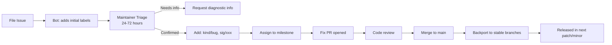

# Explaining the Cilium GitHub Issue Workflow for Users

Author: [nawazdhandala](https://github.com/nawazdhandala)

Tags: Cilium, Community, GitHub, Open Source

Description: An explanation of how the Cilium GitHub issue workflow operates, including issue triage, labels, milestones, and how to track fixes.

---

## Introduction

The Cilium GitHub issue workflow is more structured than most open-source projects, reflecting the project's maturity and the involvement of Isovalent's full-time engineering team. Understanding this workflow helps you file better issues that get resolved faster and helps you track fixes for problems affecting your deployment. The process from issue filing to fix being merged and released follows a predictable pattern that this post explains in full.

When you file an issue on github.com/cilium/cilium, it is automatically processed by a bot that adds initial labels based on the issue template you selected. A maintainer then triages it within a few days, adding more specific labels, requesting additional information if needed, and linking it to a milestone if the fix is planned for a specific release.

## Prerequisites

- GitHub account
- Basic familiarity with Cilium

## The Issue Lifecycle



## Key Labels and What They Mean

| Label | Meaning |
|-------|---------|
| `kind/bug` | Confirmed bug |
| `kind/enhancement` | Feature request |
| `needs/triage` | Not yet triaged |
| `sig/policy` | Network policy area |
| `sig/installation` | Installation area |
| `sig/ebpf` | eBPF dataplane area |
| `priority/critical` | Critical bug affecting many users |
| `backport/stable` | Will be backported to stable release |

## How to Track a Fix

```bash
# Subscribe to an issue via GitHub UI
# Or use gh CLI:
gh issue view 12345 --repo cilium/cilium

# Watch for milestone assignment
gh issue view 12345 --repo cilium/cilium --json milestone

# Check if a PR fixing your issue has been merged
gh pr list --repo cilium/cilium --search "fixes #12345"

# Check if fix is in a specific release
gh release view v1.15.5 --repo cilium/cilium | grep "12345"
```

## Providing Good Diagnostic Information

```bash
# Standard information requested for most bugs:
cilium version
cilium status --verbose

# Generate sysdump
cilium sysdump --output-filename github-issue-$(date +%Y%m%d)

# Policy-specific issues need policy trace output
kubectl exec -n kube-system ds/cilium -- cilium policy trace \
  --src-k8s-pod default:source \
  --dst-k8s-pod default:destination \
  --dport 80
```

## Understanding Backport Policy

Cilium maintains several stable release branches (e.g., v1.14.x, v1.15.x). Critical bugs are backported to these branches within days of being fixed in main. Feature changes only go into the next minor release.

```bash
# Check which stable branches exist
gh api repos/cilium/cilium/branches --jq '.[].name' | grep "^v"

# Check if your issue's fix has been backported
gh pr list --repo cilium/cilium --label "backport/stable" | grep "fixes #YOUR_ISSUE"
```

## Conclusion

Understanding the Cilium GitHub issue workflow transforms your interactions with the project from passive complaints to effective collaboration. By filing well-structured issues with complete diagnostic information, tracking the fix lifecycle, and monitoring milestone assignments and backport status, you can confidently plan when a fix will reach your production environment. The structured workflow the Cilium team maintains is a sign of project maturity that benefits all users.
