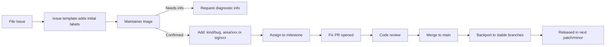

# Explaining the Cilium GitHub Issue Workflow for Users

Author: [nawazdhandala](https://github.com/nawazdhandala)

Tags: Cilium, Community, GitHub, Open Source

Description: An explanation of how the Cilium GitHub issue workflow operates, including issue triage, labels, milestones, and how to track fixes.

---

## Introduction

The Cilium GitHub issue workflow is more structured than most open-source projects, reflecting the project's maturity and the involvement of active maintainers and contributors. Understanding this workflow helps you file better issues that get resolved faster and helps you track fixes for problems affecting your deployment. The process from issue filing to fix being merged and released follows a predictable pattern that this post explains in full.

When you file an issue on github.com/cilium/cilium, GitHub applies the initial labels defined by the issue template you selected. A maintainer then triages it, adding more specific labels, requesting additional information if needed, and linking it to a milestone if the fix is planned for a specific release.

## Prerequisites

- GitHub account
- Basic familiarity with Cilium

## The Issue Lifecycle


```mermaid
graph LR
    FILE[File Issue] --> TEMPLATE[Issue template adds initial labels]
    TEMPLATE --> TRIAGE[Maintainer triage]
    TRIAGE -->|Needs info| INFO[Request diagnostic info]
    TRIAGE -->|Confirmed| LABEL[Add: kind/bug, area/xxx or sig/xxx]
    LABEL --> MILESTONE[Assign to milestone]
    MILESTONE --> PR[Fix PR opened]
    PR --> REVIEW[Code review]
    REVIEW --> MERGE[Merge to main]
    MERGE --> BACKPORT[Backport to stable branches]
    BACKPORT --> RELEASE[Released in next patch/minor]
```

## Key Labels and What They Mean

| Label | Meaning |
|-------|---------|
| `kind/bug` | Confirmed bug |
| `kind/feature` | Feature proposal |
| `needs/triage` | Not yet triaged |
| `sig/policy` | Network policy area |
| `area/helm` | Helm installation area |
| `area/datapath` | eBPF datapath area |
| `severity/high` | High-severity issue |
| `needs-backport/X.Y` | Fix should be backported to the stable `vX.Y` branch |
| `backport/X.Y` | Backport PR for the stable `vX.Y` branch |

## How to Track a Fix

```bash
# Subscribe to an issue via GitHub UI

# Or use gh CLI:
gh issue view 12345 --repo cilium/cilium

# Watch for milestone assignment
gh issue view 12345 --repo cilium/cilium --json milestone

# Check if a PR fixing your issue has been merged
gh pr list --repo cilium/cilium --state merged --search "fixes #12345"

# Check if fix is in a specific release
gh release view v1.19.3 --repo cilium/cilium | grep "12345"
```

## Providing Good Diagnostic Information

```bash
# Standard information requested for most bugs:
cilium version
cilium status --verbose

# Generate sysdump
cilium sysdump --output-filename github-issue-$(date +%Y%m%d)

# Policy-specific issues often need endpoint policy and verdict output
kubectl -n kube-system exec ds/cilium -- cilium-dbg endpoint list
kubectl -n kube-system exec ds/cilium -- cilium-dbg monitor -t policy-verdict
```

## Understanding Backport Policy

Cilium maintains several stable release branches at a time (for example, v1.17.x, v1.18.x, and v1.19.x at the time this post was reviewed). Important bug fixes are backported to these branches according to the project's backport criteria and then released in patch releases. Feature changes only go into the next minor release.

```bash
# Check which stable branches exist
gh api --paginate repos/cilium/cilium/branches --jq '.[].name' | grep "^v"

# Check if your issue's fix has been backported
gh pr list --repo cilium/cilium --label "backport/1.19" --state all --search "12345"
```

## Conclusion

Understanding the Cilium GitHub issue workflow transforms your interactions with the project from passive complaints to effective collaboration. By filing well-structured issues with complete diagnostic information, tracking the fix lifecycle, and monitoring milestone assignments and backport status, you can confidently plan when a fix will reach your production environment. The structured workflow the Cilium team maintains is a sign of project maturity that benefits all users.
