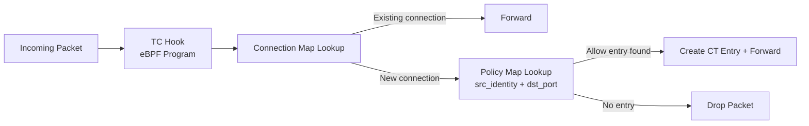

# Explaining the L3/L4 Policy in the Cilium Star Wars Demo

Author: [nawazdhandala](https://github.com/nawazdhandala)

Tags: Cilium, Kubernetes, eBPF, Network Policy, Star Wars Demo

Description: A technical deep-dive into how Cilium's L3/L4 policy enforcement works at the eBPF level in the Star Wars demo scenario.

---

## Introduction

Explaining Cilium's L3/L4 policy enforcement requires going below the YAML level and into the kernel. When you apply a `CiliumNetworkPolicy` with L3/L4 rules, Cilium does not generate iptables rules. Instead, it compiles the policy into entries in eBPF maps that are consulted by TC (Traffic Control) hook programs running in the kernel. These programs make forwarding decisions at wire speed without any kernel-to-userspace transitions.

The key data structures involved are the policy map (keyed by security identity) and the connection tracking (CT) table. The policy map determines whether a new connection is permitted based on the source and destination identity. Once a connection is allowed, entries in the CT table permit subsequent packets in that flow without re-evaluating the policy map. This is how Cilium achieves O(1) policy lookup regardless of the number of rules.

This technical explanation is intended for engineers who need to understand Cilium's internals for debugging, performance analysis, or security auditing. The Star Wars demo provides a concrete, simple context in which to explain these mechanisms.

## Prerequisites

- Linux networking fundamentals (TC, netfilter, eBPF basics)
- Star Wars demo deployed
- Cilium installed with debug access to the DaemonSet

## Identity Assignment

```bash
# View all security identities assigned by Cilium
kubectl exec -n kube-system ds/cilium -- cilium identity list

# View the identity for the xwing pod specifically
XWING_IP=$(kubectl get pod xwing -o jsonpath='{.status.podIP}')
kubectl exec -n kube-system ds/cilium -- cilium endpoint list | grep $XWING_IP
```

Each pod gets a numeric security identity derived from its label set. The `tiefighter` and `xwing` get different identities because they have different `org` labels.

## eBPF Policy Map Structure



```bash
# Inspect the policy map for the deathstar endpoint
DS_EP=$(kubectl exec -n kube-system ds/cilium -- cilium endpoint list | grep deathstar | awk '{print $1}' | head -1)
kubectl exec -n kube-system ds/cilium -- cilium bpf policy get $DS_EP
```

## Tracing Policy Enforcement

```bash
# Enable policy tracing for xwing -> deathstar
kubectl exec -n kube-system ds/cilium -- cilium policy trace \
  --src-k8s-pod default:xwing \
  --dst-k8s-pod default:deathstar-xxxx \
  --dport 80

# Monitor policy verdict in real time
kubectl exec -n kube-system ds/cilium -- cilium monitor --type policy-verdict
```

## Why Connection-Level Enforcement Is Not Enough

At L3/L4, the eBPF program only evaluates the 5-tuple: `(src IP, dst IP, src port, dst port, protocol)`. It does not look at the TCP payload. This means:

- A permitted connection (`tiefighter` to `deathstar:80`) allows any HTTP method and path
- `PUT /v1/exhaust-port` is carried in the same TCP stream as `POST /v1/request-landing`
- The eBPF L3/L4 hook cannot distinguish between them

This is why L7 policy requires a different mechanism - the L7 proxy - which parses the HTTP layer.

```bash
# Demonstrate L3/L4 limitation
kubectl exec tiefighter -- curl -s -XPUT deathstar.default.svc.cluster.local/v1/exhaust-port
# Still allowed - L3/L4 only sees port 80 TCP, not the HTTP method
```

## Conclusion

Cilium's L3/L4 policy enforcement is technically elegant: a single eBPF lookup against a compiled policy map determines whether a new TCP connection is permitted. The mechanism is fast, scalable, and identity-aware. But it is fundamentally limited to connection-level decisions. Understanding this limitation - that TCP connection permission does not imply HTTP path permission - is what makes the progression to L7 policy in the Star Wars demo both inevitable and instructive.
