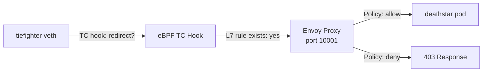

# Explaining L7 HTTP-Aware Policy in the Cilium Star Wars Demo

Author: [nawazdhandala](https://github.com/nawazdhandala)

Tags: Cilium, Kubernetes, eBPF, L7 Policy, HTTP, Envoy, Network Policy

Description: A technical deep-dive into how Cilium's L7 proxy intercepts HTTP traffic and enforces HTTP method and path policies in the Star Wars demo.

---

## Introduction

Explaining L7 HTTP policy enforcement in Cilium requires understanding the mechanics of traffic interception, proxy operation, and how policy decisions are made on HTTP semantics rather than TCP connection state. When a `CiliumNetworkPolicy` contains `rules.http`, Cilium switches from pure eBPF enforcement to a hybrid model: eBPF at the L3/L4 level for connection decisions, and an Envoy-based proxy for HTTP-level decisions.

The Envoy proxy used by Cilium is not a sidecar — it runs as a shared process on each node, managed by the Cilium agent. When an L7 policy is active for an endpoint, the eBPF TC hook inserts a redirect rule that routes TCP traffic for that endpoint through the local Envoy instance before it reaches the pod's network namespace. Envoy then applies the HTTP policies, generates access logs, and either forwards or drops the request.

This explanation covers the proxy lifecycle, how Cilium programs Envoy with policy rules via xDS, and the observable behavior of L7 enforcement.

## Prerequisites

- L7 policy applied in the Star Wars demo
- `kubectl exec` access to the Cilium DaemonSet

## How the Redirect Works



The key is the `redirect` entry in the eBPF proxy map. When a TCP connection is established to the `deathstar:80`, the TC hook sees that an L7 rule applies and redirects the connection to the local Envoy listener on a dedicated port.

## Inspecting the L7 Proxy

```bash
# View active proxy listeners
kubectl exec -n kube-system ds/cilium -- cilium bpf proxy list

# Check Envoy is running in the Cilium pod
kubectl exec -n kube-system ds/cilium -- ps aux | grep envoy

# View Envoy configuration (xDS state)
kubectl exec -n kube-system ds/cilium -- cilium proxy log

# Monitor L7 decisions live
kubectl exec -n kube-system ds/cilium -- cilium monitor --type l7
```

## xDS Configuration

Cilium programs Envoy using the xDS API (Envoy's dynamic configuration protocol). Each time a `CiliumNetworkPolicy` with HTTP rules is applied, Cilium pushes updated Envoy configuration that includes the HTTP route rules for the affected endpoints.

```bash
# View Cilium's xDS server state
kubectl exec -n kube-system ds/cilium -- cilium debuginfo | grep -A 20 "xDS"
```

## Observing L7 Decisions with Hubble

```bash
# Enable Hubble
cilium hubble enable
cilium hubble port-forward &

# Observe L7 HTTP flows
hubble observe --namespace default --protocol http --follow

# In another terminal, trigger requests
kubectl exec tiefighter -- curl -s -XPOST deathstar.default.svc.cluster.local/v1/request-landing
kubectl exec tiefighter -- curl -s -XPUT deathstar.default.svc.cluster.local/v1/exhaust-port
```

Hubble will show the L7 flow records including the HTTP method, path, and whether the request was forwarded or dropped.

## Performance Characteristics

The L7 proxy introduces additional latency compared to pure L3/L4 enforcement. Benchmarks typically show 50-200 microseconds of additional latency per request, depending on the complexity of the HTTP rule evaluation. For most API services, this is negligible. For high-throughput streaming APIs, you may want to evaluate whether L7 policy is appropriate or whether L3/L4 with supplementary application-layer auth is preferable.

```bash
# Measure latency with and without L7 policy
kubectl exec tiefighter -- bash -c 'for i in {1..100}; do
  time curl -s -XPOST deathstar.default.svc.cluster.local/v1/request-landing > /dev/null
done 2>&1 | grep real | awk "{sum+=\$2} END {print sum/NR}"'
```

## Conclusion

Cilium's L7 HTTP policy enforcement is a technically sophisticated hybrid: eBPF for connection-level decisions and an in-node Envoy proxy for HTTP semantic decisions. The architecture avoids sidecar complexity while providing the full flexibility of HTTP method, path, and header-based policy rules. Understanding how the proxy intercept mechanism works — the eBPF redirect, the Envoy xDS configuration, and the Hubble observability — is essential for operating L7 policies in production.
