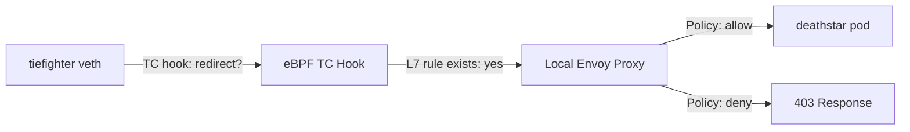

# Explaining L7 HTTP-Aware Policy in the Cilium Star Wars Demo

Author: [nawazdhandala](https://github.com/nawazdhandala)

Tags: Cilium, Kubernetes, eBPF, Network Policy, Star Wars Demo

Description: A technical deep-dive into how Cilium's L7 proxy intercepts HTTP traffic and enforces HTTP method and path policies in the Star Wars demo.

---

## Introduction

Explaining L7 HTTP policy enforcement in Cilium requires understanding the mechanics of traffic interception, proxy operation, and how policy decisions are made on HTTP semantics rather than TCP connection state. When a `CiliumNetworkPolicy` contains `rules.http`, Cilium switches from pure eBPF enforcement to a hybrid model: eBPF at the L3/L4 level for connection decisions, and an Envoy-based proxy for HTTP-level decisions.

The Envoy proxy used by Cilium is not a sidecar - by default, it runs as a separate process in each Cilium agent pod, and it can also be deployed as a dedicated `cilium-envoy` DaemonSet. When an L7 policy is active for an endpoint, Cilium redirects matching TCP traffic through the local Envoy instance before it reaches the pod's network namespace. Envoy then applies the HTTP policies, generates access logs, and either forwards the request or returns an L7 denial such as HTTP 403.

This explanation covers the proxy lifecycle, how Cilium programs Envoy with policy rules via xDS, and the observable behavior of L7 enforcement.

## Prerequisites

- L7 policy applied in the Star Wars demo
- `kubectl exec` access to the Cilium DaemonSet

## How the Redirect Works


```mermaid
graph LR
    TF[tiefighter veth] -->|TC hook: redirect?| HOOK[eBPF TC Hook]
    HOOK -->|L7 rule exists: yes| PROXY[Local Envoy Proxy]
    PROXY -->|Policy: allow| DS[deathstar pod]
    PROXY -->|Policy: deny| DROP[403 Response]
```

The key is the L7 redirect programmed for the endpoint and port. When a TCP connection is established to `deathstar:80`, Cilium sees that an L7 rule applies and redirects the connection to a local Envoy listener.

## Inspecting the L7 Proxy

```bash
# View active Envoy listeners

kubectl exec -n kube-system ds/cilium -- cilium-dbg envoy admin listeners

# View Envoy configuration (xDS state)
kubectl exec -n kube-system ds/cilium -- cilium-dbg envoy admin config

# Monitor L7 decisions live
kubectl exec -n kube-system ds/cilium -- cilium-dbg monitor --type l7
```

## xDS Configuration

Cilium programs Envoy using the xDS API (Envoy's dynamic configuration protocol). Each time a `CiliumNetworkPolicy` with HTTP rules is applied, Cilium pushes updated Envoy configuration that includes the HTTP route rules for the affected endpoints.

```bash
# View the Envoy configuration delivered by Cilium over xDS
kubectl exec -n kube-system ds/cilium -- cilium-dbg envoy admin config
```

## Observing L7 Decisions with Hubble

```bash
# Enable Hubble
cilium hubble enable
cilium hubble port-forward &

# Observe L7 HTTP flows
hubble observe --namespace default --protocol http --follow

# In another terminal, trigger requests
kubectl exec tiefighter -- curl -s -XPOST deathstar.default.svc.cluster.local/v1/request-landing
kubectl exec tiefighter -- curl -s -XPUT deathstar.default.svc.cluster.local/v1/exhaust-port
```

Hubble will show the L7 flow records including the HTTP method, path, and whether the request was forwarded or denied.

## Performance Characteristics

The L7 proxy introduces additional processing compared to pure L3/L4 enforcement because matching traffic is redirected through Envoy. The impact depends on the workload, node resources, request rate, and policy shape. For high-throughput or latency-sensitive APIs, measure the effect in your own environment and decide whether L7 policy is appropriate or whether L3/L4 with supplementary application-layer auth is preferable.

```bash
# Measure request latency in the current policy state
kubectl exec tiefighter -- bash -c 'for i in {1..100}; do
  curl -s -o /dev/null -w "%{time_total}\n" -XPOST deathstar.default.svc.cluster.local/v1/request-landing
done | awk "{sum+=\$1} END {print sum/NR}"'
```

## Conclusion

Cilium's L7 HTTP policy enforcement is a technically sophisticated hybrid: eBPF for connection-level decisions and an in-node Envoy proxy for HTTP semantic decisions. The architecture avoids sidecar complexity while providing the full flexibility of HTTP method, path, and header-based policy rules. Understanding how the proxy intercept mechanism works - the eBPF redirect, the Envoy xDS configuration, and the Hubble observability - is essential for operating L7 policies in production.
