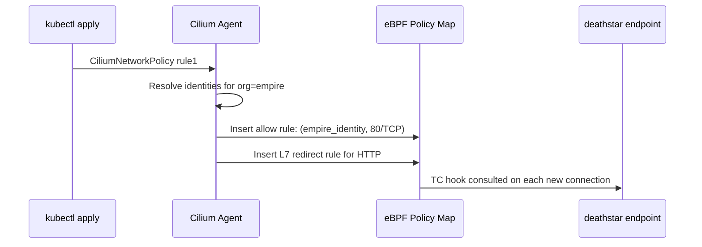

# Explaining the CiliumNetworkPolicy in the Star Wars Demo

Author: [nawazdhandala](https://github.com/nawazdhandala)

Tags: Cilium, Kubernetes, eBPF, CiliumNetworkPolicy, Network Policy, L7

Description: An in-depth technical explanation of how CiliumNetworkPolicy works under the hood in the Star Wars demo, covering identity compilation, eBPF enforcement, and L7 proxy redirection.

---

## Introduction

The `CiliumNetworkPolicy` resource looks deceptively simple. A few YAML fields with label selectors and port numbers. But the compilation of that YAML into kernel-enforced policy is a sophisticated multi-step process involving identity assignment, eBPF map population, and — for L7 rules — traffic redirection to a userspace proxy. Explaining this process demystifies what Cilium is doing and why it is both correct and performant.

When a `CiliumNetworkPolicy` is applied, the Cilium agent on each node recompiles the affected endpoints' policy maps. For each endpoint that matches the `endpointSelector`, Cilium calculates the allowed `(source_identity, destination_port)` pairs and writes them into the eBPF policy map. For L7 rules, it additionally creates redirect rules that route matching traffic through Cilium's Envoy-based L7 proxy before the traffic reaches the destination pod.

This explanation is targeted at engineers who need to understand Cilium deeply enough to debug policy issues, optimize policy compilation performance, or audit policy enforcement correctness.

## Prerequisites

- Understanding of the Star Wars demo structure
- Familiarity with eBPF and Kubernetes networking concepts
- Access to a Cilium cluster with `kubectl exec` privileges

## Step 1: Policy Parsing and Endpoint Selection

```bash
# Cilium agent logs when policy is applied
kubectl logs -n kube-system ds/cilium | grep -i "policy"

# List endpoints and their policy state
kubectl exec -n kube-system ds/cilium -- cilium endpoint list

# Show which endpoints are affected by rule1
kubectl exec -n kube-system ds/cilium -- cilium policy get | grep deathstar
```

## Step 2: Identity Resolution

Each label set maps to a security identity (a 32-bit integer). The `fromEndpoints` selector in the policy is resolved to the set of identities matching `org=empire`.

```bash
# View all security identities
kubectl exec -n kube-system ds/cilium -- cilium identity list

# Find the identity for Empire pods
kubectl exec -n kube-system ds/cilium -- cilium identity list | grep "org=empire"
```

## Step 3: eBPF Map Population



```bash
# Inspect the policy map for the deathstar endpoint
DS_EP_ID=$(kubectl exec -n kube-system ds/cilium -- cilium endpoint list | grep deathstar | awk '{print $1}' | head -1)
kubectl exec -n kube-system ds/cilium -- cilium bpf policy get $DS_EP_ID
```

## Step 4: L7 Proxy Redirection

For HTTP rules, Cilium inserts a redirect rule that routes matching TCP traffic to a local Envoy proxy instance. The proxy parses the HTTP headers, evaluates method and path, and either forwards or drops the request.

```bash
# View proxy redirect rules
kubectl exec -n kube-system ds/cilium -- cilium bpf proxy list

# Monitor L7 proxy decisions
kubectl exec -n kube-system ds/cilium -- cilium monitor --type l7
```

## Step 5: Runtime Policy Enforcement

```bash
# Trace the policy decision for a specific source->dest pair
kubectl exec -n kube-system ds/cilium -- cilium policy trace \
  --src-k8s-pod default:tiefighter \
  --dst-k8s-pod default:deathstar-xxxxxx \
  --dport 80 \
  --protocol TCP

# Monitor policy verdicts in real time
kubectl exec -n kube-system ds/cilium -- cilium monitor --type policy-verdict
```

## Conclusion

The `CiliumNetworkPolicy` in the Star Wars demo is compiled into a multi-layer enforcement system: L3/L4 decisions happen in kernel eBPF programs at TC hooks (O(1) map lookups), while L7 decisions happen in an in-node Envoy proxy after redirection. This architecture provides correctness (L7 semantic enforcement), performance (kernel-level connection filtering), and visibility (Hubble flow observability) in a single policy resource. Understanding this compilation pipeline is the foundation for diagnosing policy issues in production.
