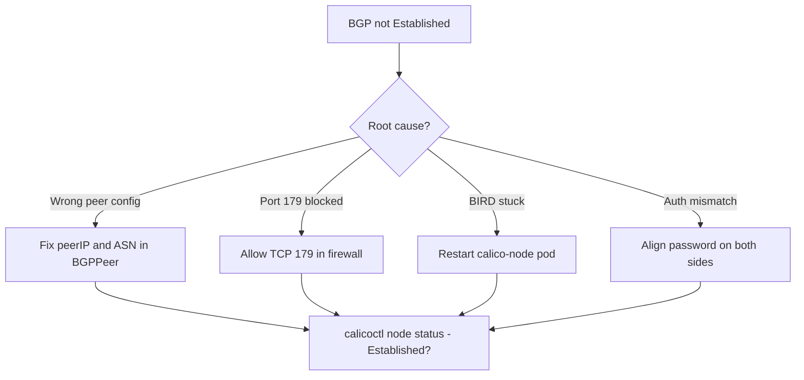

# How to Fix BGP Peer Not Established in Calico

Author: [nawazdhandala](https://github.com/nawazdhandala)

Tags: Calico, Kubernetes, Networking, Troubleshooting

Description: Fix BGP peer connection failures in Calico by correcting peer IP and AS number configuration, unblocking TCP port 179, and resolving BIRD connectivity issues.

---

## Introduction

Fixing BGP peer not established issues requires matching the fix to the specific failure identified during diagnosis. The three main fix categories are: correcting the peer configuration (wrong IP or ASN), unblocking TCP port 179, and restarting BIRD when the daemon is in a stuck state.

## Symptoms

- BGP peers in non-Established state
- Cross-node pod traffic failing for affected routes

## Root Causes

- Wrong peer IP or AS number
- Firewall blocking TCP port 179
- BIRD in stuck state

## Diagnosis Steps

```bash
calicoctl node status
calicoctl get bgppeer -o yaml
```

## Solution

**Fix 1: Correct BGP peer configuration**

```bash
# Edit the BGPPeer resource with correct values
calicoctl get bgppeer <peer-name> -o yaml > /tmp/bgppeer.yaml
# Edit /tmp/bgppeer.yaml to fix peerIP and asNumber
calicoctl apply -f /tmp/bgppeer.yaml

# Or use patch
calicoctl patch bgppeer <peer-name> \
  --patch='{"spec":{"peerIP":"<correct-ip>","asNumber":<correct-asn>}}'
```

**Fix 2: Unblock TCP port 179**

```bash
# On each node - allow BGP port
sudo iptables -I INPUT -p tcp --dport 179 -j ACCEPT
sudo iptables -I OUTPUT -p tcp --dport 179 -j ACCEPT
sudo iptables-save > /etc/iptables/rules.v4

# If UFW is used
sudo ufw allow 179/tcp

# For cloud providers - update security group to allow TCP 179 between nodes
```

**Fix 3: Restart BIRD on affected node**

```bash
# Restart calico-node to restart BIRD daemon
NODE_POD=$(kubectl get pods -n kube-system -l k8s-app=calico-node \
  --field-selector spec.nodeName=<node-name> -o name)
kubectl delete pod $NODE_POD -n kube-system

# Wait for pod restart
kubectl wait pods -n kube-system -l k8s-app=calico-node \
  --field-selector spec.nodeName=<node-name> \
  --for=condition=Ready --timeout=120s

# Check peer state after restart
calicoctl node status
```

**Fix 4: Fix BGP authentication mismatch**

```bash
# Check if password is configured
calicoctl get bgppeer <peer-name> -o yaml | grep password

# Add/remove password to match both sides
calicoctl patch bgppeer <peer-name> \
  --patch='{"spec":{"password":{"secretKeyRef":{"name":"bgp-password","key":"password"}}}}'
```

**Fix 5: For node-to-node mesh: verify mesh is enabled**

```bash
calicoctl get bgpconfiguration default -o yaml | grep nodeToNodeMeshEnabled
# If false and no explicit peers configured:
calicoctl patch bgpconfiguration default \
  --patch='{"spec":{"nodeToNodeMeshEnabled":true}}'
```

**Verify fix**

```bash
calicoctl node status
# Expected: all peers showing Established
ip route show | grep bird
# Expected: routes from peer nodes visible
```



## Prevention

- Validate BGP peer configuration before applying
- Ensure TCP 179 is in baseline firewall allow rules
- Monitor BGP peer state and alert on non-Established sessions

## Conclusion

Fixing BGP peer not established requires identifying the specific failure (configuration, connectivity, or BIRD state) and applying the targeted fix. Verify with `calicoctl node status` showing all peers as Established and confirm pod routes appear in `ip route show`.
