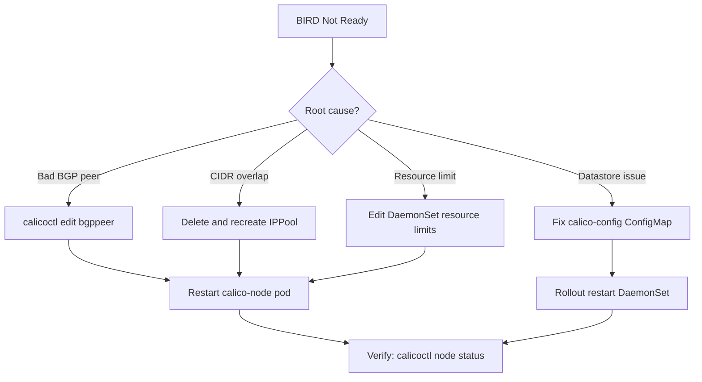

# How to Fix BIRD Not Ready Errors in Calico

Author: [nawazdhandala](https://github.com/nawazdhandala)

Tags: Calico, Kubernetes, Networking, Troubleshooting

Description: Concrete remediation steps to fix BIRD not ready errors in Calico including BGP peer correction, IP pool repair, and resource limit tuning.

---

## Introduction

After diagnosing a BIRD not-ready error in Calico, the next challenge is applying the correct fix without causing further disruption. BIRD not-ready conditions can stem from misconfigured BGP peers, IP pool conflicts, resource exhaustion, or corrupted Calico configuration. Each root cause requires a distinct remediation path.

This guide covers the most common fixes in order of likelihood. Because calico-node is a DaemonSet, most configuration changes take effect by restarting the pod on the affected node. Where a cluster-wide configuration change is needed, the impact is broader and must be planned carefully in production environments.

Always test fixes on a non-production node first. BGP configuration changes can transiently withdraw routes and briefly interrupt cross-node pod traffic while BIRD re-establishes peering.

## Symptoms

- calico-node pod stuck in `0/1 Ready` state
- `calicoctl node status` reports peers in `Idle` or `Connect`
- Felix logs: `BIRDv4 is not ready`, `BIRDv6 is not ready`
- Missing routes in node routing table for remote pod CIDRs

## Root Causes

- Incorrect BGP peer IP address or remote AS number in BGPPeer resource
- IP pool CIDR overlaps with node host subnet
- calico-node container hitting CPU/memory limits, killing BIRD subprocess
- Calico datastore connection parameters pointing to unavailable endpoint

## Diagnosis Steps

```bash
# Identify the affected node and pod
kubectl get pods -n kube-system -l k8s-app=calico-node -o wide

# Check BIRD-specific errors
NODE_POD=<calico-node-pod-name>
kubectl logs $NODE_POD -n kube-system -c calico-node | grep -i "bird\|not ready" | tail -30

# Check peer state
calicoctl node status
```

## Solution

**Fix 1: Correct a misconfigured BGP peer**

```bash
# List existing BGP peers
calicoctl get bgppeer -o yaml

# Edit the peer with wrong AS or address
calicoctl edit bgppeer <peer-name>
# Update spec.peerIP and spec.asNumber to correct values
```

**Fix 2: Resolve IP pool CIDR overlap**

```bash
# View current IP pools
calicoctl get ippool -o yaml

# Delete the conflicting pool (drain pods first)
calicoctl delete ippool <pool-name>

# Create a replacement pool with a non-overlapping CIDR
cat <<EOF | calicoctl apply -f -
apiVersion: projectcalico.org/v3
kind: IPPool
metadata:
  name: default-ipv4-ippool
spec:
  cidr: 192.168.0.0/16
  ipipMode: Always
  natOutgoing: true
EOF
```

**Fix 3: Increase calico-node resource limits**

```bash
kubectl edit daemonset calico-node -n kube-system
# Under containers[name=calico-node].resources, set:
# limits:
#   cpu: "500m"
#   memory: "500Mi"
# requests:
#   cpu: "250m"
#   memory: "256Mi"
```

**Fix 4: Restart calico-node on the affected node**

```bash
kubectl delete pod $NODE_POD -n kube-system
# Wait for the replacement pod to become ready
kubectl wait pod -n kube-system -l k8s-app=calico-node \
  --for=condition=Ready --timeout=120s
```

**Fix 5: Repair datastore connection**

```bash
# Verify the calico-config ConfigMap
kubectl get configmap calico-config -n kube-system -o yaml

# Update etcd_endpoints if needed
kubectl patch configmap calico-config -n kube-system \
  --type merge -p '{"data":{"etcd_endpoints":"https://<correct-etcd-ip>:2379"}}'

# Restart calico-node DaemonSet to pick up new config
kubectl rollout restart daemonset calico-node -n kube-system
```



## Prevention

- Use `calicoctl ipam check` regularly to catch CIDR conflicts early
- Set resource requests/limits based on node count and BGP peer count
- Pin BGP peer configuration in version-controlled manifests to avoid drift

## Conclusion

Fixing BIRD not-ready errors in Calico is straightforward once the root cause is identified. BGP peer corrections and IP pool changes require careful validation, while resource limit tuning is a low-risk change that prevents recurrence. After each fix, confirm recovery with `calicoctl node status` and verify cross-node pod connectivity before closing the incident.
