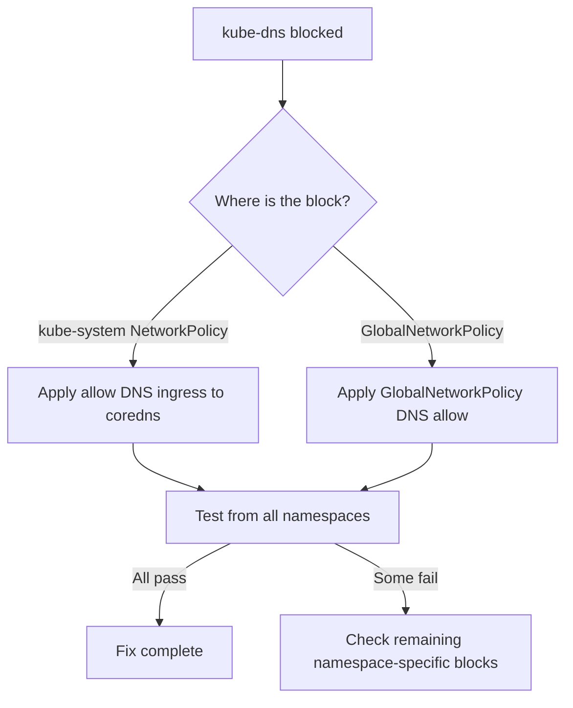

# How to Fix Calico Blocking kube-dns

Author: [nawazdhandala](https://github.com/nawazdhandala)

Tags: Calico, Kubernetes, Networking, Troubleshooting

Description: Fix Calico policies blocking kube-dns by adding ingress allow rules for UDP port 53 in kube-system namespace policies and GlobalNetworkPolicies.

---

## Introduction

Fixing Calico blocking kube-dns requires allowing ingress traffic to CoreDNS pods on UDP and TCP port 53 from all namespaces. Because this is a cluster-wide issue affecting all pods simultaneously, it is critical to apply the fix quickly and verify it from multiple namespaces.

## Symptoms

- All pods unable to resolve DNS names simultaneously
- CoreDNS pods running but not processing queries

## Root Causes

- kube-system NetworkPolicy ingress default-deny blocking DNS queries
- GlobalNetworkPolicy blocking UDP 53 to CoreDNS pods

## Diagnosis Steps

```bash
kubectl get networkpolicy -n kube-system
calicoctl get globalnetworkpolicy | grep -i "deny\|block"
```

## Solution

**Fix 1: Allow DNS ingress in kube-system NetworkPolicy**

```yaml
apiVersion: networking.k8s.io/v1
kind: NetworkPolicy
metadata:
  name: allow-dns-ingress-to-coredns
  namespace: kube-system
spec:
  podSelector:
    matchLabels:
      k8s-app: kube-dns
  policyTypes:
  - Ingress
  ingress:
  - from:
    - namespaceSelector: {}  # Allow from all namespaces
    ports:
    - protocol: UDP
      port: 53
    - protocol: TCP
      port: 53
```

**Fix 2: Fix GlobalNetworkPolicy blocking DNS**

```yaml
apiVersion: projectcalico.org/v3
kind: GlobalNetworkPolicy
metadata:
  name: allow-kube-dns-ingress
spec:
  order: 5  # Highest priority
  selector: k8s-app == 'kube-dns'
  types:
  - Ingress
  ingress:
  - action: Allow
    protocol: UDP
    destination:
      ports: [53]
  - action: Allow
    protocol: TCP
    destination:
      ports: [53]
```

**Fix 3: Apply and verify**

```bash
kubectl apply -f allow-dns-ingress-to-coredns.yaml

# Test from multiple namespaces
for NS in default production staging; do
  kubectl run dns-test --image=busybox -n $NS --restart=Never --rm -i \
    --timeout=15s -- nslookup kubernetes.default 2>&1 \
    && echo "PASS: $NS" || echo "FAIL: $NS"
done
```



## Prevention

- Never apply default-deny ingress to kube-system without CoreDNS allow
- Use GlobalNetworkPolicy DNS baseline with order 5
- Require DNS testing from all namespaces after any kube-system policy change

## Conclusion

Fixing Calico blocking kube-dns requires adding ingress allow rules for UDP/TCP 53 to CoreDNS pods, either at the kube-system NetworkPolicy level or as a GlobalNetworkPolicy. Verify from multiple namespaces simultaneously to confirm cluster-wide DNS restoration.
