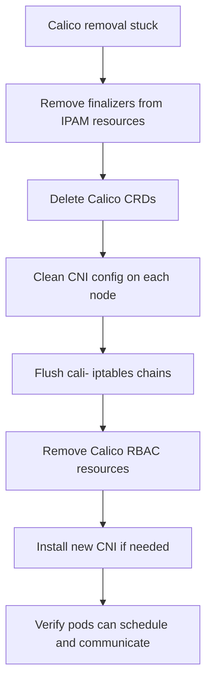

# How to Fix Problems During Calico CNI Removal

Author: [nawazdhandala](https://github.com/nawazdhandala)

Tags: Calico, Kubernetes, Networking, Troubleshooting

Description: Fix issues during Calico CNI removal by removing finalizers, cleaning up CNI configs, flushing iptables rules, and completing CRD deletion.

---

## Introduction

Fixing problems during Calico CNI removal requires addressing each stuck component individually. The recommended approach is to work through the layers in order: first resolve stuck finalizers on IPAM resources, then clean up CNI configuration files on each node, flush remaining iptables rules, and finally remove the CRDs.

Manual finalizer removal should be done carefully - finalizers exist to prevent data loss during cleanup. In the case of Calico IPAM resources, removing the finalizer is safe once the calico-node DaemonSet is already deleted, as there is no controller left to honor the finalizer's intent.

## Symptoms

- `kubectl delete crd` hangs or times out
- New CNI not working because Calico CNI config still present
- iptables cali-* chains still present after Calico removal

## Root Causes

- IPAMBlocks with `projectcalico.org/block-affinities-cleanup` finalizers
- calico-node DaemonSet removed without running cleanup scripts
- Manual resource deletion leaving partial state

## Diagnosis Steps

```bash
# Check what's stuck
kubectl get ipamblocks.crd.projectcalico.org 2>/dev/null | head
kubectl get crd | grep calico
```

## Solution

**Fix 1: Remove finalizers from stuck IPAM resources**

```bash
# Remove finalizers from all IPAMBlocks
for BLOCK in $(kubectl get ipamblocks.crd.projectcalico.org \
  -o jsonpath='{.items[*].metadata.name}' 2>/dev/null); do
  kubectl patch ipamblock $BLOCK --type=json \
    -p='[{"op":"remove","path":"/metadata/finalizers"}]' 2>/dev/null || true
done

# Remove finalizers from IPAMHandles
for HANDLE in $(kubectl get ipamhandles.crd.projectcalico.org \
  -o jsonpath='{.items[*].metadata.name}' 2>/dev/null); do
  kubectl patch ipamhandle $HANDLE --type=json \
    -p='[{"op":"remove","path":"/metadata/finalizers"}]' 2>/dev/null || true
done

# Remove finalizers from BlockAffinities
for BA in $(kubectl get blockaffinities.crd.projectcalico.org \
  -o jsonpath='{.items[*].metadata.name}' 2>/dev/null); do
  kubectl patch blockaffinity $BA --type=json \
    -p='[{"op":"remove","path":"/metadata/finalizers"}]' 2>/dev/null || true
done
```

**Fix 2: Delete Calico CRDs**

```bash
# Delete all Calico CRDs
kubectl get crd | grep calico | awk '{print $1}' | xargs kubectl delete crd
```

**Fix 3: Clean up CNI config on each node**

```bash
for NODE in $(kubectl get nodes -o jsonpath='{.items[*].metadata.name}'); do
  ssh $NODE "rm -f /etc/cni/net.d/10-calico.conflist \
                    /etc/cni/net.d/calico-kubeconfig \
                    /opt/cni/bin/calico \
                    /opt/cni/bin/calico-ipam"
  echo "Cleaned $NODE"
done
```

**Fix 4: Flush iptables cali-* chains**

```bash
# On each node
for NODE in $(kubectl get nodes -o jsonpath='{.items[*].metadata.name}'); do
  ssh $NODE << 'EOF'
# Flush all cali- chains
iptables -L | grep "^Chain cali-" | awk '{print $2}' | while read CHAIN; do
  iptables -F $CHAIN 2>/dev/null
  iptables -X $CHAIN 2>/dev/null
done
# Flush nat table cali- chains
iptables -t nat -L | grep "^Chain cali-" | awk '{print $2}' | while read CHAIN; do
  iptables -t nat -F $CHAIN 2>/dev/null
  iptables -t nat -X $CHAIN 2>/dev/null
done
echo "iptables cleanup done"
EOF
done
```

**Fix 5: Clean up RBAC and Namespace**

```bash
kubectl delete clusterrole calico-node calico-kube-controllers 2>/dev/null || true
kubectl delete clusterrolebinding calico-node calico-kube-controllers 2>/dev/null || true
kubectl delete serviceaccount calico-node calico-kube-controllers -n kube-system 2>/dev/null || true
kubectl delete configmap calico-config -n kube-system 2>/dev/null || true
```



## Prevention

- Use the official Calico uninstall procedure: `calicoctl` cleanup before DaemonSet removal
- Test removal in a staging cluster before production
- Keep the removal procedure documented in the cluster runbook

## Conclusion

Fixing Calico removal problems requires a systematic approach: remove finalizers from stuck IPAM resources, delete CRDs, clean CNI config files from each node, flush cali-* iptables chains, and remove RBAC resources. Work through these steps in order to achieve a clean Calico removal.
